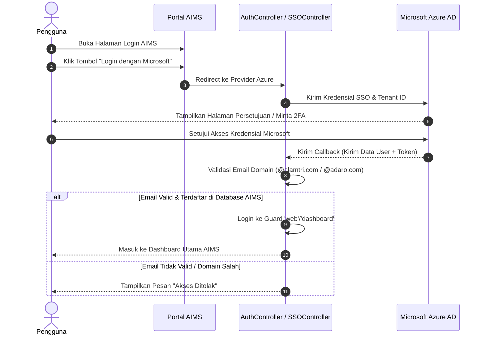

# 🛡️ AIMS Platform: Unified Authentication & Access Flow PRD

Dokumen ini berisi spesifikasi kebutuhan produk, arsitektur guard, integrasi Microsoft Azure SSO (Single Sign-On), serta diagram alir logika otentikasi dan navigasi pada platform **AIMS (Asset & Incident Management System)**.

---

## 📌 1. Pendahuluan & Gambaran Umum

Platform AIMS dirancang sebagai portal multi-modul terintegrasi yang menyatukan berbagai sistem manajemen seperti **Document System, Safety Performance (SAP), PICA, Field Leadership**, dll.

Untuk memberikan pengalaman pengguna yang aman, mulus, dan konsisten, sistem otentikasi AIMS menerapkan:
1. **SSO / Integrasi Microsoft Azure Active Directory** sebagai metode masuk utama.
2. **Multi-Guard Session Isolation** untuk memisahkan hak akses Admin Back-Office (Filament) dari hak akses Portal Pengguna Biasa.
3. **Dynamic Sidebar Access Control** untuk menampilkan menu navigasi hanya kepada pengguna yang memiliki izin/role untuk modul bersangkutan.

---

## 🔒 2. Arsitektur Multi-Guard & Isolasi Sesi

AIMS menggunakan sistem **Guard** bawaan Laravel untuk membedakan tipe pengguna dan area akses.

### Daftar Guard
*   **`admin` (Filament Admin)**: Guard khusus administrator untuk mengelola konfigurasi sistem, database, hak akses, dan manajemen konten melalui antarmuka Filament. Menggunakan model `App\Models\Admin`.
*   **`web` / `dashboard` (Portal User)**: Guard utama untuk karyawan/pengguna akhir platform AIMS. Menggunakan model `App\Models\User`.
*   **Guard Modul Spesifik (`ko`, `kpp`, `sap`, dll.)**: Guard lokal per modul untuk membatasi ruang lingkup otentikasi di masing-masing sub-aplikasi.

### Sesi Logout Terintegrasi (Single Logout - SLO)
Ketika pengguna keluar dari Dashboard Utama AIMS, mereka tidak boleh ter-logout dari Filament Admin (dan sebaliknya) secara tidak disengaja.

*   **Penyebab Masalah**: Default `Auth::logout()` menghancurkan seluruh sesi PHP (`$request->session()->invalidate()`), sehingga logout di satu guard mematikan sesi guard lainnya.
*   **Solusi Desentralisasi Logout** (`AuthController@logout`):
    ```php
    public function logout(Request $request): RedirectResponse
    {
        $guards = ['web', 'dashboard', 'ko', 'kpp', 'sap', 'csms', 'coe', 'kplh', 'mcu', 'pica', 'ibpr-and-bowtie', 'document-system', 'field-leadership'];

        foreach ($guards as $guard) {
            if (Auth::guard($guard)->check()) {
                Auth::guard($guard)->logout();
            }
        }
        
        // Memperbarui token CSRF demi keamanan tanpa menghancurkan sesi Filament
        $request->session()->regenerateToken();
        return redirect()->route('login');
    }
    ```

---

## 🔄 3. Alur Otentikasi Microsoft Azure SSO

Sistem menggunakan pustaka **Laravel Socialite** yang dikonfigurasi untuk Azure Active Directory.



---

## 🗂️ 4. Logika Tampilan & Filter Akses Menu Sidebar

Sidebar utama diatur secara dinamis agar hanya menampilkan modul-modul yang berhak diakses oleh pengguna yang bersangkutan.

### 1. Kondisi Tidak Login (Guest)
*   **Kebutuhan**: Jika pengguna belum masuk ke sistem, seluruh tautan modul di sidebar wajib disembunyikan.
*   **Tampilan**: Hanya menampilkan menu **Home** dan tombol **Filter**.
*   **Implementasi**:
    ```php
    // Jika tidak ada user terotentikasi, $hasAccess akan bernilai false
    $hasAccess = ($user && method_exists($user, 'hasAccessToGuard')) 
        ? $user->hasAccessToGuard($guard) 
        : ($user instanceof \App\Models\Admin);
    ```

### 2. Kondisi Login (User Terotentikasi)
*   **Kebutuhan**: Menyaring daftar menu secara otomatis berdasarkan permission yang dimiliki pengguna.
*   **Tampilan**: Menampilkan menu **Home**, ditambah modul-modul spesifik yang diizinkan (misal: "Calendar of Event", "Document System", dll.).
*   **Metode Validasi**:
    Menggunakan method `hasAccessToGuard($guard)` pada Model `User` untuk memetakan role pengguna ke guard modul.

### 3. Kondisi Login Administrator (Filament Admin)
*   **Kebutuhan**: Mencegah error crash `Call to undefined method App\Models\Admin::hasAccessToGuard()` saat Admin Filament membuka Dashboard Utama.
*   **Tampilan**: Menampilkan seluruh menu modul secara default.
*   **Implementasi**: Memanfaatkan safeguard `method_exists()` untuk memverifikasi ketersediaan fungsi sebelum dipanggil.

---

## 👤 5. Komponen UI Dropdown Profil (Header Utama)

Sebagai pengganti tombol login/logout bawaan yang kurang premium, AIMS menggunakan dropdown inisial profil yang dinamis dan terisolasi.

### Fungsionalitas Dropdown:
1.  **Deteksi Sesi Aktif**: Menggunakan pengecekan gabungan `Auth::guard('web')->check() || Auth::guard('dashboard')->check()`.
2.  **Inisial Avatar Otomatis**: Memotong nama depan dan nama belakang pengguna menjadi 2 inisial huruf besar (contoh: "Fadjri Wivindi" ➔ "FW").
3.  **Dropdown Menu Toggling (Vanilla JS)**: Menggunakan manipulasi DOM sederhana untuk membuka/menutup dropdown, serta menyembunyikan dropdown secara otomatis saat pengguna mengklik di area luar menu (*click-away*).
4.  **Style Symmetry**: Caret down arrow (`::after`) dihilangkan secara global pada semua halaman sub-modul (melalui `styles.css` dan `styles-audit.css`) agar tampilan profil lebih rapi dan simetris dengan padding `4px 8px`.

---

## 🛠️ 6. Matriks Logika & File Penting

| Alur / Komponen | File Implementasi | Deskripsi / Peran |
| :--- | :--- | :--- |
| **Pusat Aksi Login & SLO** | `app/Http/Controllers/Auth/AuthController.php` | Menangani otentikasi kredensial lokal dan pembersihan sesi multi-guard saat logout. |
| **Layout Header Utama** | `resources/views/livewire/main-dashboard/public/index.blade.php` | Memuat navigasi atas, inisial avatar profil dinamis, dan drop-down logout. |
| **Sidebar Utama** | `resources/views/livewire/main-dashboard/public/sidebar/sidebar-left.blade.php` | Menyaring dan merender daftar modul berdasarkan status login dan izin peran. |
| **Sidebar Mobile / Slidebar** | `resources/views/layouts/main-dashboard/dashboard-slidebar.blade.php` | Menyaring navigasi mobile dengan logika validasi akses yang identik dengan sidebar utama. |
| **Header Sub-Modul** | `Modules/DocumentSystem/Resources/views/layouts/partials/header.blade.php`<br>`Modules/Sap/Resources/views/layouts/header/admin-header.blade.php` | Header khusus per modul untuk menampilkan inisial avatar tanpa panah caret. |
| **Global Stylesheet** | `public/assets/css/styles.css`<br>`public/assets/css/styles-audit.css` | Mengatur styling global, menyembunyikan icon caret, dan menyelaraskan padding avatar. |
