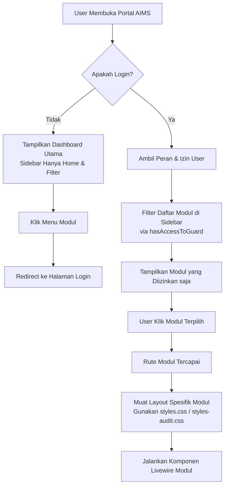

# 🧭 AIMS Platform: Panduan Alur & Spesifikasi Modul (PRD)

Dokumen ini memetakan tujuan utama, prefix URL, struktur folder, controller kunci, dan alur proses bisnis dari **12 Modul Utama** yang berjalan di atas sistem modular AIMS.

---

## 🏗️ 1. Struktur Modul Global

Seluruh modul dikembangkan menggunakan pola **Laravel Modules** (`nwidart/laravel-modules`). Setiap modul berada di bawah direktori `Modules/` dengan struktur internal standar sebagai berikut:

```
Modules/{NamaModul}/
├── Config/               # Konfigurasi spesifik modul
├── Database/
│   ├── Migrations/       # Skema tabel database modul
│   └── Seeders/          # Data awal (seeder) modul
├── Entities/             # Model Eloquent (Database Model)
├── Http/
│   ├── Controllers/      # Controller logika bisnis (REST / MVC)
│   └── Middleware/       # Filter hak akses lokal modul
├── Resources/
│   └── views/            # Template Blade (layout, pages, components)
│       └── livewire/     # Komponen reaktif Livewire modul
└── Routes/
    ├── web.php           # Definisi URL/Rute Web
    └── api.php           # Definisi URL/Rute API
```

---

## 🗂️ 2. Detail Spesifikasi Alur 12 Modul Utama

---

### 📂 1. DocumentSystem (AIMS - Document System)
*   **Tujuan**: Mengelola, menyortir, dan mengontrol versi dokumen perusahaan secara terpusat (kategori, departemen, draf, final).
*   **Prefix URL**: `/document-systems`
*   **Guard**: `document-system`
*   **Logika & File Kunci**:
    *   *Base Layout*: `Modules/DocumentSystem/Resources/views/layouts/master.blade.php`
    *   *Header*: `Modules/DocumentSystem/Resources/views/layouts/partials/header.blade.php`
    *   *Routes*: `Modules/DocumentSystem/Routes/web.php`
*   **Alur Proses**:
    1.  User mengunggah dokumen baru (PDF, DOCX) melalui form input.
    2.  Dokumen dikelompokkan berdasarkan **Category** dan **Department**.
    3.  User lain dapat mengunduh, mencari dokumen lewat search bar global, atau membaca dokumen langsung melalui PDF viewer bawaan.

---

### 🛡️ 2. Sap (Safety Accountability Program)
*   **Tujuan**: Pencatatan target KPI keselamatan bulanan (headcount, man-hours, unsafe condition, dll.) per departemen serta validasi laporan.
*   **Prefix URL**: `/sap`
*   **Guard**: `sap`
*   **Logika & File Kunci**:
    *   *Base Layout*: `Modules/Sap/Resources/views/layouts/base.blade.php`
    *   *Routes*: `Modules/Sap/Routes/web.php`
    *   *Home View*: `Modules/Sap/Resources/views/livewire/home/index.blade.php`
*   **Alur Proses**:
    1.  Admin mengatur kriteria & kategori scorecard keselamatan per departemen.
    2.  Setiap bulan, sistem menghitung otomatis skor program K3 (atau user menginput target manual).
    3.  Pimpinan departemen meninjau pencapaian (YTD/MTD) pada grafik dan diagram pencapaian.

---

### 🔍 3. Audit (AIMS - Audit)
*   **Tujuan**: Perencanaan, penjadwalan, pelaksanaan, dan pelaporan audit kepatuhan K3LH (Kesehatan, Keselamatan Kerja & Lingkungan Hidup) di area kerja.
*   **Prefix URL**: `/audit`
*   **Guard**: `audit`
*   **Logika & File Kunci**:
    *   *Base Layout*: `resources/views/components/layouts/audit.blade.php`
    *   *Routes*: `Modules/Audit/Routes/web.php`
*   **Alur Proses**:
    1.  Tim auditor membuat jadwal audit tahunan.
    2.  Saat audit berlangsung, auditor mengisi checklist temuan dan mengunggah bukti dokumentasi foto.
    3.  Hasil audit dihitung menjadi skor persentase kepatuhan dan diterbitkan sebagai laporan final.

---

### 🤝 4. CSMS (Contractor Safety Management System)
*   **Tujuan**: Mengelola kualifikasi keselamatan dari kontraktor/mitra kerja pihak ketiga yang bekerja di bawah naungan perusahaan.
*   **Prefix URL**: `/csms`
*   **Guard**: `csms`
*   **Logika & File Kunci**:
    *   *Routes*: `Modules/CSMS/Routes/web.php`
    *   *Master Layout*: `Modules/CSMS/Resources/views/layouts/master.blade.php`
*   **Alur Proses**:
    1.  Mitra kerja mengirimkan dokumen profil CSMS (kebijakan K3, data kecelakaan kerja).
    2.  Tim internal AIMS menilai kualifikasi keselamatan mitra tersebut.
    3.  Mitra yang lolos mendapat sertifikasi / predikat CSMS aktif untuk dapat beroperasi di proyek.

---

### 📅 5. Coe (Calendar of Event)
*   **Tujuan**: Menyediakan kalender terpusat untuk seluruh agenda kegiatan K3LH, sosialisasi, pelatihan, dan kampanye keselamatan perusahaan.
*   **Prefix URL**: `/coe`
*   **Guard**: `coe`
*   **Logika & File Kunci**:
    *   *Base Layout*: `Modules/Coe/Resources/views/layouts/master.blade.php`
    *   *Routes*: `Modules/Coe/Routes/web.php`
*   **Alur Proses**:
    1.  Admin membuat event/kegiatan baru dengan detail tanggal, pelaksana, dan deskripsi acara.
    2.  Event tersebut tampil secara real-time di widget kalender di halaman utama maupun dashboard Coe.
    3.  Sistem mengirimkan reminder / notifikasi event kepada peserta terdaftar.

---

### 🚶 6. FieldLeadership (Field Leadership)
*   **Tujuan**: Memfasilitasi manajemen puncak dan pengawas lapangan untuk melakukan observasi keselamatan langsung (Safety Walk & Talk) dan mencatat perilaku aman/tidak aman.
*   **Prefix URL**: `/field-leadership`
*   **Guard**: `field-leadership`
*   **Logika & File Kunci**:
    *   *Routes*: `Modules/FieldLeadership/Routes/web.php`
*   **Alur Proses**:
    1.  Pengawas lapangan melakukan inspeksi dan membuka form observasi di ponsel/PC.
    2.  Pengawas mengisi detail temuan kepemimpinan keselamatan, tindakan perbaikan instan, dan melampirkan foto.
    3.  Data masuk ke dashboard untuk mengukur metrik keaktifan kepemimpinan keselamatan (YTD).

---

### 🕸️ 7. IbprAndBowtie (Risk Management / IBPR & Bowtie)
*   **Tujuan**: Identifikasi Bahaya dan Penilaian Risiko (IBPR) serta visualisasi pencegahan risiko tinggi menggunakan metodologi diagram Bowtie.
*   **Prefix URL**: `/ibpr-and-bowtie`
*   **Guard**: `ibpr-and-bowtie`
*   **Logika & File Kunci**:
    *   *Base Layout*: `Modules/IbprAndBowtie/Resources/views/layouts/base.blade.php`
*   **Alur Proses**:
    1.  Analis risiko memetakan bahaya utama (hazard) dan kejadian pelepasan bahaya (top event).
    2.  Menyusun skenario pencegahan (threat barriers) di sisi kiri diagram, dan penanggulangan dampak (consequence barriers) di sisi kanan.
    3.  Menghubungkan kontrol penghalang ini dengan tugas pengawasan di lapangan untuk memantau efektivitas barrier secara dinamis.

---

### 🚨 8. KO (Safety Operation / Kegiatan Operasi)
*   **Tujuan**: Pencatatan aktivitas harian operasional keselamatan, log book patroli K3, serta laporan cepat jika terjadi insiden darurat.
*   **Prefix URL**: `/ko`
*   **Guard**: `ko`
*   **Logika & File Kunci**:
    *   *Routes*: `Modules/KO/Routes/web.php`
*   **Alur Proses**:
    1.  Petugas mencatat log harian operasional ( patroli jalan, pengecekan sarana K3).
    2.  Jika terjadi deviasi atau kondisi bahaya segera dikirim notifikasi cepat ke penanggung jawab terkait.

---

### ⚖️ 9. KPP (Compliance Regulation)
*   **Tujuan**: Memantau kepatuhan perusahaan terhadap regulasi hukum pemerintah pusat maupun daerah terkait aspek K3LH.
*   **Prefix URL**: `/kpp`
*   **Guard**: `kpp`
*   **Logika & File Kunci**:
    *   *Master Layout*: `Modules/KPP/Resources/views/layouts/master.blade.php`
*   **Alur Proses**:
    1.  Staff legal/K3 menginput undang-undang atau peraturan baru ke sistem.
    2.  Setiap departemen mencocokkan kepatuhan mereka terhadap butir-butir pasal undang-undang tersebut.
    3.  Dashboard menyajikan status pemenuhan regulasi (Compliance Rate).

---

### 📋 10. Kplh (Inspection / Inspeksi K3LH)
*   **Tujuan**: Pelaksanaan inspeksi periodik pada peralatan, kendaraan, pabrik, atau fasilitas kantor guna memastikan kondisi kerja yang layak.
*   **Prefix URL**: `/kplh`
*   **Guard**: `kplh`
*   *Logika & File Kunci*:
    *   *Routes*: `Modules/Kplh/Routes/web.php`
*   **Alur Proses**:
    1.  Inspektur membuat checklist inspeksi sesuai standar fasilitas.
    2.  Inspektur memindai QR code fasilitas atau memilih nama aset lalu menginput checklist item (OK / Not OK).
    3.  Setiap temuan "Not OK" otomatis memicu pembuatan action item tindak lanjut.

---

### 🏥 11. Mcu (Medical Check Up)
*   **Tujuan**: Manajemen data kesehatan karyawan, hasil tes kesehatan berkala (MCU), sertifikat kelayakan kerja (Fit to Work), serta penugasan dokter perusahaan.
*   **Prefix URL**: `/mcu`
*   **Guard**: `mcu`
*   **Logika & File Kunci**:
    *   *Routes*: `Modules/Mcu/Routes/web.php`
    *   *Controllers*: `Modules\Mcu\Http\Controllers\McuController`
*   **Alur Proses**:
    1.  Klinik/Karyawan mengunggah lembar hasil pemeriksaan kesehatan laboratorium.
    2.  Dokter perusahaan (`Doctor` role) memeriksa hasil laboratorium dan menentukan status kelayakan kerja (Fit, Fit with Note, Unfit).
    3.  Sistem menerbitkan surat keterangan sehat digital (SKK) untuk karyawan bersangkutan.

---

### 🛠️ 12. Pica (Corrective and Preventive Action)
*   **Tujuan**: Pengawasan tindakan perbaikan dan pencegahan atas seluruh temuan kecelakaan, audit, inspeksi, maupun observasi keselamatan kerja.
*   **Prefix URL**: `/pica`
*   **Guard**: `pica`
*   **Logika & File Kunci**:
    *   *Routes*: `Modules/Pica/Routes/web.php`
*   **Alur Proses**:
    1.  Temuan penyimpangan diinput ke sistem PICA (asal temuan, tanggal batas akhir / due date, nama penanggung jawab).
    2.  Penanggung jawab menerima notifikasi tugas dan melakukan perbaikan fisik.
    3.  Setelah selesai, penanggung jawab mengunggah bukti foto perbaikan dan mengajukan penutupan (*closing action*).
    4.  Pembuat temuan memverifikasi hasil sebelum status action ditutup secara resmi.

---

## 📈 3. Diagram Alir Navigasi Global Modul AIMS


