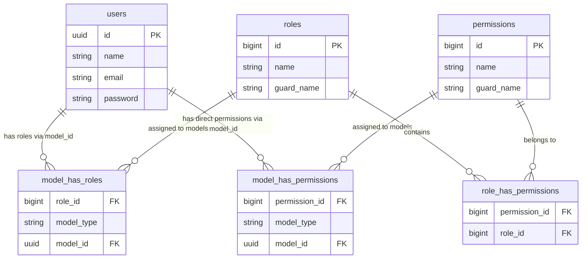

# Analisis Teknis Spatie Laravel Permission — Adaro AIMS

Dokumen ini menyajikan analisis mendalam tentang implementasi paket **Spatie Laravel Permission** di dalam sistem **Adaro AIMS**, mencakup struktur tabel database, hubungan relasional (ERD), alur kerja otorisasi, mekanisme caching, serta daftar lengkap seluruh permission dan guard aktif langsung dari database sistem.

---

## 1. Ikhtisar Arsitektur (Architecture Overview)

Spatie Laravel Permission digunakan untuk mengelola Hak Akses (Permissions) dan Peran (Roles) pengguna. Di AIMS, arsitekturnya didesain unik dengan dua karakteristik utama:
1. **Dukungan UUID**: Kolom identifikasi model menggunakan tipe data `UUID` (bukan integer standar) karena User ID di AIMS berbasis UUID.
2. **Multi-Guard**: Sistem memiliki **13 Guard aktif** (seperti `kpp`, `mcu`, `ko`, dll.) untuk memisahkan otorisasi antar-modul secara aman.

---

## 2. Struktur Tabel Database (Database Schema)

Spatie menggunakan **5 tabel utama** yang didefinisikan dalam berkas migrasi `2023_01_10_193550_create_permission_tables.php`:

### 2.1 Tabel Master

#### 1. `permissions` (Tabel Hak Akses)
Menyimpan semua daftar aksi/hak spesifik yang tersedia di sistem.
*   `id` (bigint, Primary Key, Auto Increment)
*   `name` (varchar): Nama unik permission (contoh: `"KPP - Create Ekstraksi"`)
*   `guard_name` (varchar): Guard yang menaungi permission tersebut (contoh: `"kpp"`)
*   `created_at` & `updated_at` (timestamp)
*   *Index Unik*: `unique(['name', 'guard_name'])` (mencegah nama ganda pada guard yang sama)

#### 2. `roles` (Tabel Peran)
Menyimpan peran/grup pengguna yang mewakili sekumpulan permission.
*   `id` (bigint, Primary Key, Auto Increment)
*   `name` (varchar): Nama peran (contoh: `"Kebijakan Peraturan dan Perizinan - Maker"`)
*   `guard_name` (varchar): Guard terkait (contoh: `"kpp"`)
*   `created_at` & `updated_at` (timestamp)
*   *Index Unik*: `unique(['name', 'guard_name'])`

---

### 2.2 Tabel Pivot & Relasi Polymorphic

#### 3. `role_has_permissions` (Relasi Peran ↔ Hak Akses)
Tabel pivot *Many-to-Many* yang menghubungkan Role dengan Permission yang dimilikinya.
*   `permission_id` (bigint, Foreign Key → `permissions.id`, cascade delete)
*   `role_id` (bigint, Foreign Key → `roles.id`, cascade delete)
*   *Primary Key*: Composite `(permission_id, role_id)`

#### 4. `model_has_roles` (Relasi Model/User ↔ Peran)
Tabel pivot *Polymorphic Many-to-Many* yang menghubungkan entitas pengguna (User) dengan Role.
*   `role_id` (bigint, Foreign Key → `roles.id`, cascade delete)
*   `model_type` (varchar): Namespace class model terkait (contoh: `"App\Models\User"`)
*   `model_id` (uuid): ID unik pengguna (bertipe UUID di AIMS)
*   *Primary Key*: Composite `(role_id, model_id, model_type)`

#### 5. `model_has_permissions` (Relasi Model/User ↔ Hak Akses Langsung)
Digunakan jika admin ingin memberikan hak akses langsung ke pengguna tertentu tanpa melalui peran/role (*direct permissions*).
*   `permission_id` (bigint, Foreign Key → `permissions.id`, cascade delete)
*   `model_type` (varchar): Namespace class model terkait (contoh: `"App\Models\User"`)
*   `model_id` (uuid): ID unik pengguna (bertipe UUID)
*   *Primary Key*: Composite `(permission_id, model_id, model_type)`

---

## 3. Diagram Hubungan Entitas (ERD)

Berikut adalah visualisasi hubungan antar-tabel Spatie Permission dengan tabel `users` bawaan AIMS:



---

## 4. Alur Kerja Teknis & Kueri (Technical Workflow)

### 4.1 Menghubungkan Role ke User
Ketika seorang user diberikan suatu role, Laravel akan menyisipkan baris baru ke tabel `model_has_roles`:
```sql
INSERT INTO model_has_roles (role_id, model_type, model_id) 
VALUES (5, 'App\\Models\\User', '9a0b1c2d-3e4f-5a6b-7c8d-9e0f1a2b3c4d');
```
*Di Laravel:* `$user->assignRole($role);`

### 4.2 Menyinkronkan Permission ke Role (Form Simpan Matriks)
Pada form *Permissions Checklist* yang kita buat di Filament, ketika tombol **Save** ditekan, Spatie akan menghapus relasi lama dan menyisipkan yang baru di tabel `role_has_permissions`:
```sql
-- Spatie menghapus asosiasi permission lama untuk role terkait
DELETE FROM role_has_permissions WHERE role_id = 12;

-- Spatie menyisipkan permission baru yang dicentang
INSERT INTO role_has_permissions (permission_id, role_id) VALUES (1, 12), (2, 12), (5, 12);
```
*Di Laravel:* `$role->syncPermissions($checkedPermissionNames);`

### 4.3 Pemeriksaan Hak Akses (Otorisasi)
Saat aplikasi memanggil `@can('KPP - View Peraturan')` atau `$user->hasPermissionTo('KPP - View Peraturan')`, Spatie akan melakukan evaluasi berikut:
1. Mengecek apakah permission tersebut diberikan langsung di tabel `model_has_permissions`.
2. Jika tidak, mengecek apakah permission tersebut melekat pada salah satu role yang dimiliki pengguna melalui gabungan tabel `model_has_roles` dan `role_has_permissions`.

---

## 5. Caching & Optimasi Performa

Untuk menghindari kueri database yang berulang pada setiap *page load*, Spatie secara otomatis menyimpan seluruh daftar role dan permission dalam memori cache Laravel.

> [!TIP]
> **Detail Caching AIMS (dari `config/permission.php`):**
> *   **Masa Kedaluwarsa Cache**: 24 Jam (`\DateInterval::createFromDateString('24 hours')`).
> *   **Key Penyimpanan**: `'spatie.permission.cache'`.
> *   **Driver Cache**: Mengikuti driver default aplikasi (`store => 'default'`).
> *   **Pembersihan Otomatis**: Setiap kali ada operasi tambah/edit/hapus pada Role atau Permission melalui model Spatie, cache ini akan otomatis dihapus (*flushed*) sehingga data di browser tetap ter-update tanpa intervensi manual.

Jika Anda mengubah permission langsung dari database (bukan via Laravel Eloquent) dan perubahan tidak muncul, jalankan perintah pembersihan cache manual:
```bash
php artisan permission:cache-reset
# ATAU
php artisan cache:clear
```

---

## 6. Konvensi Penamaan Khusus Adaro AIMS

Di dalam proyek AIMS, permission dan role diatur agar rapi dan tersegregasi berdasarkan modul bisnis dengan aturan berikut:

### 6.1 Format Penamaan Permission
Semua nama permission di database mengikuti format `"Modul - Aksi"` (2 bagian dipisahkan oleh tanda hubung spasi). Contoh:
*   `"MCU - View Dashboard MCU"` (Modul: `MCU` | Aksi: `View Dashboard MCU`)
*   `"CSMS - Letter Create"` (Modul: `CSMS` | Aksi: `Letter Create`)

### 6.2 Segregasi Multi-Guard
Untuk memastikan keamanan antar-layanan (misalnya admin audit tidak bisa menembus data rekam medis MCU secara tidak sengaja), setiap role dan permission dikunci pada `guard_name` masing-masing yang terdaftar di `config/auth.php`:
*   `kpp` (Kepatuhan Peraturan & Perizinan)
*   `mcu` (Medical Check Up)
*   `audit` (Audit SMKP)
*   `ko` (Keselamatan Operasi)
*   `field-leadership` (Field Leadership)
*   *dan seterusnya...*

---

## 7. Daftar Lengkap Permission per Guard (Total: 248 Items)

Berikut adalah daftar lengkap seluruh permission yang tersimpan di database sistem AIMS, dikelompokkan berdasarkan **13 Guard aktif**:

<details>
<summary>📂 1. Guard: audit (21 permissions) - Klik untuk expand</summary>

*   `Audit - Create SMKP`
*   `Audit - Detail SMKP`
*   `Audit - Detail SMKP Another Attachment`
*   `Audit - Detail SMKP Audit Fix Recomendation`
*   `Audit - Detail SMKP Audit Plan`
*   `Audit - Detail SMKP Audit Response`
*   `Audit - Detail SMKP Closing Attendance`
*   `Audit - Detail SMKP Criteria Audit`
*   `Audit - Detail SMKP Criteria Audit Confirmance`
*   `Audit - Detail SMKP Criteria Audit Non Confirmance`
*   `Audit - Detail SMKP Criteria Audit Non Confirmance Fix Plan`
*   `Audit - Detail SMKP Dashboard`
*   `Audit - Detail SMKP Implementation Report`
*   `Audit - Detail SMKP Implementation Schedule`
*   `Audit - Detail SMKP Method and Sample`
*   `Audit - Detail SMKP Notice Letter`
*   `Audit - Detail SMKP Opening Attendance`
*   `Audit - Detail SMKP Report Result`
*   `Audit - Lead Auditor`
*   `Audit - Login`
*   `Audit - Master Mandays`

</details>

<details>
<summary>📂 2. Guard: coe (12 permissions) - Klik untuk expand</summary>

*   `COE - Create COE`
*   `COE - Delete COE`
*   `COE - Edit COE`
*   `COE - Export Data`
*   `COE - Import Data`
*   `COE - Login`
*   `COE - Manage Category`
*   `COE - Superuser`
*   `COE - View Callendar`
*   `COE - View Dashboard`
*   `COE - View Detail`
*   `COE - View List`

</details>

<details>
<summary>📂 3. Guard: csms (64 permissions) - Klik untuk expand</summary>

*   `CSMS - Bidding Create`
*   `CSMS - Bidding Delete`
*   `CSMS - Bidding Reviewer D/H OHS`
*   `CSMS - Bidding Reviewer KTT`
*   `CSMS - Bidding Reviewer OHS`
*   `CSMS - Bidding Update`
*   `CSMS - Bidding View Active`
*   `CSMS - Bidding View Draft`
*   `CSMS - Bidding View On Going`
*   `CSMS - Dashboard`
*   `CSMS - Dictionary Create`
*   `CSMS - Dictionary Delete`
*   `CSMS - Dictionary Update`
*   `CSMS - Dictionary View`
*   `CSMS - Inactive Create`
*   `CSMS - Inactive Delete`
*   `CSMS - Inactive Reviewer D/H OHS`
*   `CSMS - Inactive Reviewer KTT`
*   `CSMS - Inactive Reviewer OHS`
*   `CSMS - Inactive Update`
*   `CSMS - Inactive View Active`
*   `CSMS - Inactive View Draft`
*   `CSMS - Inactive View On Going`
*   `CSMS - Letter Create`
*   `CSMS - Letter Delete`
*   `CSMS - Letter Update`
*   `CSMS - Letter View`
*   `CSMS - Memo KTT Create`
*   `CSMS - Memo KTT Delete`
*   `CSMS - Memo KTT Update`
*   `CSMS - Memo KTT View`
*   `CSMS - Pica Create`
*   `CSMS - Pica Delete`
*   `CSMS - Pica Update`
*   `CSMS - Pica View Active`
*   `CSMS - Pica View Draft`
*   `CSMS - Pica View On Going`
*   `CSMS - Pjo Create`
*   `CSMS - Pjo Delete`
*   `CSMS - Pjo Reviewer Evaluator`
*   `CSMS - Pjo Reviewer KTT`
*   `CSMS - Pjo Reviewer OHS`
*   `CSMS - Pjo Update`
*   `CSMS - Pjo View Active`
*   `CSMS - Pjo View Draft`
*   `CSMS - Pjo View On Going`
*   `CSMS - Post Bidding Create`
*   `CSMS - Post Bidding Delete`
*   `CSMS - Post Bidding Reviewer D/H OHS`
*   `CSMS - Post Bidding Reviewer KTT`
*   `CSMS - Post Bidding Reviewer OHS`
*   `CSMS - Post Bidding Update`
*   `CSMS - Post Bidding View Active`
*   `CSMS - Post Bidding View Draft`
*   `CSMS - Post Bidding View On Going`
*   `CSMS - Renewal Create`
*   `CSMS - Renewal Delete`
*   `CSMS - Renewal Reviewer D/H OHS`
*   `CSMS - Renewal Reviewer KTT`
*   `CSMS - Renewal Reviewer OHS`
*   `CSMS - Renewal Update`
*   `CSMS - Renewal View Active`
*   `CSMS - Renewal View Draft`
*   `CSMS - Renewal View On Going`

</details>

<details>
<summary>📂 4. Guard: dashboard (12 permissions) - Klik untuk expand</summary>

*   `Dashboard - Attachment`
*   `Dashboard - Banner`
*   `Dashboard - General`
*   `Dashboard - Incident Notification`
*   `Dashboard - Kegiatan K3LH`
*   `Dashboard - News and Update`
*   `Dashboard - Penghargaan K3LH`
*   `Dashboard - Performance`
*   `Dashboard - Production`
*   `Dashboard - Safety Performance`
*   `Dashboard - Slideshow`
*   `Dashboard - Strategi Project`

</details>

<details>
<summary>📂 5. Guard: document-system (22 permissions) - Klik untuk expand</summary>

*   `Document System - Approve Document Level 1`
*   `Document System - Approve Document Level 2`
*   `Document System - Create Document`
*   `Document System - Create JSA`
*   `Document System - Create PTW`
*   `Document System - Delete Document`
*   `Document System - Delete JSA`
*   `Document System - Delete PTW`
*   `Document System - Edit Document`
*   `Document System - Edit JSA`
*   `Document System - Export Document`
*   `Document System - Export JSA`
*   `Document System - Export PTW`
*   `Document System - Master Data`
*   `Document System - View Active Document`
*   `Document System - View Active JSA`
*   `Document System - View Active PTW`
*   `Document System - View Draft Document`
*   `Document System - View Draft JSA`
*   `Document System - View Obsolate Document`
*   `Document System - View Obsolate JSA`
*   `Document System - View OnGoing Document`

</details>

<details>
<summary>📂 6. Guard: field-leadership (9 permissions) - Klik untuk expand</summary>

*   `Field Leadsership - Create`
*   `Field Leadsership - Delete`
*   `Field Leadsership - Read`
*   `Field Leadsership - Update`
*   `Field Leadsership - View Active`
*   `Field Leadsership - View Draft`
*   `Field Leadsership - View Draft For PJA`
*   `Field Leadsership - View Request Review For Approval`
*   `Field Leadsership - View Request Review For PJA`

</details>

<details>
<summary>📂 7. Guard: ibpr-and-bowtie (13 permissions) - Klik untuk expand</summary>

*   `Ibpr And Bowtie - Approve BOWTIE`
*   `Ibpr And Bowtie - Approve IADL`
*   `Ibpr And Bowtie - Approve IBPR`
*   `Ibpr And Bowtie - Create BOWTIE`
*   `Ibpr And Bowtie - Create IADL`
*   `Ibpr And Bowtie - Create IBPR`
*   `Ibpr And Bowtie - Daftar Bowtie`
*   `Ibpr And Bowtie - Daftar Risiko`
*   `Ibpr And Bowtie - Login`
*   `Ibpr And Bowtie - Master Library`
*   `Ibpr And Bowtie - View BOWTIE`
*   `Ibpr And Bowtie - View IADL`
*   `Ibpr And Bowtie - View IBPR`

</details>

<details>
<summary>📂 8. Guard: ko (18 permissions) - Klik untuk expand</summary>

*   `KO - Admin Commissioning Verification`
*   `KO - Admin PICA`
*   `KO - Admin Proposal Verification`
*   `KO - Admin Revoke Unit Verification`
*   `KO - Coordinator Commissioning Verification`
*   `KO - Coordinator PICA`
*   `KO - Coordinator Proposal Verification`
*   `KO - Coordinator Revoke Unit Verification`
*   `KO - Create Commissioning`
*   `KO - Create Proposal`
*   `KO - Login`
*   `KO - Master Library`
*   `KO - Open PICA`
*   `KO - Print QR`
*   `KO - Print Temporary QR`
*   `KO - QR Request Verification`
*   `KO - Request Temporary QR`
*   `KO - Solved PICA`

</details>

<details>
<summary>📂 9. Guard: kplh (28 permissions) - Klik untuk expand</summary>

*   `KPLH - Approval`
*   `KPLH - Create Area Jetty`
*   `KPLH - Create Area Maintank`
*   `KPLH - Create Food Hygiene`
*   `KPLH - Create K3`
*   `KPLH - Create Workplace`
*   `KPLH - Delete Area Jetty`
*   `KPLH - Delete Area Maintank`
*   `KPLH - Delete Food Hygiene`
*   `KPLH - Delete K3`
*   `KPLH - Delete Workplace`
*   `KPLH - Edit Area Jetty`
*   `KPLH - Edit Area Maintank`
*   `KPLH - Edit Food Hygiene`
*   `KPLH - Edit K3`
*   `KPLH - Edit Workplace`
*   `KPLH - Login`
*   `KPLH - View Dashboard`
*   `KPLH - View Detail Area Jetty`
*   `KPLH - View Detail Area Maintank`
*   `KPLH - View Detail Food Hygiene`
*   `KPLH - View Detail K3`
*   `KPLH - View Detail Workplace`
*   `KPLH - View List Area Jetty`
*   `KPLH - View List Area Maintank`
*   `KPLH - View List Food Hygiene`
*   `KPLH - View List K3`
*   `KPLH - View List Workplace`

</details>

<details>
<summary>📂 10. Guard: kpp (13 permissions) - Klik untuk expand</summary>

*   `KPP - Approve Kepatuhan`
*   `KPP - Create Ekstraksi`
*   `KPP - Create Kepatuhan`
*   `KPP - Create Peraturan`
*   `KPP - Edit Peraturan`
*   `KPP - Export Peraturan`
*   `KPP - Login`
*   `KPP - Master Library`
*   `KPP - Monitoring Ekstraksi`
*   `KPP - PICA`
*   `KPP - PJA/PJO`
*   `KPP - Reviewer`
*   `KPP - View Peraturan`

</details>

<details>
<summary>📂 11. Guard: mcu (15 permissions) - Klik untuk expand</summary>

*   `MCU - Create MCU`
*   `MCU - Create Summary Doctor`
*   `MCU - Delete MCU`
*   `MCU - Edit MCU`
*   `MCU - Export Data MCU`
*   `MCU - Import Data MCU`
*   `MCU - Login`
*   `MCU - Manage Formula MCU`
*   `MCU - Manage Provider MCU`
*   `MCU - View Dashboard MCU`
*   `MCU - View Detail MCU Doctor`
*   `MCU - View Detail MCU Medical Staff`
*   `MCU - View List MCU Doctor`
*   `MCU - View List MCU Medical Staff`
*   `MCU - View MCU Patient`

</details>

<details>
<summary>📂 12. Guard: pica (17 permissions) - Klik untuk expand</summary>

*   `Pica - Audit Approve Document`
*   `Pica - Audit Create Document`
*   `Pica - Audit View Document`
*   `Pica - Audit View Draft`
*   `Pica - CRS View Request Review`
*   `Pica - Field Leadership Approve Document`
*   `Pica - Field Leadership View Document`
*   `Pica - IBPR Approve Document`
*   `Pica - IBPR Create Document`
*   `Pica - IBPR View Document`
*   `Pica - IBPR View Draft`
*   `Pica - Inspeksi KPLH Approve Document`
*   `Pica - Inspeksi KPLH Create Document`
*   `Pica - Inspeksi KPLH View Document`
*   `Pica - Inspeksi KPLH View Draft`
*   `Pica - PJA View Draft`
*   `Pica - PJA View Request Review`

</details>

<details>
<summary>📂 13. Guard: sap (4 permissions) - Klik untuk expand</summary>

*   `SAP - Dashboard`
*   `SAP - Monthly`
*   `SAP - Setup`
*   `SAP - Summary`

</details>

---

## 8. Sampel Hubungan Pengguna & Peran (User-Role Samples)

Berikut adalah sampel data 3 pengguna nyata dari database AIMS beserta asosiasi peran (*Roles*) yang terhubung dengan mereka:

### 👤 Pengguna 1: Febrianto Dedi Hosea
*   **Email**: `febrianto.hosea@adaro.com`
*   **UUID**: `1168ac52-8de4-11ef-9993-00505689d9bd`
*   **Assigned Roles** (54 Roles terhubung):
    *   `Audit - Auditor` (Guard: `audit`)
    *   `Calendar of Event - Maker` (Guard: `coe`)
    *   `Calendar of Event - Viewer` (Guard: `web`)
    *   `CSMS - DH OHS` (Guard: `admin`)
    *   `CSMS - Evaluator PJO` (Guard: `admin`)
    *   `CSMS - KTT` (Guard: `admin`)
    *   `CSMS - Maker` (Guard: `admin`)
    *   `CSMS - Reviewer OHS` (Guard: `admin`)
    *   `CSMS - Super User` (Guard: `csms`)
    *   `Dashboard - Attachment` (Guard: `dashboard`)
    *   `Dashboard - Banner` (Guard: `dashboard`)
    *   `Dashboard - General` (Guard: `dashboard`)
    *   `Dashboard - Incident Notification` (Guard: `dashboard`)
    *   `Dashboard - Kegiatan K3LH` (Guard: `dashboard`)
    *   `Dashboard - News and Update` (Guard: `dashboard`)
    *   `Dashboard - Penghargaan K3LH` (Guard: `dashboard`)
    *   `Dashboard - Performance` (Guard: `dashboard`)
    *   `Dashboard - Safety Performance` (Guard: `dashboard`)
    *   `Dashboard - Slideshow` (Guard: `dashboard`)
    *   `Dashboard - Strategi Project` (Guard: `dashboard`)
    *   `Document Systems - Approval CRS` (Guard: `document-system`)
    *   `Document Systems - Approval PJA` (Guard: `document-system`)
    *   `Field Leadership - Approval PJA` (Guard: `field-leadership`)
    *   `Field Leadership - Maker` (Guard: `field-leadership`)
    *   `Field Leadership - Reviewer` (Guard: `field-leadership`)
    *   `IBPR - Approval DH ENV` (Guard: `ibpr-and-bowtie`)
    *   `IBPR - Approval DH OHS` (Guard: `ibpr-and-bowtie`)
    *   `IBPR - Approval PJA` (Guard: `ibpr-and-bowtie`)
    *   `IBPR - Approval PJO` (Guard: `ibpr-and-bowtie`)
    *   `IBPR - Maker` (Guard: `ibpr-and-bowtie`)
    *   `IBPR - Pengawas` (Guard: `ibpr-and-bowtie`)
    *   `Inspeksi KPLH - Approval PJA` (Guard: `kplh`)
    *   `Inspeksi KPLH - Maker` (Guard: `kplh`)
    *   `Kebijakan Peraturan dan Perizinan - Approval Final` (Guard: `kpp`)
    *   `Kebijakan Peraturan dan Perizinan - Approval PJA` (Guard: `kpp`)
    *   `Kebijakan Peraturan dan Perizinan - Approval PJO` (Guard: `kpp`)
    *   `Kebijakan Peraturan dan Perizinan - Contractor Maker` (Guard: `kpp`)
    *   `Kebijakan Peraturan dan Perizinan - Kontraktor` (Guard: `kpp`)
    *   `Kebijakan Peraturan dan Perizinan - Maker` (Guard: `kpp`)
    *   `Kebijakan Peraturan dan Perizinan - Sub Contractor Maker` (Guard: `kpp`)
    *   `Kebijakan Peraturan dan Perizinan - Viewer` (Guard: `kpp`)
    *   `Keselamatan Operasional - Koordinator KO` (Guard: `ko`)
    *   `Keselamatan Operasional - Maker` (Guard: `ko`)
    *   `Keselamatan Operasional - Verificator` (Guard: `ko`)
    *   `Medical Check Up - Dokter` (Guard: `mcu`)
    *   `Medical Check Up - Pasien` (Guard: `mcu`)
    *   `Medical Check Up - Tenaga Medis` (Guard: `mcu`)
    *   `PICA - Approval CRS` (Guard: `pica`)
    *   `PICA - Approval PJA` (Guard: `pica`)
    *   `PICA - Maker` (Guard: `pica`)
    *   `SAP - Maker` (Guard: `sap`)
    *   `SAP - Monthly` (Guard: `sap`)
    *   `SAP - Setup` (Guard: `sap`)
    *   `SAP - Summary` (Guard: `sap`)
*   **Direct Permissions**: Tidak ada (Semua otorisasi didapatkan melalui integrasi Peran/Roles).

---

### 👤 Pengguna 2: Hengky Putra Simanullang
*   **Email**: `hengky.simanullang@adaro.com`
*   **UUID**: `1168f7d0-8de4-11ef-9993-00505689d9bd`
*   **Assigned Roles** (54 Roles terhubung): Identik dengan pengguna 1.
*   **Direct Permissions**: Tidak ada.

---

### 👤 Pengguna 3: Afrizal Fakhmy
*   **Email**: `afrizal.fakhmy@adaro.com`
*   **UUID**: `1168fa81-8de4-11ef-9993-00505689d9bd`
*   **Assigned Roles** (54 Roles terhubung): Identik dengan pengguna 1.
*   **Direct Permissions**: Tidak ada.
