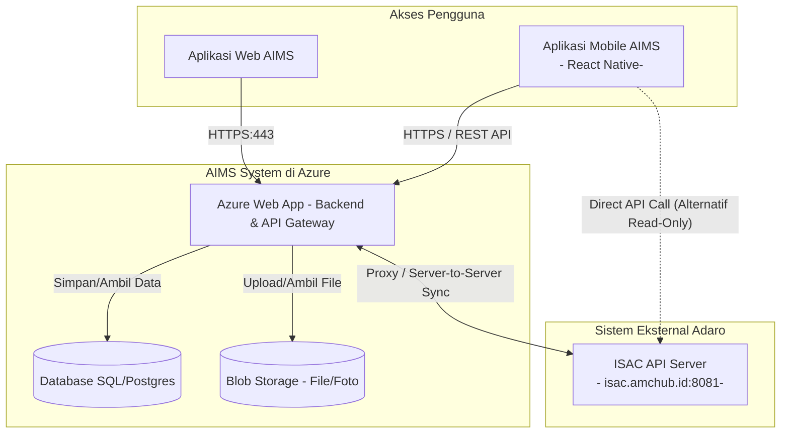
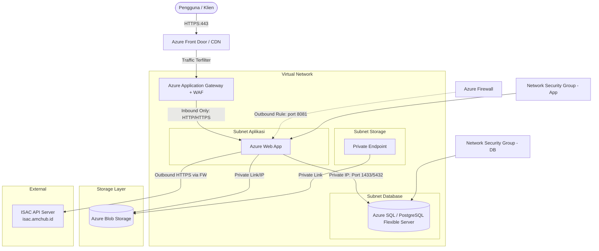
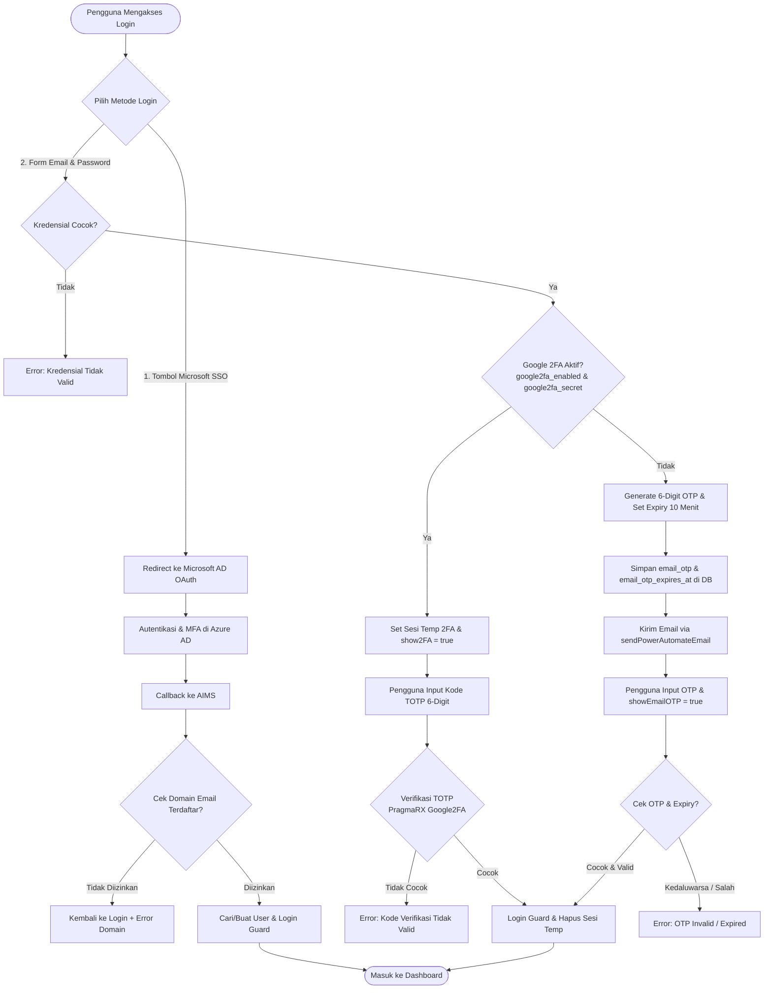
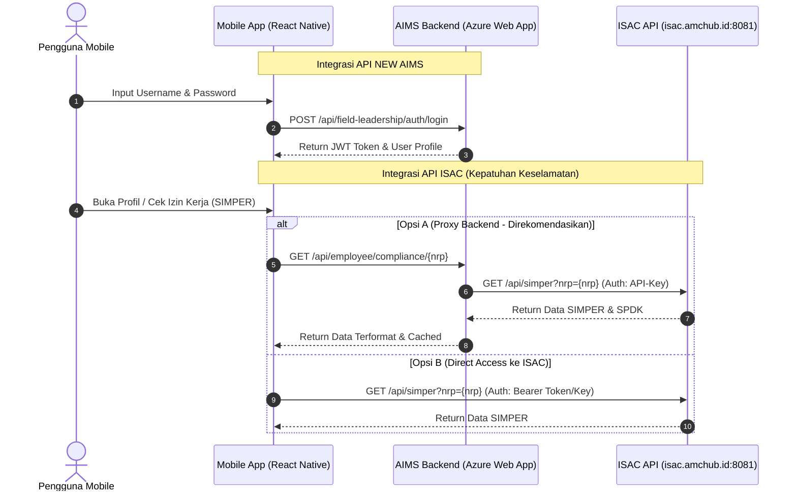

# Dokumen Arsitektur 3-Layer Azure Cloud & Sistem Autentikasi (MFA, 2FA, Email OTP)

Dokumen ini menjelaskan rancangan arsitektur sistem 3-layer yang aman di Microsoft Azure Cloud beserta mekanisme autentikasi multi-faktor (MFA/2FA) dan Email OTP.

---

### 1. Diagram Sederhana Alur Sistem & Integrasi ISAC

Berikut adalah diagram alur tingkat tinggi yang memetakan hubungan antara perangkat klien (Mobile & Web), sistem AIMS di Azure Cloud, serta integrasi eksternal ke API ISAC.

### Analisis Integrasi API ke ISAC (Mobile & Web AIMS):
1. **Pintu Gerbang API (API Gateway/Web App):**
   * Aplikasi Mobile AIMS berkomunikasi secara secure menggunakan protokol HTTPS ke **Azure Web App** untuk seluruh modul transaksional (Field Leadership, KPLH, CoE).
2. **Integrasi ISAC (Information System & Authorization Control):**
   * **Sinkronisasi Data & Validasi Kepatuhan:** Sistem mengakses data kepegawaian dan kepatuhan keselamatan (SIMPER, SPDK, SKK) dari **ISAC API** untuk memvalidasi kualifikasi pekerja secara real-time di area operasional.
   * **Dua Opsi Alur Integrasi:**
     * **Opsi A (Proxy/Server-to-Server - Direkomendasikan):** Mobile App memanggil API AIMS, kemudian backend AIMS yang melakukan request ke ISAC API. Cara ini mengamankan API key/kredensial ISAC dari sisi klien dan meminimalkan beban jaringan perangkat.
     * **Opsi B (Direct Call):** Mobile App langsung memanggil endpoint API ISAC (`http://isac.amchub.id:8081/api/*`) untuk melakukan verifikasi instan status SIMPER/SPDK di lapangan.

---

## 2. Topologi Jaringan & Infrastruktur Azure (Detail)

Arsitektur dirancang dengan prinsip *Defense in Depth* dan segmentasi jaringan yang ketat menggunakan Virtual Network (VNet).

### Detail Layer Arsitektur:

1. **Presentation & Application Layer (Layer 1):**
   * **Azure Web App:** Host aplikasi backend dan frontend. Ditempatkan di dalam *Private App Subnet* menggunakan VNet Integration sehingga tidak memiliki IP publik yang dapat diakses langsung dari internet.
   * **Azure Application Gateway (dengan Web Application Firewall - WAF):** Berfungsi sebagai pintu masuk lalu lintas HTTPS (Reverse Proxy & Load Balancer). WAF melindungi aplikasi dari serangan umum seperti SQL Injection dan Cross-Site Scripting (XSS).
   * **Azure Front Door (Opsional):** Global load balancer dan CDN di edge network untuk mempercepat pengiriman konten serta menangani proteksi DDoS di layer global.

2. **Storage Layer (Layer 2):**
   * **Azure Blob Storage:** Digunakan untuk menyimpan file statis, dokumen, gambar, dan backup.
   * **Keamanan:** Blob Storage dikonfigurasi agar menolak koneksi publik (*Public Access Disabled*). Akses dari Azure Web App hanya diperbolehkan melalui **Azure Private Endpoint** (Private Link) menggunakan IP privat dalam Virtual Network.

3. **Database Layer (Layer 3):**
   * **Azure SQL Database / Azure Database for PostgreSQL (Flexible Server):** Ditempatkan di *Private Database Subnet*.
   * **Keamanan:** Dilengkapi dengan firewall database tingkat lanjut. Port database (misal: 1433 untuk SQL Server, 5432 untuk PostgreSQL) hanya dibuka secara eksklusif untuk IP internal dari *Private App Subnet*. Akses publik sepenuhnya dinonaktifkan.

---

## 3. Keamanan Jaringan & Firewall Tambahan

Untuk meningkatkan keamanan di seluruh layer, komponen firewall berikut diimplementasikan:

* **Azure Firewall:**
  * Berfungsi sebagai firewall jaringan terkelola (Next-Generation Firewall) untuk memfilter lalu lintas keluar (*outbound traffic*) dari subnet aplikasi ke internet (misal untuk update library atau integrasi API pihak ketiga) menggunakan *FQDN filtering*.
  * **Integrasi ISAC:** Azure Firewall dikonfigurasi dengan Outbound Rule khusus yang mengizinkan lalu lintas keluar ke `isac.amchub.id` pada port `8081`.
* **Network Security Groups (NSG):**
  * Bertindak sebagai firewall virtual di tingkat subnet.
  * **NSG Subnet Aplikasi:** Hanya mengizinkan *inbound* dari Azure Application Gateway pada port aplikasi (misal: 80/443 atau 8000/9000). Semua koneksi inbound langsung lainnya diblokir.
  * **NSG Subnet Database:** Hanya mengizinkan *inbound* dari Subnet Aplikasi pada port database terkait.

---

## 4. Alur Login & Autentikasi AIMS (Analisis Codebase)

Berdasarkan implementasi kode di AIMS (`Login.php` Livewire Component & `MicrosoftSSOController.php`), berikut adalah alur proses login dan verifikasi keamanan yang berjalan di sistem:

### A. Diagram Alur Keputusan Login & Autentikasi

### B. Analisis Teknis Alur Autentikasi di Codebase AIMS

#### 1. Skenario Microsoft SSO (OAuth & Azure AD MFA)
* **Controller:** [MicrosoftSSOController.php](file:///c:/laragon/www/aims/app/Http/Controllers/Auth/MicrosoftSSOController.php)
* **Mekanisme & Proteksi:**
  1. Mengalihkan pengguna ke Microsoft login screen dengan driver Socialite Azure (`Socialite::driver('azure')->redirect()`). Azure AD menangani semua proses validasi password beserta kebijakan MFA internal perusahaan.
  2. Saat callback diterima (`callback()`), sistem melakukan **Domain Verification** berdasarkan data tabel `AzureTenant`. Hanya email dengan domain yang diizinkan (`allowed_domains`) yang dapat masuk.
  3. Setelah validasi domain lolos, sistem melakukan `User::firstOrCreate()` untuk mendaftarkan atau mencocokkan user, memperbarui `microsoft_id`, lalu melakukan `Auth::guard('web')->login()`.

#### 2. Skenario Standard Login: Google 2FA (TOTP)
* **Component:** [Login.php](file:///c:/laragon/www/aims/app/Http/Livewire/MainDashboard/Auth/Login.php)
* **Fungsi Verifikasi:** `verify2FA()`
* **Mekanisme & Proteksi:**
  1. Jika pengguna telah mengaktifkan 2FA (`google2fa_enabled` dan `google2fa_secret` tidak kosong), sistem tidak akan langsung melakukan login.
  2. Sistem menyimpan User ID sementara di dalam session (`2fa:user_id`) dan mengaktifkan flag `$show2FA = true` untuk menampilkan form input TOTP.
  3. Menggunakan library `PragmaRX\Google2FA\Google2FA`, aplikasi melakukan pengecekan `verifyKey($user->google2fa_secret, $this->totp_code)`.
  4. Jika lolos, pengguna masuk ke guard `dashboard` dan session dibersihkan.

#### 3. Skenario Standard Login: Email OTP (Fallback & Otomatis)
* **Component:** [Login.php](file:///c:/laragon/www/aims/app/Http/Livewire/MainDashboard/Auth/Login.php)
* **Fungsi Verifikasi:** `verifyEmailOTP()`
* **Mekanisme & Proteksi:**
  1. Jika Google 2FA tidak aktif, sistem secara otomatis mengalihkan alur login ke **Email OTP** sebagai pengaman cadangan.
  2. Membuat kode OTP acak 6 digit (`rand(100000, 999999)`), menyimpannya di DB (`email_otp`), dan menetapkan waktu kedaluwarsa 10 menit ke depan (`email_otp_expires_at`).
  3. Mengirimkan email OTP menggunakan template HTML [otp.blade.php](file:///c:/laragon/www/aims/resources/views/emails/otp.blade.php) via helper **`sendPowerAutomateEmail()`**.
  4. Flag `$showEmailOTP = true` diaktifkan untuk memunculkan form input OTP Email.
  5. Pada saat verifikasi, sistem memeriksa apakah waktu saat ini melebihi `email_otp_expires_at` dan mencocokkan kode. Jika valid, data OTP di DB langsung dibersihkan (`null`) untuk mencegah penggunaan ulang kode.

---

## 5. Arsitektur Integrasi API (NEW AIMS & ISAC API)

Bagian ini memetakan arsitektur integrasi API secara detail untuk aplikasi Mobile (React Native) yang terhubung ke **NEW AIMS API** (Backend internal AIMS) dan **ISAC API** (Sistem kepatuhan keselamatan Adaro).

### A. Arsitektur Komunikasi API

### B. Pemetaan Endpoint API (API Mapping)

#### 1. Endpoint NEW AIMS API
Backend utama NEW AIMS menyediakan layanan API untuk 3 modul utama pada aplikasi mobile:

| Modul | Endpoint | Method | Keterangan |
|---|---|---|---|
| **Auth** | `/api/field-leadership/auth/login` | `POST` | Autentikasi user mobile & return session token |
| **Field Leadership** | `/api/field-leadership/general/ccow` | `GET` | List data CCOW |
| | `/api/field-leadership/general/company` | `GET` | List data Perusahaan |
| | `/api/field-leadership/general/department/{id}` | `GET` | List departemen berdasarkan ID Perusahaan |
| | `/api/field-leadership/general/section/{id}` | `GET` | List seksi berdasarkan ID Departemen |
| | `/api/field-leadership/general/area-location/{id}`| `GET` | List area kerja berdasarkan seksi |
| | `/api/field-leadership/general/employee/{id}` | `GET` | List data karyawan / PJOKTT |
| | `/api/field-leadership/general/area-manager/{id}` | `GET` | List Area Manager (PJA) |
| | `/api/field-leadership/listing/document/question` | `GET` | List pertanyaan checklist safety (PTO) |
| | `/api/field-leadership/listing/create` | `POST` | Membuat laporan Field Leadership baru |
| | `/api/field-leadership/listing/edit/{id}` | `POST` | Mengedit laporan Field Leadership yang ada |
| | `/api/field-leadership/general/upload-file` | `POST` | Upload media / lampiran foto laporan |
| **KPLH** | `/api/kplh/forms` | `GET` | Mengambil template form inspeksi KPLH |
| | `/api/kplh/create` | `POST` | Submit laporan inspeksi KPLH baru |
| | `/api/kplh/inspection-lists` | `GET` | Mengambil daftar dokumen inspeksi KPLH |
| | `/api/kplh/inspection/{id}` | `GET` | Detail data inspeksi KPLH |
| | `/api/kplh/update` | `POST` | Melakukan update/tindak lanjut temuan inspeksi |
| **Calendar (CoE)** | `/api/coe/monthly-lists` | `GET` | Jumlah event harian untuk indikator kalender bulanan |
| | `/api/coe/day-lists` | `GET` | List detail kegiatan dalam satu hari |
| | `/api/coe/event-details/{id}` | `GET` | Detail detail deskripsi, kategori, & undangan event |

#### 2. Endpoint ISAC API
Aplikasi mobile/backend mengintegrasikan 4 endpoint utama ISAC untuk validasi status kelayakan kerja di lapangan secara real-time:

| Fitur | Endpoint Eksternal | Method | Fungsi Integrasi |
|---|---|---|---|
| **Biodata** | `http://isac.amchub.id:8081/api/biodata` | `GET` | Mengambil data personal karyawan (NRP, Jabatan, Departemen, Perusahaan) |
| **SIMPER** | `http://isac.amchub.id:8081/api/simper` | `GET` | Mengambil data Surat Izin Mengemudi Perusahaan (jenis unit yang boleh dioperasikan & masa berlaku) |
| **SPDK** | `http://isac.amchub.id:8081/api/spdk` | `GET` | Mengambil catatan Surat Pelanggaran Disiplin Karyawan (poin pelanggaran K3 & sanksi aktif) |
| **SKK** | `http://isac.amchub.id:8081/api/skk` | `GET` | Memverifikasi Sertifikat Kompetensi Kerja & lisensi khusus staf |

---

### C. Detail Modul AIMS Web yang Terhubung ke Mobile AIMS

Berdasarkan arsitektur codebase dan alur proses bisnis, berikut adalah detail modul dari AIMS Web yang disinkronkan dan diintegrasikan ke dalam aplikasi Mobile AIMS:

1. **Modul Autentikasi (Auth)**
   * **Fungsi**: Memverifikasi kredensial login pengguna mobile serta mengeluarkan JWT token untuk mengamankan komunikasi API berikutnya.
   * **Integrasi**: `POST /field-leadership/auth/login`.

2. **Modul Field Leadership (FL)**
   * **Fungsi**: Membantu pengawas dalam melakukan observasi keselamatan dan kepemimpinan di lapangan (meliputi program KTA/Kesiapan Tanggap Aman dan PTO/Personal Task Observation).
   * **Integrasi**: 
     * Sinkronisasi master data (Perusahaan, Departemen, Seksi, Lokasi Area, Karyawan/PJOKTT, dan PJA/Area Manager).
     * Pengambilan data checklist pertanyaan PTO/KTA (`document/question`).
     * Pengiriman laporan observasi baru (`create`), penyuntingan laporan (`edit`), dan upload bukti foto temuan lapangan.

3. **Modul KPLH (Kesehatan, Keselamatan Kerja & Lingkungan Hidup)**
   * **Fungsi**: Mengelola aktivitas inspeksi keselamatan kerja tambang secara terstruktur.
   * **Integrasi**: 
     * Form Inspeksi khusus area kerja seperti **KPLH Area Jetty**, **KPLH Area Main Tank**, **KPLH Workplace (Tempat Kerja)**, **KPLH Food Hygiene (Katering/Kantin)**, dan **Inspeksi Alat K3**.
     * Sinkronisasi formulir template dan checklist pertanyaan (`kplh/forms`).
     * Pengiriman laporan inspeksi baru (`create`), monitoring daftar dokumen inspeksi, update/tindak lanjut temuan, serta upload media dokumentasi.

4. **Modul Calendar of Events (CoE)**
   * **Fungsi**: Sinkronisasi jadwal agenda dan kegiatan korporat/divisi ke kalender perangkat mobile karyawan.
   * **Integrasi**:
     * Sinkronisasi jumlah event harian untuk indikator visual kalender bulanan (`coe/monthly-lists`).
     * Pengambilan daftar kegiatan terperinci dalam satu hari (`coe/day-lists`).
     * Pengambilan detail event lengkap meliputi kategori, deskripsi, tautan lampiran, dan daftar undangan (`coe/event-details/{id}`).

---

### D. Strategi Keamanan & Keandalan Integrasi (Reliability & Security)

1. **Pengamanan API Key / Token ISAC:**
   * Dibandingkan menyimpan credential API ISAC langsung di aplikasi React Native (yang rentan di-*reverse engineer*), komunikasi ke `isac.amchub.id` dilewatkan melalui **AIMS Web App Proxy**.
   * Backend AIMS bertindak sebagai middleware yang menyematkan token otorisasi ISAC secara aman di level server (*server-to-server*).
2. **Caching Data Kepatuhan:**
   * Mengingat area tambang seringkali mengalami kendala sinyal offline/low-signal, backend AIMS mengimplementasikan caching data SIMPER & SPDK dari ISAC di Redis/Database lokal AIMS dengan waktu kedaluwarsa (TTL) 12–24 jam.
   * Aplikasi Mobile React Native dapat menyimpan status terakhir ini secara lokal menggunakan secure storage (`AsyncStorage` terenkripsi) untuk keperluan validasi offline sementara di lapangan.
3. **Outbound Firewall Restriction:**
   * Di tingkat Azure Cloud, Azure Firewall dikonfigurasikan agar port outbound aplikasi hanya dapat mengakses domain whitelist, termasuk `isac.amchub.id:8081`. Langkah ini mencegah aplikasi melakukan kebocoran data (*data exfiltration*) ke domain lain.

