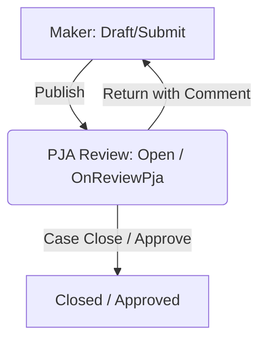
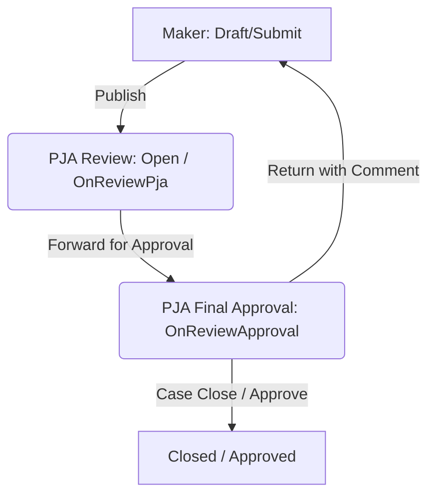

# Rencana Implementasi Teknis: Migrasi Approval Field Leadership

Dokumen ini merinci rencana untuk memindahkan tanggung jawab persetujuan akhir (final approval) dalam alur kerja **Field Leadership** dari peran **KTT/PJO** ke **Section Area Manager** (juga disebut sebagai Penanggung Jawab Area / PJA).

---

## 1. Konteks & Tujuan

Saat ini, siklus hidup dokumen Field Leadership melibatkan:
1. **Maker Submission:** Maker membuat dan mengirimkan dokumen.
2. **PJA Review (Section Area Manager):** Section Area Manager meninjau dan mengedit detail dokumen. Setelah dipublikasikan, dokumen beralih ke status `OnReviewApproval`.
3. **KTT / PJO Approval:** PJO (terhubung melalui `company.user_id`) melakukan peninjauan akhir untuk menutup/menyetujui dokumen.

**Tujuan:** Memindahkan wewenang persetujuan akhir dari KTT/PJO ke **Section Area Manager**.

---

## 2. Opsi yang Diusulkan

Kami menyajikan dua pendekatan alternatif untuk mencapai migrasi ini.

### Opsi A: Penyederhanaan Alur Kerja (Persetujuan Langsung oleh PJA)
Pada opsi ini, langkah alur kerja ketiga dieliminasi. Section Area Manager melakukan peninjauan dan langsung menyetujui (menutup) dokumen, atau menolak/mengembalikan dokumen ke Maker.



#### Keuntungan Utama:
* Alur kerja lebih sederhana dan efisien.
* Menghilangkan langkah redundan jika Section Area Manager sudah memiliki wewenang penuh untuk memverifikasi dan menutup risiko temuan.
* Menghilangkan kebutuhan akan antarmuka persetujuan KTT/PJO (`RequestReviewApprovalPage` & `DetailRequestApprovalPage`).

---

### Opsi B: Mempertahankan 3 Tahap Status Lifecycle (PJA sebagai Approver Akhir)
Siklus hidup 3 tahap dipertahankan (`Open` -> `OnReviewPja` -> `OnReviewApproval` -> `Closed`). Namun, baik tahap 2 (Review) maupun tahap 3 (Approval) ditangani oleh Section Area Manager, kemungkinan besar di antrean atau tab yang berbeda, atau oleh pengguna Section Area Manager yang berbeda.



#### Keuntungan Utama:
* Mempertahankan lencana status (status badges) yang sudah ada dan logika transisi standar.
* Memisahkan fase "peninjauan/edit" dari fase "persetujuan akhir (sign-off)".

---

## 3. Analisis Dampak & Pembaruan Komponen

Bergantung pada opsi yang dipilih, komponen-komponen berikut akan memerlukan modifikasi:

### A. Field Leadership Helper (`App\Helpers\FieldLeadershipHelper.php`)
* **Di bawah Opsi A:** Hapus penghitungan kueri KTT/PJO dan perhitungan lencana (badge) untuk antrean persetujuan.
* **Di bawah Opsi B:** Perbarui metode `totalRequestApproval` untuk melakukan kueri dengan mencocokkan `pja_id` dengan catatan `AreaManager` dari pengguna yang sedang login, bukan memeriksa `company.user_id`.

```php
// Implementasi Opsi B untuk penghitungan badge
function totalRequestApproval()
{
    $areaManager = AreaManager::where('user_id', auth()->user()->id)->get()->pluck('id');

    return FieldLeadership::where('requested', FieldLeadershipType::RequestedApproval)
        ->where('published', FieldLeadershipType::Publish)
        ->whereIn('pja_id', $areaManager)
        ->count();
}
```

### B. Controller & Listing Approval (`RequestReviewApprovalPage.php`)
* **Di bawah Opsi A:** Halaman ini beserta rutenya akan dinonaktifkan/dihapus.
* **Di bawah Opsi B:** Ubah filter kueri untuk memeriksa `whereIn('pja_id', $areaManager)` alih-alih memeriksa `company.user_id = auth()->user()->id`.

```php
// Modifikasi filter kueri di RequestReviewApprovalPage.php
$areaManager = AreaManager::where('user_id', auth()->user()->id)->get()->pluck('id');

$this->countData = FieldLeadership::whereIn('pja_id', $areaManager)
    ->where('published', FieldLeadershipType::Publish)
    ->where('status', FieldLeadershipType::OnReviewApproval)
    ->count();
```

### C. Detail Approval (`DetailRequestApprovalPage.php` / `DetailPjaPage.php`)
* **Di bawah Opsi A:** Tambahkan tombol Approval dan Return langsung ke `DetailPjaPage.php` dan tampilan blade yang bersangkutan, yang saat ini dikomentari (commented out).
* **Di bawah Opsi B:** Perbarui pemeriksaan izin di `DetailRequestApprovalPage.php` untuk memverifikasi bahwa pengguna adalah PJA (Area Manager) yang ditugaskan, bukan memeriksa `company.user_id`.

### D. Menu Sidebar (`sidebar.blade.php`)
* **Di bawah Opsi A:** Hapus item menu "Approval PJA".
* **Di bawah Opsi B:** Pertahankan item menu tersebut tetapi pastikan hanya terlihat oleh pengguna PJA yang memiliki wewenang untuk melakukan persetujuan akhir.

---

## 4. Pemisahan Kolom KTT dan PJO pada Field Leadership

### Latar Belakang

Saat ini pada form Field Leadership, field **KTT** dan **PJO** digabung menjadi **satu dropdown** dengan label `KTT/PJO`, yang nilainya diambil otomatis dari `companies.user_id` (satu user per company). Ini menyebabkan tidak bisa membedakan siapa yang berperan sebagai KTT dan siapa yang berperan sebagai PJO secara terpisah.

```
// Kondisi saat ini di create-active-field-leadership-page.blade.php
<label>KTT/PJO</label>
<select wire:model="pjo_id">
    <option value="{{ $company_type->user_id }}">  ← hanya 1 user dari company
        {{ $company_type->user->name }}
    </option>
</select>
```

**Kolom terkait di tabel `field_leaderships`:**
| Kolom | Tipe | Keterangan |
|---|---|---|
| `company_id` | FK → `companies` | Perusahaan yang diobservasi |
| `pjo_id` | FK → `users` | Saat ini menampung KTT **sekaligus** PJO |
| `ccow_id` | FK → `companies` | Perusahaan internal CCOW |

**Kolom di tabel `companies`:**
| Kolom | Keterangan |
|---|---|
| `user_id` | Satu user terhubung ke company — dipakai sebagai KTT/PJO |

> Tabel `companies` **tidak memiliki** kolom `ktt_id` terpisah untuk FieldLeadership.

---

### Pertanyaan untuk Diputuskan

> **Apakah KTT dan PJO perlu dipisahkan menjadi dua kolom/dropdown berbeda di Field Leadership?**

---

### Opsi Implementasi

#### Opsi 1: Tambah Kolom `ktt_id` Langsung di `field_leaderships` *(Rekomendasi)*

Tambah satu kolom baru `ktt_id` (FK ke `users`) di tabel `field_leaderships`, tanpa mengubah tabel `companies`. Kolom `pjo_id` yang sudah ada tetap digunakan untuk PJO.

**Perubahan Database:**
```php
// Migration baru
Schema::table('field_leaderships', function (Blueprint $table) {
    $table->foreignUuid('ktt_id')
        ->nullable()
        ->references('id')
        ->on('users')
        ->nullOnDelete()
        ->after('pjo_id');
});
```

**Perubahan Form:**
```blade
{{-- Dropdown KTT (baru) --}}
<label>KTT</label>
<x-field-leadership-select2 wire:model="ktt_id" id="ktt_id">
    {{-- list user dengan role KTT dari company terpilih --}}
</x-field-leadership-select2>

{{-- Dropdown PJO (sudah ada, dipisah) --}}
<label>PJO</label>
<x-field-leadership-select2 wire:model="pjo_id" id="pjo_id">
    {{-- list user dengan role PJO dari company terpilih --}}
</x-field-leadership-select2>
```

**Keuntungan:**
- ✅ Tidak mengubah tabel `companies` — aman untuk modul lain
- ✅ Perubahan terlokalisasi hanya di modul FieldLeadership
- ✅ Data historis `pjo_id` tetap valid

**Kekurangan:**
- ⚠️ Perlu definisi cara memilih user KTT (dari role? dari daftar semua user company?)

---

#### Opsi 2: Tambah Kolom `ktt_id` di Tabel `companies`

Tambah kolom `ktt_id` di tabel `companies` sehingga satu company bisa memiliki user KTT dan user PJO yang berbeda. Nilai kemudian diwariskan ke form Field Leadership.

**Perubahan Database:**
```php
// Migration di tabel companies
Schema::table('companies', function (Blueprint $table) {
    $table->foreignUuid('ktt_id')
        ->nullable()
        ->references('id')
        ->on('users')
        ->nullOnDelete()
        ->after('user_id');
});
```

**Keuntungan:**
- ✅ Konsisten dengan pola di modul **KPLH** yang sudah menggunakan `ktt_id`
- ✅ Satu sumber kebenaran (single source of truth) untuk KTT per company

**Kekurangan:**
- ⚠️ Mengubah tabel `companies` yang berdampak pada seluruh aplikasi
- ⚠️ Perlu migrasi data KTT yang sudah ada di modul KPLH agar konsisten

---

#### Opsi 3: Pisah Tampilan Dropdown Saja (Tanpa Ubah Database)

Tidak menambah kolom baru. Cukup memisahkan dropdown menjadi dua secara visual, namun keduanya tetap menyimpan ke kolom `pjo_id` yang sama (hanya nilai terakhir yang tersimpan), atau salah satunya disimpan ke field lain yang sudah ada.

**Keuntungan:**
- ✅ Tidak ada perubahan database sama sekali
- ✅ Paling cepat diimplementasikan

**Kekurangan:**
- ❌ Tidak benar-benar memisahkan data KTT dan PJO
- ❌ Tidak bisa melaporkan/memfilter berdasarkan KTT vs PJO secara terpisah

---

### Ringkasan Perbandingan Opsi

| | Opsi 1 | Opsi 2 | Opsi 3 |
|---|:---:|:---:|:---:|
| Ubah tabel `field_leaderships` | ✅ Ya | Tidak | Tidak |
| Ubah tabel `companies` | Tidak | ✅ Ya | Tidak |
| KTT & PJO benar-benar terpisah di DB | ✅ | ✅ | ❌ |
| Dampak ke modul lain | Minimal | Luas | Tidak ada |
| Konsisten dengan modul KPLH | Tidak | ✅ | Tidak |
| Kompleksitas implementasi | Rendah | Sedang | Sangat Rendah |

---

## 5. Langkah Selanjutnya & Permintaan Umpan Balik

Silakan tinjau seluruh opsi di atas dan berikan masukan Anda mengenai:

1. **Alur Kerja Approval (Bagian 2):** Apakah Anda lebih memilih **Opsi A** (2 langkah, PJA langsung approve) atau **Opsi B** (3 langkah, PJA review & approve)?

2. **Pemetaan Izin / Peran:** Apakah ada peran izin (permission roles) spesifik atau security guard yang perlu disesuaikan agar Section Area Manager dapat melihat kedua antrean tersebut?

3. **Pemisahan KTT & PJO (Bagian 4):** Apakah kolom KTT dan PJO perlu dipisah? Jika ya, pilih salah satu:
   - **Opsi 1** — Tambah `ktt_id` di tabel `field_leaderships` saja *(dampak minimal)*
   - **Opsi 2** — Tambah `ktt_id` di tabel `companies` *(konsisten dengan KPLH)*
   - **Opsi 3** — Pisah tampilan saja tanpa ubah database *(paling cepat, tapi tidak terpisah di data)*

4. **Sumber Data User KTT/PJO:** Jika Opsi 1 atau Opsi 2 dipilih, bagaimana cara menentukan user mana yang bisa dipilih sebagai KTT dan mana sebagai PJO? Apakah berdasarkan:
   - Role/permission tertentu di sistem?
   - Semua user yang terhubung ke company yang dipilih?
   - Input manual bebas (pilih dari semua user)?

*Catatan: Untuk pemisahan approval (Bagian 2), tidak diperlukan perubahan skema database karena kolom `pja_id` sudah tersedia. Untuk pemisahan KTT/PJO (Bagian 4), diperlukan migration baru sesuai opsi yang dipilih.*
