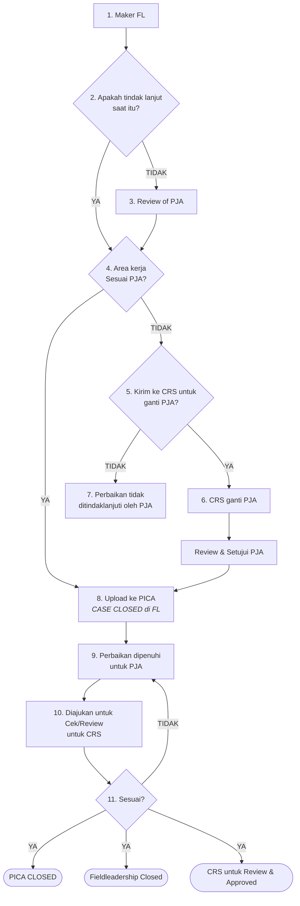

# Workflow Baru Field Leadership & Integrasi PICA

Dokumen ini menjelaskan alur kerja (*workflow*) baru untuk modul **Field Leadership (FL)** dan integrasinya dengan **PICA (Corrective Action)** berdasarkan diagram alur bisnis terbaru yang diberikan.

---

## 1. Visualisasi Diagram Alur (Mermaid.js)

Berikut adalah diagram alur proses yang digambarkan menggunakan Mermaid.js untuk mempermudah pemahaman logika sistem:

---

## 2. Penjelasan Detail Langkah Alur Kerja

### Fase 1: Observasi & Keputusan Tindak Lanjut Awal
1. **Maker FL**: Pembuat dokumen (Observer) menginput temuan observasi perilaku atau kondisi berisiko di lapangan ke dalam sistem Field Leadership.
2. **Apakah tindak lanjut saat itu?**:
   - **YA**: Jika tindakan korektif langsung dilakukan di tempat saat observasi berlangsung, alur berlanjut ke verifikasi area kerja PJA.
   - **TIDAK**: Jika tindakan korektif belum diselesaikan di tempat, dokumen akan dikirim terlebih dahulu ke **Penanggung Jawab Area (PJA)** untuk dilakukan **Review of PJA** sebelum berlanjut ke tahap berikutnya.

### Fase 2: Verifikasi Kepemilikan Area & Rute Alternatif (CRS)
3. **Area kerja Sesuai PJA?**:
   - **YA**: Jika PJA yang dipilih sesuai dengan area kerja tempat temuan terjadi, data temuan dianggap valid untuk area tersebut dan langsung diunggah ke sistem PICA (**Upload ke PICA**).
   - **TIDAK**: Jika area kerja temuan tidak sesuai dengan area tanggung jawab PJA yang bersangkutan, sistem menawarkan opsi rute koreksi.
4. **Kirim ke CRS (Corporate Relation & Safety) untuk ganti PJA?**:
   - **YA**: Dokumen diteruskan ke admin/CRS untuk dilakukan pengalihan. CRS akan menugaskan PJA yang tepat (**CRS ganti PJA**), lalu PJA baru tersebut akan melakukan **Review & Setujui PJA** sebelum temuan diunggah ke PICA.
   - **TIDAK**: Jika tidak dialihkan, temuan tersebut akan dikategorikan sebagai **Perbaikan tidak ditindaklanjuti oleh PJA** (status mandek/ditolak).

### Fase 3: Integrasi & Penyelesaian Tindakan Korektif (PICA)
5. **Upload ke PICA**: Temuan yang telah diverifikasi dan disetujui oleh PJA yang sesuai diunggah secara otomatis ke modul PICA untuk pelacakan perbaikan lebih lanjut.
6. **Perbaikan dipenuhi untuk PJA**: PJA melaksanakan perbaikan fisik/prosedural sesuai tindakan perbaikan yang ditentukan dan mengunggah bukti penyelesaian ke sistem.

### Fase 4: Penutupan & Verifikasi Akhir oleh CRS
7. **Diajukan untuk Cek/Review untuk CRS**: PJA mengajukan permohonan verifikasi atas tindakan perbaikan kepada tim CRS.
8. **Sesuai? (Verifikasi CRS)**:
   - **TIDAK**: Jika CRS menganggap perbaikan belum memadai atau bukti kurang lengkap, status akan dikembalikan ke **Perbaikan dipenuhi untuk PJA** agar diperbaiki ulang oleh PJA.
   - **YA**: Jika verifikasi lolos, sistem akan secara otomatis memicu tiga status akhir:
     - **PICA CLOSED**: Tugas tindakan korektif pada modul PICA ditutup.
     - **Fieldleadership Closed**: Dokumen sumber Field Leadership ditutup dengan sukses.
     - **CRS untuk Review & Approved**: Dokumen disetujui secara permanen oleh CRS.

---

## 3. Pemetaan Peran & Hak Akses (Access Matrix)

| Peran (Role) | Tanggung Jawab Utama dalam Alur | Aksi di Sistem |
| :--- | :--- | :--- |
| **Maker** | Mengamati lapangan dan membuat laporan awal. | - Mengisi Form Observasi FL - Menentukan apakah ada tindakan langsung |
| **PJA (Penanggung Jawab Area)** | Meninjau temuan di areanya dan melaksanakan perbaikan. | - Melakukan Review PJA - Mengunggah bukti tindakan perbaikan |
| **CRS (Corporate Relation & Safety)** | Memverifikasi seluruh alur, melakukan re-route PJA, dan menutup kasus. | - Mengubah PJA yang salah rute - Memverifikasi tindakan perbaikan PJA (Approve/Reject) |
