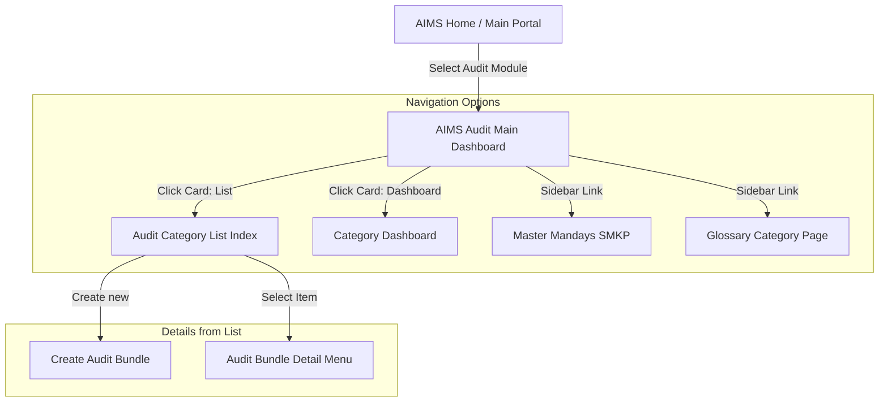

# 📊 AIMS — Audit Dashboard Workflow Documentation

This document describes the workflow, structure, and navigation flows originating from the main **AIMS Audit Dashboard**.

---

## 1. Dashboard Overview

The **AIMS Audit Dashboard** serves as the landing gateway and control center for the Audit Module. It categorizes audits into five standards (SMKP, SMK3, ISO 45001, ISO 9001, ISO 14001) and directs users to listing pages, category-specific analytical dashboards, master data settings, and glossaries.



---

## 2. Main Dashboard Layout & Interactions

The main dashboard page renders summary metrics card panels for each audit category containing:
*   **Total Counts**: Number of audits matching the category.
*   **List Button**: Routes directly to the listing page for that category.
*   **Dashboard Button**: Routes to detailed analytical charts for that category.

| Category Card | List Route | Dashboard Route |
| :--- | :--- | :--- |
| **SMKP** | `audit::smkp.index` | `audit::smkp.dashboard` |
| **SMK3** | `audit::smk3.index` | `audit::smk3.dashboard` |
| **ISO 45001** | `audit::iso45001.index` | `audit::iso45001.dashboard` |
| **ISO 9001** | `audit::iso9001.index` | `audit::iso9001.dashboard` |
| **ISO 14001** | `audit::iso14001.index` | `audit::iso14001.dashboard` |

---

## 3. Sidebar Navigation Flow

The sidebar layout (`livewire.layouts.sidebar`) is persistent across the module, exposing all modules and submenus:

```
├── Home AIMS (Public Portal Dashboard)
├── Dashboard (Audit Main Dashboard Index)
├── SMKP
│   ├── List
│   ├── Dashboard (Category Metrics)
│   └── Master Mandays (Only if user has 'Audit - Master Mandays' permission)
├── SMK3
│   ├── List
│   └── Dashboard
├── ISO 45001
│   ├── List
│   └── Dashboard
├── ISO 9001
│   ├── List
│   └── Dashboard
├── ISO 14001
│   ├── List
│   └── Dashboard
└── GLOSSARY (Category-wise document library)
    ├── SMKP
    ├── SMK3
    ├── ISO45001
    ├── ISO14001
    └── ISO9001
```

---

## 4. Category-Specific Analytical Dashboards

When clicking **Dashboard** on a category card or sidebar, the application renders a specialized page with graphical analytics powered by livewire chart components:

### Available Charts & Graphs:
1.  **Audit counts by Year**: Displays a vertical bar chart representing the volume of audits over the past 5 years.
2.  **Audit CCOW**: Displays internal company audits for the current year.
3.  **Audit Perusahaan (External)**: Displays external vendor audits for the current year.
4.  **Audit Percentage Points**: Compares points completed versus targets across different audits.
5.  **Audit Status**: Tracks the count of audits categorized by workflow statuses (`Draft`, `Submitted`, etc.).
