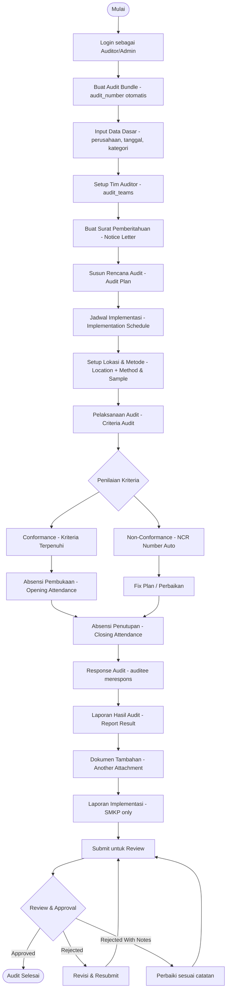
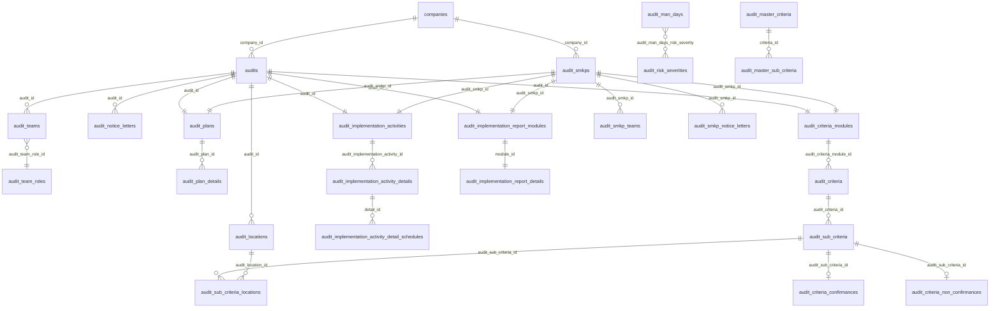
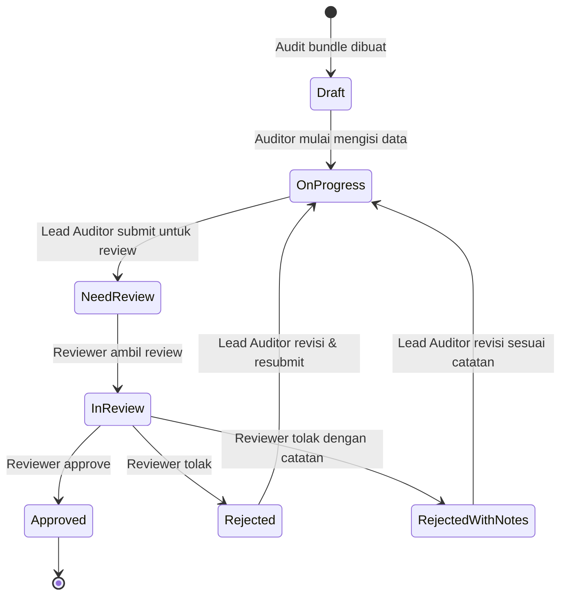
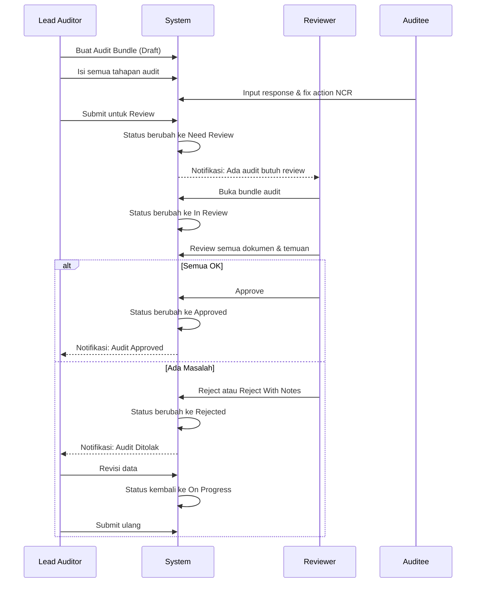

# 📋 AIMS — Audit Module Documentation

> **Modul**: Audit  
> **Versi**: 1.0  
> **Tanggal**: 2026-06-20  
> **Scope Kategori Audit**: SMKP · SMK3 · ISO 45001 · ISO 9001 · ISO 14001

---

## 1. Ringkasan Modul

Modul **Audit** adalah sistem manajemen audit keselamatan dan standar mutu berbasis web (Laravel + Livewire). Modul ini mendukung lima kategori audit regulasi Indonesia dan internasional:

| Kode | Nama Lengkap |
|------|-------------|
| **SMKP** | Sistem Manajemen Keselamatan Pertambangan |
| **SMK3** | Sistem Manajemen Keselamatan & Kesehatan Kerja |
| **ISO 45001** | Occupational Health & Safety Management System |
| **ISO 9001** | Quality Management System |
| **ISO 14001** | Environmental Management System |

Setiap kategori mengikuti alur proses yang sama namun memiliki kriteria dan sub-kriteria penilaian yang berbeda sesuai standar masing-masing.

---

## 2. Workflow Proses Audit

### 2.1 Alur Utama (Main Flow)



### 2.2 Detail Tahapan

#### **Tahap 1 — Inisiasi Audit (Bundle Creation)**
- User memilih kategori audit (SMKP/SMK3/ISO 45001/ISO 9001/ISO 14001)
- Sistem auto-generate `audit_number` dengan format: `[CATEGORY]-[COMPANY_CODE]-[YEAR]-[SEQUENCE]`
  - SMKP: `SMKP-{company}-{year}-001`
  - Lainnya: `{CATEGORY}-{company}-{year}-001`
- Status awal: `Draft`
- Input: company_id, tanggal mulai/akhir, kategori audit

#### **Tahap 2 — Setup Tim**
- Tambah anggota tim auditor dari daftar user
- Assign peran (Lead Auditor, Auditor, Observer) via `audit_team_roles`
- Setiap member ter-link ke `audit_teams` atau `audit_smkp_teams`

#### **Tahap 3 — Surat Pemberitahuan (Notice Letter)**
- Upload dokumen surat pemberitahuan audit (PDF/file)
- Support multiple notice letter per audit

#### **Tahap 4 — Rencana Audit (Audit Plan)**
- Buat rencana audit dengan detail jadwal
- `audit_plan` → `audit_plan_details`

#### **Tahap 5 — Jadwal Implementasi (Implementation Schedule)**
- Setup jadwal harian pelaksanaan audit
- `audit_implementation_activities` → `audit_implementation_activity_details` → `audit_implementation_activity_detail_schedules`
- Setiap jadwal dikaitkan ke auditor (schedule_team) dan sub-kriteria yang diaudit (schedule_sub_criteria)

#### **Tahap 6 — Lokasi & Metode (SMKP)**
- Input lokasi-lokasi yang akan diaudit (`audit_locations`)
- Setup metode sampling per sub-kriteria (`audit_sub_criteria_sample_methods`)

#### **Tahap 7 — Penilaian Kriteria (Criteria Audit)**
- Auditor menilai setiap kriteria dan sub-kriteria
- `audit_criteria_modules` → `audit_criteria` → `audit_sub_criteria`
- Untuk SMKP: ada penilaian per-lokasi (`audit_sub_criteria_locations`)
- Hasil penilaian:
  - **Conformance**: sub-kriteria dinilai sesuai → `audit_criteria_confirmances`
  - **Non-Conformance**: sub-kriteria tidak sesuai → `audit_criteria_non_confirmances` (auto NCR number: `NCR-{year}-{category}-001`)

#### **Tahap 8 — Tindak Lanjut NCR**
- Fix Plan: auditor merekomendasikan perbaikan
- Auditee merespons rencana perbaikan dengan bukti dan root cause investigation
- Tracking via `audit_sub_criteria_locations.fix_action`, `.root_cause_investigation`, `.due_date`

#### **Tahap 9 — Absensi**
- Opening Attendance: absensi rapat pembuka audit
- Closing Attendance: absensi rapat penutupan audit

#### **Tahap 10 — Response & Laporan**
- Response Audit: tanggapan auditee terhadap temuan
- Report Result: upload laporan hasil akhir
- Another Attachment: lampiran tambahan

#### **Tahap 11 — Laporan Implementasi (SMKP Only)**
- Laporan komprehensif dengan perhitungan man-days
- Safety performance, adjustment factor, eligibility
- Auto-calculate berdasarkan `audit_man_days` dan `audit_risk_severities`

#### **Tahap 12 — Approval**
- Supervisor/Admin melakukan review
- Status berubah: Draft → On Progress → Need Review → In Review → Approved/Rejected

---

## 3. ERD Database

### 3.1 Deskripsi Tabel

#### **Tabel Inti Audit**

| Tabel | Deskripsi | Kolom Penting |
|-------|-----------|---------------|
| `audits` | Header audit untuk SMK3/ISO | `id`, `audit_number`, `audit_category`, `company_id`, `start_date`, `end_date`, `status` |
| `audit_smkps` | Header audit khusus SMKP | `id`, `audit_number`, `company_id`, `start_date`, `end_date`, `status` |
| `audit_categories` | Master kategori audit | `id`, `name`, `code` |
| `audit_team_roles` | Peran anggota tim | `id`, `name` (Lead Auditor, Auditor, Observer) |
| `audit_teams` | Tim audit (SMK3/ISO) | `id`, `audit_id`, `user_id`, `audit_team_role_id` |
| `audit_smkp_teams` | Tim audit SMKP | `id`, `audit_smkp_id`, `user_id`, `audit_team_role_id` |
| `audit_evaluators` | Evaluator audit | `id`, `audit_id`, `audit_smkp_id`, `user_id` |

#### **Tabel Surat & Jadwal**

| Tabel | Deskripsi | Kolom Penting |
|-------|-----------|---------------|
| `audit_notice_letters` | Surat pemberitahuan (SMK3/ISO) | `id`, `audit_id`, `file_path`, `date` |
| `audit_smkp_notice_letters` | Surat pemberitahuan SMKP | `id`, `audit_smkp_id`, `file_path`, `date` |
| `audit_plans` | Rencana audit | `id`, `audit_id`, `audit_smkp_id` |
| `audit_plan_details` | Detail rencana audit | `id`, `audit_plan_id`, `activity`, `date`, `pic` |
| `audit_implementation_activities` | Container jadwal implementasi | `id`, `audit_id`, `audit_smkp_id` |
| `audit_implementation_activity_details` | Jadwal per hari | `id`, `audit_implementation_activity_id`, `date` |
| `audit_implementation_activity_detail_schedules` | Slot waktu per hari | `id`, `audit_implementation_activity_detail_id`, `start_time`, `end_time`, `location` |
| `audit_implementation_activity_schedule_team` | Pivot: jadwal ↔ tim | `audit_implementation_activity_detail_schedule_id`, `audit_team_id` |
| `audit_implementation_activity_schedule_sub_criteria` | Pivot: jadwal ↔ sub-kriteria | `audit_implementation_activity_detail_schedule_id`, `audit_sub_criteria_id` |

#### **Tabel Master Kriteria**

| Tabel | Deskripsi | Kolom Penting |
|-------|-----------|---------------|
| `audit_master_criteria` | Master kriteria standar | `id`, `name`, `code`, `category`, `element_value` |
| `audit_master_sub_criteria` | Master sub-kriteria | `id`, `audit_master_criteria_id`, `parent_id`, `name`, `code`, `weight` |
| `audit_master_sub_criteria_points` | Poin penilaian master | `id`, `audit_master_sub_criteria_id`, `point`, `description` |

#### **Tabel Kriteria Audit (Per Bundle)**

| Tabel | Deskripsi | Kolom Penting |
|-------|-----------|---------------|
| `audit_criteria_modules` | Wrapper kriteria per audit | `id`, `audit_id`, `audit_smkp_id` |
| `audit_criteria` | Kriteria yang dinilai | `id`, `audit_criteria_module_id`, `name`, `code` |
| `audit_sub_criteria` | Sub-kriteria | `id`, `audit_criteria_id`, `parent_id`, `name`, `code`, `weight`, `excluded`, `is_critical` |
| `audit_sub_criteria_points` | Poin sub-kriteria | `id`, `audit_sub_criteria_id`, `point`, `description` |
| `audit_sub_criteria_sample_methods` | Pivot: sub-kriteria ↔ metode | `audit_sub_criteria_id`, `audit_method_id`, `sample` |
| `audit_methods` | Metode audit (interview/observasi/dll) | `id`, `name` |
| `audit_criteria_confirmances` | Hasil: kriteria sesuai | `id`, `audit_sub_criteria_id`, `audit_team_id`, `notes`, `evidence` |
| `audit_criteria_non_confirmances` | Hasil: kriteria tidak sesuai | `id`, `audit_sub_criteria_id`, `audit_team_id`, `non_confirmance_number`, `description`, `category`, `due_date` |

#### **Tabel Lokasi (SMKP)**

| Tabel | Deskripsi | Kolom Penting |
|-------|-----------|---------------|
| `audit_locations` | Lokasi-lokasi diaudit | `id`, `audit_id`, `name`, `description` |
| `audit_sub_criteria_locations` | Penilaian per lokasi | `id`, `audit_location_id`, `audit_sub_criteria_id`, `point`, `status`, `is_critical`, `fix_recommendation`, `root_cause_investigation`, `fix_action`, `due_date`, `auditee`, `proof` |

#### **Tabel Dokumen & Laporan**

| Tabel | Deskripsi | Kolom Penting |
|-------|-----------|---------------|
| `audit_opening_attendances` | Daftar hadir pembukaan | `id`, `audit_id`, `audit_smkp_id`, `file_path`, `date` |
| `audit_closing_attendances` | Daftar hadir penutupan | `id`, `audit_id`, `audit_smkp_id`, `file_path`, `date` |
| `audit_response_audits` | Respons auditee | `id`, `audit_id`, `audit_smkp_id`, `file_path`, `date` |
| `audit_report_results` | Laporan hasil audit | `id`, `audit_id`, `audit_smkp_id`, `file_path`, `date` |
| `audit_another_attachments` | Lampiran tambahan | `id`, `audit_id`, `audit_smkp_id`, `file_path`, `title` |
| `audit_glossaries` | Glosarium audit | `id`, `title`, `description`, `category`, `file_path` |

#### **Tabel Laporan Implementasi (SMKP)**

| Tabel | Deskripsi |
|-------|-----------|
| `audit_implementation_report_modules` | Container laporan implementasi |
| `audit_implementation_report_details` | Detail laporan (man-power, man-days, total auditor, risk severity) |
| `audit_implementation_report_detail_auditors` | Daftar auditor dalam laporan |
| `audit_implementation_report_detail_risk_of_presents` | Risiko saat ini |
| `audit_implementation_report_detail_risk_of_futures` | Risiko ke depan |
| `audit_implementation_report_detail_trend_locations` | Tren per lokasi |
| `audit_implementation_report_detail_trend_activities` | Tren per aktivitas |
| `audit_implementation_report_detail_trend_positions` | Tren per jabatan |
| `audit_implementation_report_detail_trend_deviations` | Tren deviasi |
| `audit_implementation_report_detail_trend_factors_causings` | Faktor penyebab tren |
| `audit_implementation_report_detail_mining_equipment_works` | Pekerjaan peralatan tambang |
| `audit_implementation_report_detail_key_leading_indicators` | KLI (Key Leading Indicators) |
| `audit_implementation_report_detail_trend_factors` | Faktor tren |
| `audit_implementation_report_detail_stakeholders` | Pemangku kepentingan |
| `audit_implementation_report_detail_complementary_documents` | Dokumen pelengkap |

#### **Tabel Master Man-Days & Risiko**

| Tabel | Deskripsi | Kolom Penting |
|-------|-----------|---------------|
| `audit_risk_severities` | Tingkat keparahan risiko | `id`, `name`, `code` |
| `audit_man_days` | Tabel man-days berdasarkan jumlah orang | `id`, `minimum_people`, `maximum_people` |
| `audit_man_days_risk_severity` | Pivot: man-days ↔ risk severity | `audit_man_days_id`, `audit_risk_severity_id`, `value` |
| `audit_master_safety_performances` | Master safety performance | `id`, `name` |
| `audit_master_adjustment_factors` | Master adjustment factor | `id`, `name` |
| `audit_master_eligibilities` | Master eligibility | `id`, `name` |

### 3.2 Relasi Utama (ERD Summary)



---

## 4. Struktur Folder Module

```
Modules/Audit/
├── Config/
│   └── config.php                        # Konfigurasi module (auth guard, dll)
│
├── Console/                              # Artisan commands
│
├── Database/
│   ├── factories/                        # Model factories untuk testing
│   ├── Migrations/                       # 96+ file migrasi database
│   │   ├── 2023_05_22_*.php             # Tabel master & SMKP awal
│   │   ├── 2023_08_20_*.php             # Tabel audit umum (SMK3/ISO)
│   │   ├── 2023_09_*.php               # Modifikasi & tambahan
│   │   ├── 2023_12_*.php               # Tabel laporan implementasi (14 tabel)
│   │   └── 2024_*.php                  # Tabel lokasi & sub-kriteria
│   └── Seeders/
│
├── Entities/                            # Eloquent Models (55 model)
│   ├── [Core Audit]
│   │   ├── Audit.php                   # Model audit SMK3/ISO
│   │   ├── AuditSmkp.php              # Model audit SMKP
│   │   └── AuditCategory.php
│   ├── [Team]
│   │   ├── AuditTeam.php
│   │   ├── AuditSmkpTeam.php
│   │   ├── AuditTeamRole.php
│   │   └── AuditEvaluator.php
│   ├── [Documents]
│   │   ├── AuditNoticeLetter.php
│   │   ├── AuditSmkpNoticeLetter.php
│   │   ├── AuditOpeningAttendance.php
│   │   ├── AuditClosingAttendance.php
│   │   ├── AuditResponseAudit.php
│   │   ├── AuditReportResult.php
│   │   └── AuditAnotherAttachment.php
│   ├── [Plan & Schedule]
│   │   ├── AuditPlan.php
│   │   ├── AuditPlanDetail.php
│   │   ├── AuditImplementationActivity.php
│   │   ├── AuditImplementationActivityDetail.php
│   │   └── AuditImplementationActivityDetailSchedule.php
│   ├── [Criteria]
│   │   ├── AuditCriteriaModule.php
│   │   ├── AuditCriteria.php
│   │   ├── AuditSubCriteria.php
│   │   ├── AuditSubCriteriaPoint.php
│   │   ├── AuditSubCriteriaSampleMethod.php
│   │   ├── AuditMethod.php
│   │   ├── AuditCriteriaConfirmance.php
│   │   └── AuditCriteriaNonConfirmance.php
│   ├── [Location - SMKP]
│   │   ├── AuditLocation.php
│   │   └── AuditSubCriteriaLocation.php
│   ├── [Implementation Report - SMKP]
│   │   ├── AuditImplementationReportModule.php
│   │   ├── AuditImplementationReportDetail.php
│   │   └── AuditImplementationReportDetail*.php (13 sub-entity)
│   ├── [Master Data]
│   │   ├── AuditMasterCriteria.php
│   │   ├── AuditMasterSubCriteria.php
│   │   ├── AuditMasterSubCriteriaPoint.php
│   │   ├── AuditMasterSafetyPerformance.php
│   │   ├── AuditMasterAdjustmentFactor.php
│   │   ├── AuditMasterEligibility.php
│   │   ├── AuditRiskSeverity.php
│   │   ├── AuditManDays.php
│   │   └── AuditManDaysRiskSeverity.php
│   └── AuditGlossary.php
│
├── Enums/
│   ├── AuditCategory.php               # SMKP | SMK3 | ISO45001 | ISO9001 | ISO14001
│   ├── AuditMethod.php                 # Metode sampling
│   ├── AuditSmk3Level.php             # Level penilaian SMK3
│   ├── AuditType.php                   # Internal / Eksternal
│   ├── BundleStatusEnum.php            # Draft → Approved workflow status
│   └── ScheduleActivityType.php        # Tipe aktivitas jadwal
│
├── Http/
│   ├── Controllers/                    # Download controllers (PDF/file)
│   │   ├── AnotherAttachmentController.php
│   │   ├── ClosingAttendanceController.php
│   │   ├── GlossaryController.php
│   │   ├── NoticeLetterController.php
│   │   ├── OpeningAttendanceController.php
│   │   ├── ReportResultController.php
│   │   └── ResponseAuditController.php
│   │
│   ├── Livewire/
│   │   ├── Auth/Login.php
│   │   ├── Dashboard/Index.php
│   │   ├── MasterData/Manday/{Index, Create, Edit}.php
│   │   │
│   │   ├── Smkp/                       # 18 sections SMKP
│   │   │   ├── Bundle/{Index, Create, Detail}
│   │   │   ├── Dashboard/Index
│   │   │   ├── Location/Index
│   │   │   ├── NoticeLetter/Index
│   │   │   ├── Plan/Index
│   │   │   ├── ImplementationReport/Index
│   │   │   ├── ImplementationSchedule/Index
│   │   │   ├── MethodAndSample/{Index, Detail}
│   │   │   ├── CriteriaAudit/{Index, Detail}
│   │   │   ├── ConfirmanceCriteriaAudit/{Index, Export}
│   │   │   ├── NonConfirmanceCriteriaAudit/{Index, Detail, FixPlan}
│   │   │   ├── FixRecomendationAudit/Index
│   │   │   ├── OpeningAttendance/Index
│   │   │   ├── ClosingAttendance/Index
│   │   │   ├── ResponseAudit/Index
│   │   │   ├── ReportResult/Index
│   │   │   ├── AnotherAttachment/Index
│   │   │   └── Glossary/Index
│   │   │
│   │   ├── Iso45001/                   # 16 sections (sama dengan SMKP minus ImplementationReport & Location)
│   │   ├── Smk3/                       # 16 sections
│   │   ├── Iso9001/                    # 16 sections
│   │   └── Iso14001/                   # 16 sections
│   │
│   ├── Middleware/
│   └── Requests/
│
├── Providers/
│   ├── AuditServiceProvider.php
│   └── RouteServiceProvider.php
│
├── Resources/views/livewire/           # Blade templates
├── Routes/
│   ├── web.php                         # 481 baris routes
│   └── api.php
├── Tests/
├── module.json
├── composer.json
└── vite.config.js
```

---

## 5. Matrix User Permission

### 5.1 Definisi Role

| Role | Kode | Deskripsi |
|------|------|-----------|
| **Super Admin** | `SA` | Admin sistem, akses penuh semua fitur |
| **Admin Audit** | `AA` | Admin modul audit, kelola semua data audit |
| **Lead Auditor** | `LA` | Ketua tim auditor, bisa membuat & submit bundle |
| **Auditor** | `AU` | Anggota tim auditor, isi penilaian kriteria |
| **Auditee** | `AE` | Pihak yang diaudit, merespons temuan NCR |
| **Reviewer / Supervisor** | `RV` | Mereview dan approve/reject hasil audit |
| **Viewer / Read-Only** | `VW` | Hanya lihat dashboard & laporan |

### 5.2 Matrix Permission Per Fitur

#### Manajemen Bundle Audit

| Fitur | SA | AA | LA | AU | AE | RV | VW |
|-------|:--:|:--:|:--:|:--:|:--:|:--:|:--:|
| Lihat daftar audit | ✅ | ✅ | ✅ | ✅ | ✅ | ✅ | ✅ |
| Buat audit baru | ✅ | ✅ | ✅ | ❌ | ❌ | ❌ | ❌ |
| Lihat detail audit | ✅ | ✅ | ✅ | ✅ | ✅ | ✅ | ✅ |
| Edit header audit | ✅ | ✅ | ✅ | ❌ | ❌ | ❌ | ❌ |
| Hapus audit | ✅ | ✅ | ❌ | ❌ | ❌ | ❌ | ❌ |
| Submit untuk review | ✅ | ✅ | ✅ | ❌ | ❌ | ❌ | ❌ |

#### Tim Audit

| Fitur | SA | AA | LA | AU | AE | RV | VW |
|-------|:--:|:--:|:--:|:--:|:--:|:--:|:--:|
| Tambah/hapus anggota tim | ✅ | ✅ | ✅ | ❌ | ❌ | ❌ | ❌ |
| Ganti peran anggota | ✅ | ✅ | ✅ | ❌ | ❌ | ❌ | ❌ |
| Lihat daftar tim | ✅ | ✅ | ✅ | ✅ | ✅ | ✅ | ✅ |

#### Surat Pemberitahuan, Rencana & Jadwal

| Fitur | SA | AA | LA | AU | AE | RV | VW |
|-------|:--:|:--:|:--:|:--:|:--:|:--:|:--:|
| Upload/hapus notice letter | ✅ | ✅ | ✅ | ❌ | ❌ | ❌ | ❌ |
| Buat/edit audit plan | ✅ | ✅ | ✅ | ❌ | ❌ | ❌ | ❌ |
| Buat/edit implementation schedule | ✅ | ✅ | ✅ | ❌ | ❌ | ❌ | ❌ |
| Download/export dokumen | ✅ | ✅ | ✅ | ✅ | ❌ | ✅ | ✅ |

#### Penilaian Kriteria (Criteria Audit)

| Fitur | SA | AA | LA | AU | AE | RV | VW |
|-------|:--:|:--:|:--:|:--:|:--:|:--:|:--:|
| Input conformance | ✅ | ✅ | ✅ | ✅ | ❌ | ❌ | ❌ |
| Input non-conformance | ✅ | ✅ | ✅ | ✅ | ❌ | ❌ | ❌ |
| Edit penilaian kriteria | ✅ | ✅ | ✅ | ✅ | ❌ | ❌ | ❌ |
| Export kriteria (PDF/XLS) | ✅ | ✅ | ✅ | ✅ | ❌ | ✅ | ✅ |
| Lihat penilaian | ✅ | ✅ | ✅ | ✅ | ✅ | ✅ | ✅ |

#### NCR & Fix Recommendation

| Fitur | SA | AA | LA | AU | AE | RV | VW |
|-------|:--:|:--:|:--:|:--:|:--:|:--:|:--:|
| Lihat daftar NCR | ✅ | ✅ | ✅ | ✅ | ✅ | ✅ | ✅ |
| Input fix recommendation | ✅ | ✅ | ✅ | ✅ | ❌ | ❌ | ❌ |
| Input root cause & fix action | ✅ | ✅ | ✅ | ✅ | ✅ | ❌ | ❌ |
| Update status NCR | ✅ | ✅ | ✅ | ❌ | ❌ | ✅ | ❌ |
| Export NCR (PDF/Word) | ✅ | ✅ | ✅ | ✅ | ❌ | ✅ | ✅ |

#### Dokumen Absensi & Laporan

| Fitur | SA | AA | LA | AU | AE | RV | VW |
|-------|:--:|:--:|:--:|:--:|:--:|:--:|:--:|
| Upload opening/closing attendance | ✅ | ✅ | ✅ | ❌ | ❌ | ❌ | ❌ |
| Upload response audit | ✅ | ✅ | ✅ | ❌ | ✅ | ❌ | ❌ |
| Upload report result | ✅ | ✅ | ✅ | ❌ | ❌ | ❌ | ❌ |
| Upload lampiran tambahan | ✅ | ✅ | ✅ | ✅ | ❌ | ❌ | ❌ |
| Download semua dokumen | ✅ | ✅ | ✅ | ✅ | ✅ | ✅ | ✅ |

#### Laporan Implementasi (SMKP)

| Fitur | SA | AA | LA | AU | AE | RV | VW |
|-------|:--:|:--:|:--:|:--:|:--:|:--:|:--:|
| Input detail laporan implementasi | ✅ | ✅ | ✅ | ❌ | ❌ | ❌ | ❌ |
| Edit data man-days report | ✅ | ✅ | ✅ | ❌ | ❌ | ❌ | ❌ |
| Export laporan (Word) | ✅ | ✅ | ✅ | ✅ | ❌ | ✅ | ✅ |

#### Master Data & Dashboard

| Fitur | SA | AA | LA | AU | AE | RV | VW |
|-------|:--:|:--:|:--:|:--:|:--:|:--:|:--:|
| Kelola master man-days | ✅ | ✅ | ❌ | ❌ | ❌ | ❌ | ❌ |
| Kelola glosarium | ✅ | ✅ | ✅ | ❌ | ❌ | ❌ | ❌ |
| Lihat glosarium | ✅ | ✅ | ✅ | ✅ | ✅ | ✅ | ✅ |
| Dashboard per kategori audit | ✅ | ✅ | ✅ | ✅ | ❌ | ✅ | ✅ |
| Statistik NCR & Conformance | ✅ | ✅ | ✅ | ✅ | ❌ | ✅ | ✅ |

### 5.3 Akun Pengguna Dummy untuk Simulasi

Untuk kebutuhan simulasi aliran proses dan hak akses (*permission*), akun pengguna dummy berikut telah disediakan dengan password default `password`:

| Email | Nama User | Role | Deskripsi Akses |
| :--- | :--- | :--- | :--- |
| `audit.superadmin@alamtri.com` | Audit Super Admin | Audit - Super Admin | Hak akses penuh sistem & master mandays |
| `audit.admin@alamtri.com` | Audit Admin | Audit - Admin | Hak akses penuh pengelolaan modul audit |
| `audit.lead@alamtri.com` | Audit Lead Auditor | Audit - Lead Auditor | Mengisi kriteria, submit bundle review, & tim |
| `audit.auditor@alamtri.com` | Audit Auditor | Audit - Auditor | Mengisi penilaian kriteria & rekomendasi |
| `audit.auditee@alamtri.com` | Audit Auditee | Audit - Auditee | Menginput tanggapan & tindakan perbaikan NCR |
| `audit.reviewer@alamtri.com` | Audit Reviewer | Audit - Reviewer | Melakukan review & menyetujui/menolak hasil audit |
| `audit.viewer@alamtri.com` | Audit Viewer | Audit - Viewer | Hak akses baca-saja (*read-only*) laporan & dashboard |

---

## 6. Flow Approval

### 6.1 Status Lifecycle (BundleStatusEnum)



### 6.2 Detail Transisi Status

| Dari Status | Ke Status | Aktor | Kondisi |
|-------------|-----------|-------|---------|
| — | **Draft** | Lead Auditor / Admin | Bundle baru dibuat |
| Draft | **On Progress** | Lead Auditor | Mulai mengisi data audit |
| On Progress | **Need Review** | Lead Auditor | Semua tahapan terisi, submit |
| Need Review | **In Review** | Reviewer | Reviewer membuka & memulai review |
| In Review | **Approved** | Reviewer | Semua temuan valid, audit selesai |
| In Review | **Rejected** | Reviewer | Data tidak valid, harus diulang |
| In Review | **Rejected With Notes** | Reviewer | Ada catatan perbaikan spesifik |
| Rejected | **On Progress** | Lead Auditor | Revisi dan lanjutkan |
| Rejected With Notes | **On Progress** | Lead Auditor | Revisi sesuai catatan reviewer |

### 6.3 Checklist Sebelum Submit Review

Sebelum Lead Auditor bisa submit ke status **Need Review**:

- [ ] Data header audit lengkap (tanggal, perusahaan, kategori)
- [ ] Tim auditor sudah diisi (minimal 1 Lead Auditor)
- [ ] Surat pemberitahuan sudah diupload
- [ ] Rencana audit sudah dibuat
- [ ] Jadwal implementasi sudah disusun
- [ ] Semua kriteria sudah dinilai (conformance / non-conformance)
- [ ] NCR yang ada sudah ada fix recommendation
- [ ] Opening attendance sudah diupload
- [ ] Closing attendance sudah diupload
- [ ] Response audit sudah diupload
- [ ] Laporan hasil audit sudah diupload

### 6.4 Flow Approval (Sequence)



---

## 7. Export & Dokumen Output

| Dokumen Output | Format | Tersedia di |
|----------------|--------|-------------|
| Jadwal Implementasi | Word (.docx) | Semua kategori |
| Laporan Conformance | PDF, Word | Semua kategori |
| Laporan Non-Conformance | PDF, Word | Semua kategori |
| Fix Plan NCR | PDF, Word | Semua kategori |
| Detail NCR Individual | PDF | Semua kategori |
| Fix Recommendation Summary | PDF, Word | Semua kategori |
| Laporan Implementasi | Word | SMKP only |
| Kriteria Audit | PDF, XLS | SMKP only |

---

## 8. Auto-Generate Numbering

| Dokumen | Format | Contoh |
|---------|--------|--------|
| Audit Number (SMK3/ISO) | `{CATEGORY}-{COMPANY}-{YEAR}-{SEQ}` | `SMK3-PTX-2026-001` |
| Audit Number (SMKP) | `SMKP-{COMPANY}-{YEAR}-{SEQ}` | `SMKP-PTX-2026-001` |
| NCR Number | `NCR-{YEAR}-{CATEGORY}-{SEQ}` | `NCR-2026-SMKP-001` |

> Semua penomoran di-reset jika prefix berubah (tahun atau perusahaan berganti).

---

## 9. Referensi File Kode Utama

| Komponen | File |
|----------|------|
| Model Audit (SMK3/ISO) | [`Audit.php`](file:///c:/laragon/www/aims/Modules/Audit/Entities/Audit.php) |
| Model Audit SMKP | [`AuditSmkp.php`](file:///c:/laragon/www/aims/Modules/Audit/Entities/AuditSmkp.php) |
| Status Enum | [`BundleStatusEnum.php`](file:///c:/laragon/www/aims/Modules/Audit/Enums/BundleStatusEnum.php) |
| Kategori Enum | [`AuditCategory.php`](file:///c:/laragon/www/aims/Modules/Audit/Enums/AuditCategory.php) |
| Web Routes | [`web.php`](file:///c:/laragon/www/aims/Modules/Audit/Routes/web.php) |
| Model NCR | [`AuditCriteriaNonConfirmance.php`](file:///c:/laragon/www/aims/Modules/Audit/Entities/AuditCriteriaNonConfirmance.php) |
| Lap. Implementasi | [`AuditImplementationReportDetail.php`](file:///c:/laragon/www/aims/Modules/Audit/Entities/AuditImplementationReportDetail.php) |
| Penilaian per Lokasi | [`AuditSubCriteriaLocation.php`](file:///c:/laragon/www/aims/Modules/Audit/Entities/AuditSubCriteriaLocation.php) |
| Kriteria Audit | [`AuditCriteria.php`](file:///c:/laragon/www/aims/Modules/Audit/Entities/AuditCriteria.php) |
| Sub Kriteria | [`AuditSubCriteria.php`](file:///c:/laragon/www/aims/Modules/Audit/Entities/AuditSubCriteria.php) |
