# 📅 Calendar of Events (CoE) — Workflow & ERD Report
> **Sistem:** AIMS (Aplikasi Integrated Management System)  
> **Modul:** `Modules\Coe`  
> **Tanggal:** Juni 2026  
> **Framework:** Laravel + Livewire

---

## 1. Gambaran Umum Modul

Modul **Calendar of Events (CoE)** adalah sistem manajemen kalender event terpusat yang memungkinkan pengguna untuk membuat, mengelola, dan memantau kegiatan/event organisasi. Modul ini mendukung fitur **pengulangan event (recurring events)**, **notifikasi email ke undangan**, **filter per perusahaan/departemen**, serta **laporan dashboard** berbasis data historis.

---

## 2. ERD Database (Entity Relationship Diagram)

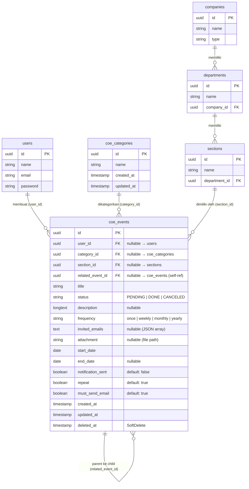

### 2.1 Penjelasan Relasi Tabel

| Relasi | Tipe | Keterangan |
|--------|------|------------|
| `coe_events.user_id` → `users.id` | BelongsTo (nullable) | Pembuat event |
| `coe_events.category_id` → `coe_categories.id` | BelongsTo (nullable) | Kategori prioritas event |
| `coe_events.section_id` → `sections.id` | BelongsTo (nullable) | Seksi/unit organisasi |
| `coe_events.related_event_id` → `coe_events.id` | Self-referencing BelongsTo (nullable) | Event induk untuk recurring |
| `coe_categories` → `coe_events` | HasMany | Satu kategori punya banyak event |

### 2.2 Enum Status Event (`COEStatus`)

| Nilai | Keterangan | Warna Kalender |
|-------|-----------|----------------|
| `PENDING` | Menunggu / Belum terlaksana | 🟠 Orange |
| `DONE` | Selesai / Terlaksana | 🟢 Green |
| `CANCELED` | Dibatalkan | 🔴 Red |

---

## 3. Struktur Modul

```
Modules/Coe/
├── Database/
│   ├── Migrations/
│   │   ├── 2023_01_30_154335_create_coe_categories_table.php
│   │   ├── 2023_01_30_154649_create_coe_events_table.php
│   │   ├── 2023_07_05_185541_update_coe_events.php
│   │   └── 2023_07_06_073149_update_coe_events_attachment.php
├── Entities/
│   ├── Category.php         ← Model coe_categories
│   └── Event.php            ← Model coe_events
├── Http/
│   ├── Controllers/
│   │   └── CoeController.php    ← API Controller
│   └── Livewire/
│       ├── Add.php              ← Form tambah event
│       ├── Edit.php             ← Form edit event
│       ├── Lists.php            ← Daftar event (tabel)
│       ├── CallendarView.php    ← Tampilan kalender
│       ├── Dashboard.php        ← Dashboard statistik
│       ├── Category.php         ← Manajemen kategori
│       └── InvitedEx.php        ← Kalender untuk undangan eksternal
└── Routes/
    ├── web.php              ← Route web (Livewire)
    └── api.php              ← Route API (mobile/JSON)
```

---

## 4. Alur Bisnis (Business Flow)

### 4.1 Alur Utama: Buat Event Baru

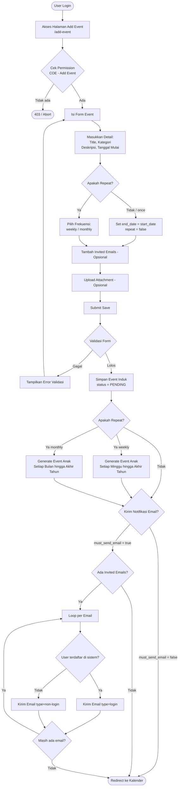

### 4.2 Alur Edit Event

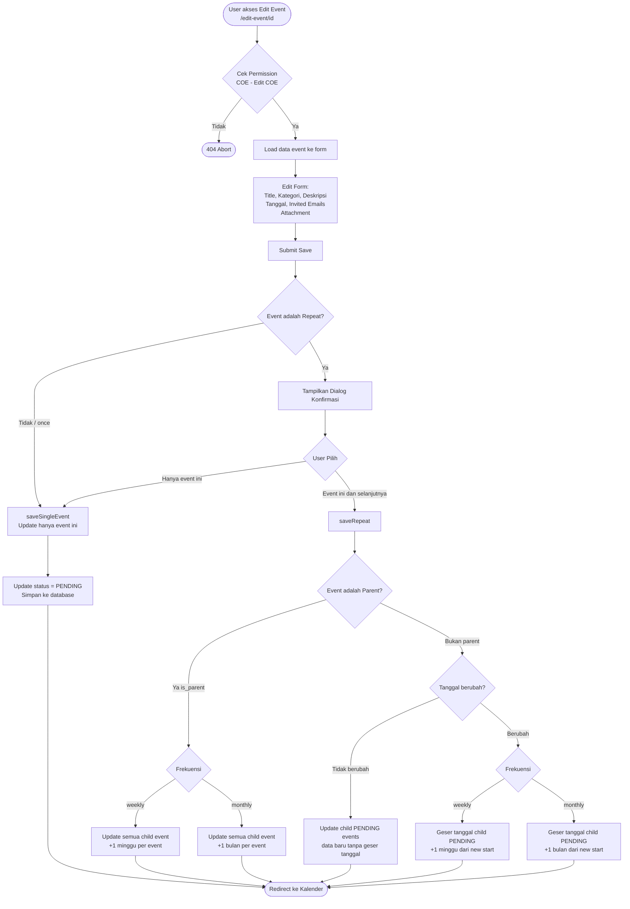

### 4.3 Alur Hapus Event

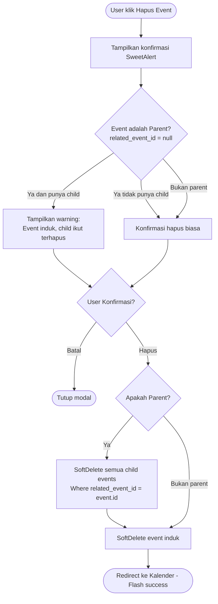

### 4.4 Alur Manajemen Status Event

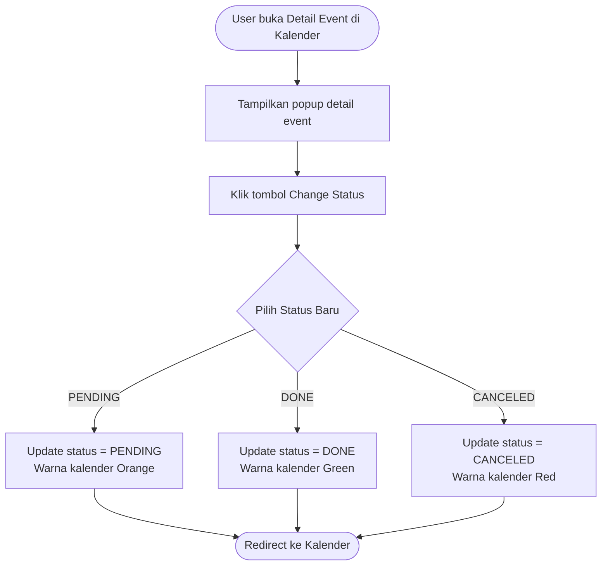

### 4.5 Alur Manajemen Kategori

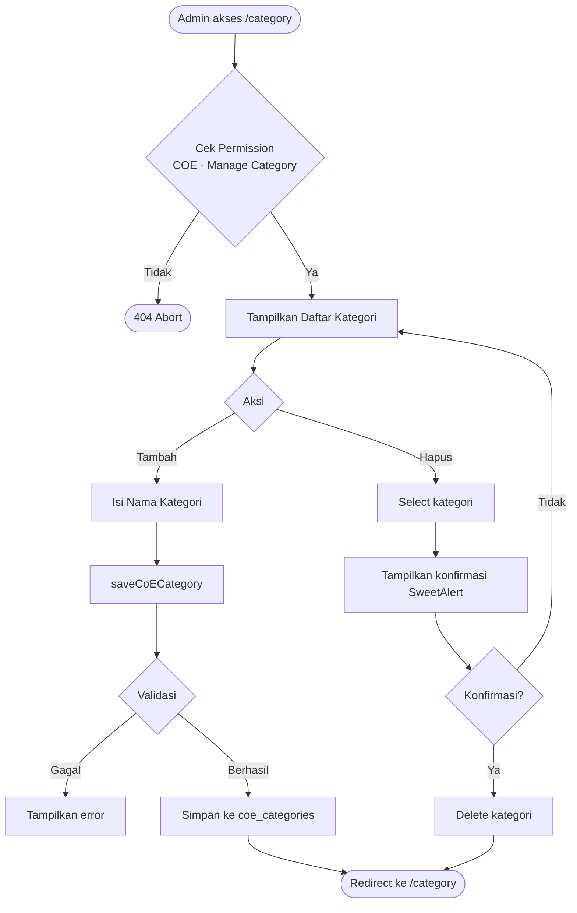

### 4.6 Alur Akses Kalender Undangan Eksternal

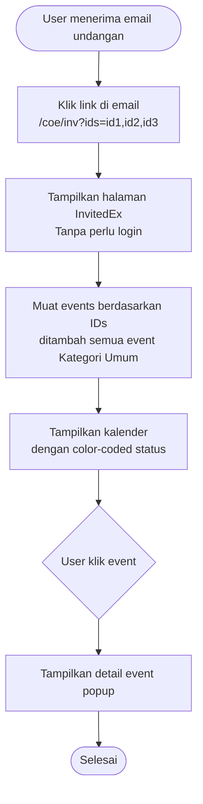

---

## 5. Alur Data Dashboard & Statistik

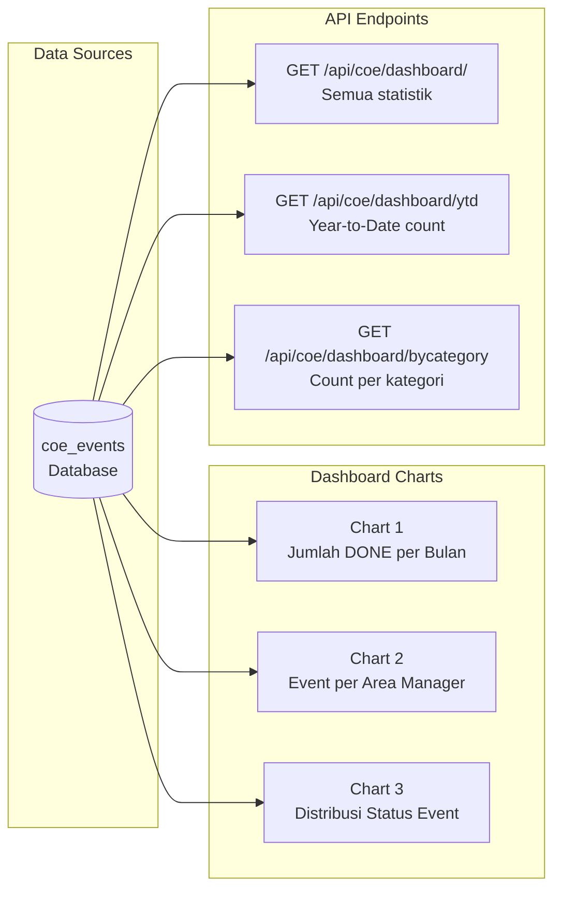

### 5.1 Metrik Dashboard yang Tersedia

| Metrik | Endpoint API | Keterangan |
|--------|-------------|------------|
| Total event tahunan | `getAllIn` | Count semua event tahun ini |
| Completion rate | `getAnnualCompletion` | % event DONE vs total |
| Event YTD | `getYtd` | Count event bulan ini |
| Count by category | `getBycategory` | URGENT / IMPORTANT / MEDIUM / LOW |
| Monthly completion | `getCompletionByMonth` | Breakdown per bulan |
| Event bulanan per hari | `getMonthlyListsCount` | Untuk mobile calendar dots |
| Detail event by day | `getEventDayLists` | Untuk mobile day view |

---

## 6. Komponen Livewire & Fungsinya

| Komponen | Route | Permission | Fungsi Utama |
|----------|-------|-----------|--------------|
| `Dashboard` | `/dashboard` | `COE - View Dashboard` | Statistik dan chart analitik |
| `CallendarView` | `/calendar` | Semua auth user | Tampilan kalender interaktif, import/export |
| `Lists` | `/list` | `COE - View List` | Tabel daftar event + export Excel |
| `Add` | `/add-event` | — | Form buat event baru + repeat logic |
| `Edit` | `/edit-event/{id}` | `COE - Edit COE` | Form edit event + cascade update |
| `Category` | `/category` | `COE - Manage Category` | CRUD master kategori |
| `InvitedEx` | `/inv?ids=...` | Public (no auth) | Kalender untuk undangan eksternal |

---

## 7. Permission Matrix

| Permission | Dashboard | Lihat Kalender | Lihat List | Edit Event | Hapus Event | Kelola Kategori |
|-----------|-----------|----------------|------------|-----------|------------|-----------------|
| `COE - View Dashboard` | ✅ | — | — | — | — | — |
| `COE - View List` | — | — | ✅ | — | ✅ | — |
| `COE - Edit COE` | — | — | — | ✅ | — | — |
| `COE - Manage Category` | — | — | — | — | — | ✅ |
| `COE - Superuser` | ✅ | ✅ semua | ✅ semua | ✅ | ✅ | ✅ |

> **Catatan:** User non-Superuser hanya melihat event yang:
> - Mereka buat sendiri (`user_id = auth user`)
> - Mereka diundang (`invited_emails contains email`)
> - Berkategori **"Umum"** (event publik)

---

## 8. Alur Repeat Event (Recurring Logic)

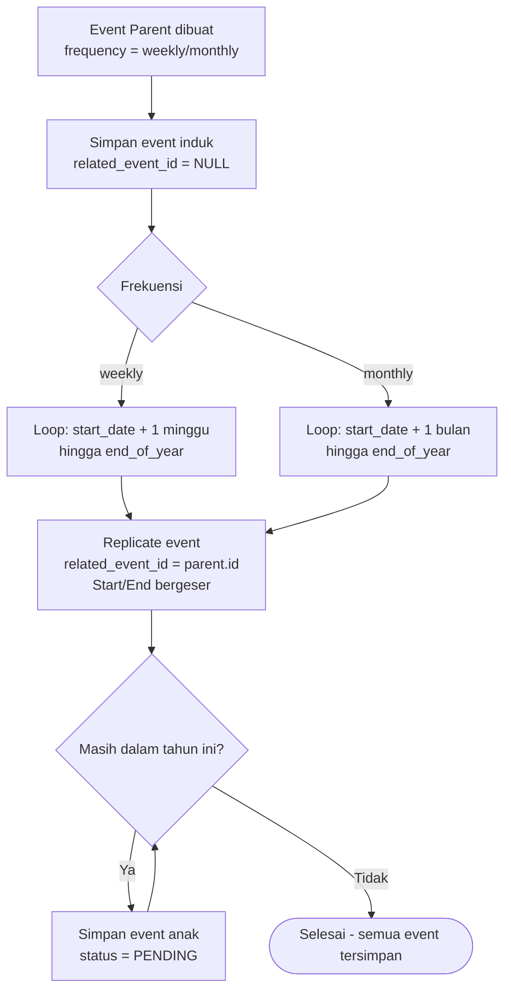

### 8.1 Contoh Visualisasi Repeat Event

```
Event: "Meeting Mingguan" | Frequency: weekly | Start: 2 Jan 2024
│
├── Event INDUK  [related_event_id: NULL]
│   └── Start: 2 Jan 2024 | Status: PENDING
│
├── Event ANAK 1 [related_event_id: induk.id]
│   └── Start: 9 Jan 2024 | Status: PENDING
│
├── Event ANAK 2 [related_event_id: induk.id]
│   └── Start: 16 Jan 2024 | Status: PENDING
│
└── ... berlanjut setiap minggu hingga 31 Des 2024
```

---

## 9. Alur Notifikasi Email

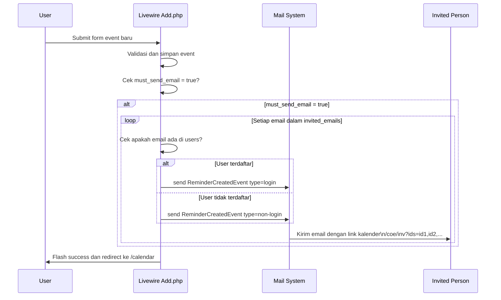

---

## 10. API Endpoints (Mobile & External)

### Web Routes (`/coe/*`)

| Method | URL | Komponen | Auth |
|--------|-----|----------|------|
| GET | `/coe/` | `Home` | Guest |
| GET | `/coe/login` | `Auth\Login` | Guest |
| GET | `/coe/dashboard` | `Dashboard` | `auth:coe` |
| GET | `/coe/list` | `Lists` | `auth:coe` |
| GET | `/coe/calendar` | `CallendarView` | `auth:coe` |
| GET | `/coe/add-event` | `Add` | `auth:coe` |
| GET | `/coe/edit-event/{event}` | `Edit` | `auth:coe` |
| GET | `/coe/category` | `Category` | `auth:coe` |
| GET | `/coe/inv` | `InvitedEx` | Public |
| GET | `/coe/attachment/{id}` | `CallendarView@attachment` | Public |

### API Routes (`/api/coe/*`)

| Method | URL | Fungsi |
|--------|-----|--------|
| GET | `/api/coe/dashboard/` | Semua statistik dashboard |
| GET | `/api/coe/dashboard/ytd` | Year-to-Date count |
| GET | `/api/coe/dashboard/count-annual` | Total event tahunan |
| GET | `/api/coe/dashboard/annual-completion` | Completion rate |
| GET | `/api/coe/dashboard/annual-on-going` | On-going events |
| GET | `/api/coe/dashboard/bycategory` | Count by category |
| GET | `/api/coe/dashboard/thismonth` | Stats bulan ini |
| GET | `/api/coe/dashboard/thisyear` | Stats tahun ini |
| GET | `/api/coe/dashboard/completion-by-month` | Completion per bulan |
| GET | `/api/coe/monthly-lists` | Count event per hari (Mobile) |
| GET | `/api/coe/day-lists` | List event per hari (Mobile) |
| GET | `/api/coe/event-details/{id}` | Detail event (Mobile) |

---

## 11. Alur Filter & Pencarian Data Dashboard

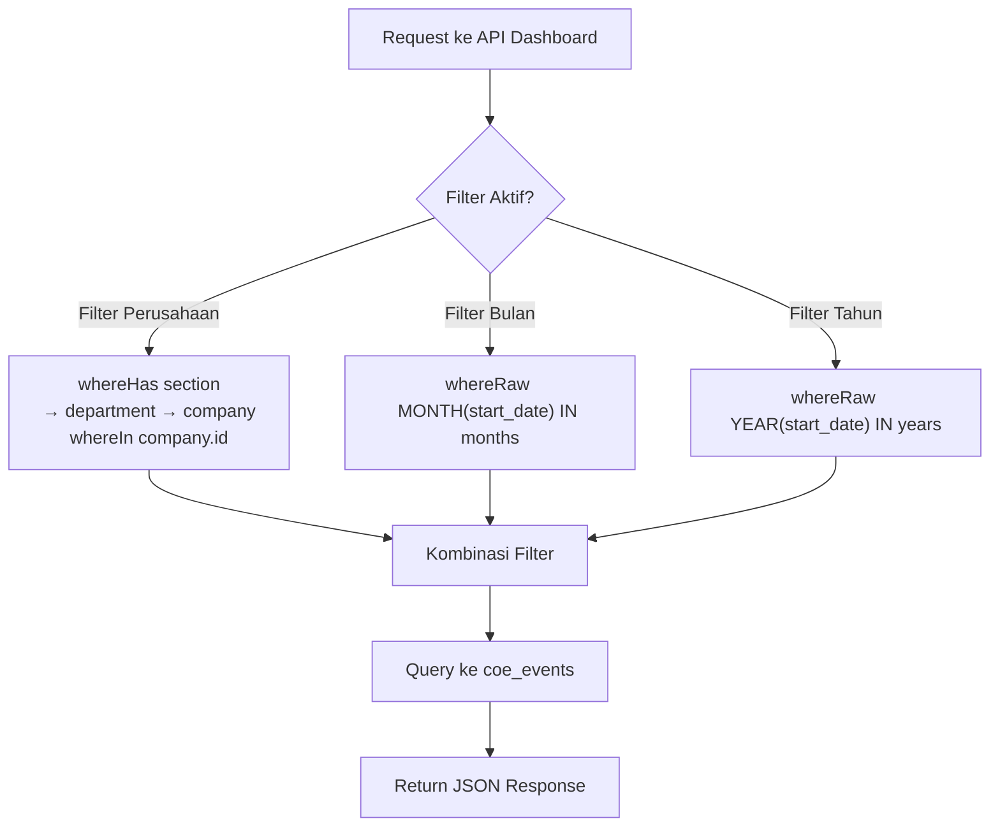

---

## 12. Export & Import Data

| Fitur | Komponen | Format | Keterangan |
|-------|---------|--------|-----------|
| Export Event List | `Lists.php` | `.xlsx` | Export event yang dipilih (multi-select) |
| Export dari Kalender | `CallendarView.php` | `.xlsx` | Export semua event kalender |
| Import Event | `CallendarView.php` | `.xlsx / .xls` | Import massal via file Excel |

---

## 13. Kesimpulan Alur Sistem

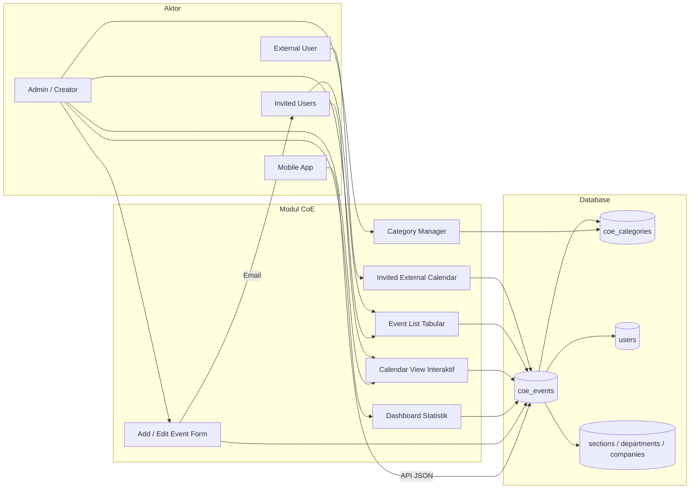

---

*Dokumen ini dibuat secara otomatis berdasarkan analisis source code modul `Modules\Coe` pada sistem AIMS.*
