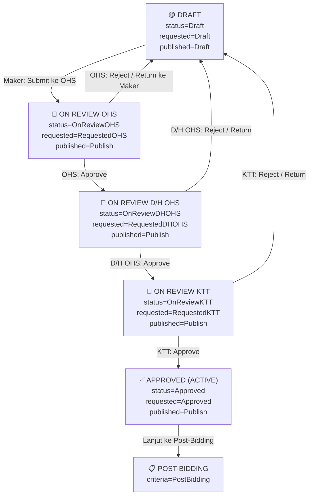
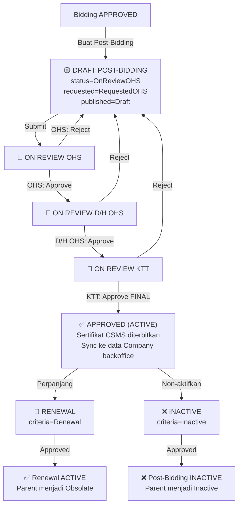
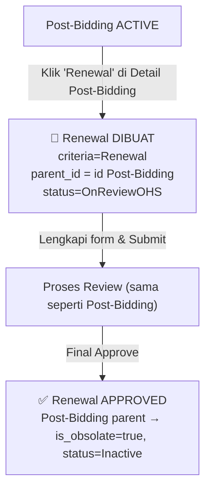
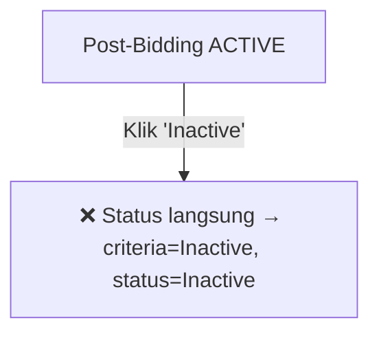
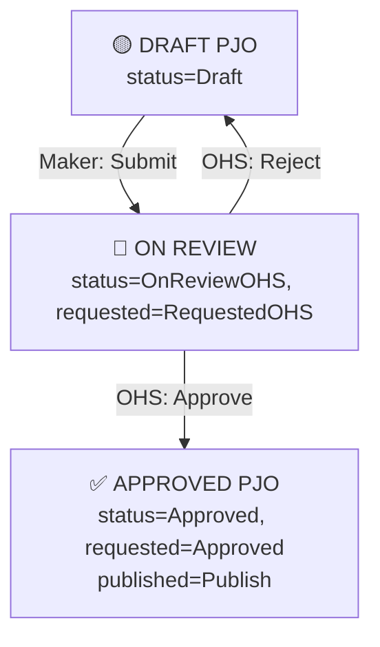
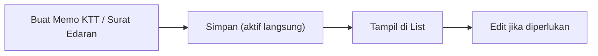
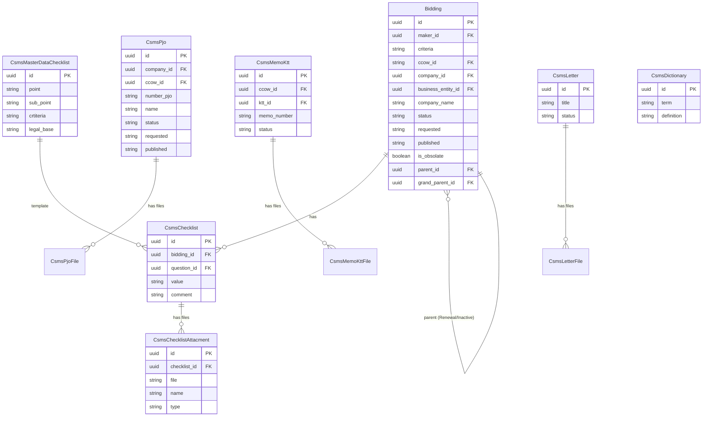

# Contractor Safety Management System (CSMS) — Workflow, Permission Matrix & Folder Structure

Dokumen ini menjelaskan secara lengkap alur kerja (workflow), matrix permission berdasarkan role, dan struktur folder dari modul **CSMS (Contractor Safety Management System)** yang ada di AIMS. CSMS mengelola siklus hidup kelayakan kontraktor mulai dari **Bidding** hingga **Post-Bidding**, **Renewal**, dan **Inactive**.

---

## 1. Ringkasan Modul

CSMS adalah sistem mandiri (standalone) dengan guard auth sendiri (`csms`). Modul ini mengelola:

| Sub-Modul | Deskripsi |
|---|---|
| **Bidding** | Pendaftaran awal kontraktor, termasuk checklist CSMS dan dokumen persyaratan |
| **Post-Bidding** | Penilaian lanjutan kontraktor yang lolos bidding — menghasilkan sertifikat CSMS |
| **Renewal** | Perpanjangan sertifikat kontraktor yang sudah Active (Post-Bidding) |
| **Inactive** | Penonaktifan kontraktor aktif |
| **PJO** | Penanggung Jawab Operasional — pejabat yang bertanggung jawab di site kontraktor |
| **Memo KTT** | Memo internal dari Kepala Teknik Tambang |
| **Surat Edaran (Letter)** | Surat edaran ke kontraktor |
| **Kamus (Dictionary)** | Master data istilah dan definisi CSMS |
| **Approval** | Halaman review dan persetujuan untuk Bidding & Post-Bidding |
| **Dashboard** | Ringkasan statistik dan monitoring keseluruhan CSMS |
| **PICA** | Corrective action dari temuan CSMS |

---

## 2. Alur Status (State Machine)

Semua data Bidding, Post-Bidding, Renewal, dan Inactive menggunakan 3 kolom status di tabel `biddings`:

| Kolom | Deskripsi |
|---|---|
| `criteria` | Tipe dokumen: `Bidding`, `PostBidding`, `Renewal`, `Inactive` |
| `status` | Status review: `Draft`, `OnReviewOHS`, `OnReviewDHOHS`, `OnReviewKTT`, `Approved`, `Inactive`, `Obsolate` |
| `requested` | Status permintaan: `Draft`, `RequestedOHS`, `RequestedDHOHS`, `RequestedKTT`, `Approved`, `Rejected` |
| `published` | Visibilitas: `Draft` (internal saja) / `Publish` (semua bisa lihat) |

---

## 3. Workflow Bidding

### 3.1 Diagram Alur Bidding



### 3.2 Deskripsi Tahapan Bidding

| Tahap | Status DB | Actor | Aksi |
|---|---|---|---|
| **Draft** | `status=Draft, requested=Draft` | Maker | Buat data kontraktor baru, isi checklist CSMS, simpan sebagai draft |
| **Submit ke OHS** | `status=OnReviewOHS, requested=RequestedOHS, published=Publish` | Maker | Lengkapi checklist, submit untuk review OHS |
| **Review OHS** | (sama) | OHS | Periksa kelengkapan dokumen dan checklist |
| **Approve ke D/H OHS** | `status=OnReviewDHOHS, requested=RequestedDHOHS` | OHS | Setujui, naik ke Dept/Head OHS |
| **Approve ke KTT** | `status=OnReviewKTT, requested=RequestedKTT` | D/H OHS | Setujui, naik ke KTT |
| **Final Approve** | `status=Approved, requested=Approved` | KTT | Bidding selesai, kontraktor **Active** |
| **Reject** | `requested=Rejected` | OHS / D/H OHS / KTT | Kembalikan ke Maker untuk perbaikan |

---

## 4. Workflow Post-Bidding

Post-Bidding adalah penilaian mendalam setelah kontraktor lolos Bidding. Menggunakan model `Bidding` yang sama tetapi dengan `criteria = PostBidding`.

### 4.1 Diagram Alur Post-Bidding



### 4.2 Aksi Khusus Post-Bidding

| Aksi | Method | Efek |
|---|---|---|
| **Approve Final** | `approve(Approved, Approved)` | Sertifikat aktif, sync Company ke backoffice AIMS |
| **Return ke Maker** | `return_maker()` | `requested=Rejected`, kembali ke maker |
| **Cetak Sertifikat** | `certificate($id)` | Generate PDF sertifikat CSMS dengan QR Code |
| **Buat Renewal** | `renewal_bidding()` | Clone Post-Bidding dengan `criteria=Renewal`, `parent_id` diisi |
| **Non-aktifkan** | `inactive_bidding()` | Set `criteria=Inactive, status=Inactive` |
| **Obsolete** | `obsolete_bidding()` | Set `status=Obsolate` (dipakai saat Renewal approved) |

---

## 5. Workflow Renewal

Renewal adalah perpanjangan sertifikat CSMS untuk kontraktor yang sudah **Active (Post-Bidding)**. Data Renewal dibuat dengan mereplikasi (`replicate()`) data Post-Bidding yang sudah ada.



---

## 6. Workflow Inactive

Untuk menonaktifkan kontraktor yang sebelumnya Active.



---

## 7. Workflow PJO (Penanggung Jawab Operasional)

PJO adalah pejabat K3 kontraktor yang bertanggung jawab di lokasi tambang.

### 7.1 Diagram Alur PJO



---

## 8. Workflow Memo KTT & Surat Edaran

Kedua sub-modul ini bersifat sederhana (Create / Edit / List) tanpa alur approval bertingkat.



---

## 9. Matrix Permission (Spatie Permissions)

Berikut adalah matrix permission yang digunakan di modul CSMS berdasarkan analisis source code:

### 9.1 Permission yang Terdeteksi di Source Code

| Permission | Deskripsi | Digunakan Di |
|---|---|---|
| `CSMS - Bidding View Active` | Lihat semua Bidding active (bukan hanya milik sendiri) | `Bidding/Lists.php` |
| `CSMS - Bidding Reviewer OHS` | Review & approve Bidding sebagai OHS | `Approval/Biddings.php` (komentar) |
| `CSMS - Bidding Reviewer D/H OHS` | Review & approve Bidding sebagai Dept Head OHS | `Approval/Biddings.php` (komentar) |
| `CSMS - Bidding Reviewer KTT` | Review & approve Bidding sebagai KTT | `Approval/Biddings.php` (komentar) |

### 9.2 Matrix Role vs Fitur (Rekomendasi Lengkap)

> [!NOTE]
> Permission `CSMS - Bidding Reviewer *` saat ini **dinonaktifkan di kode** (ada dalam komentar). Semua reviewer bisa melihat semua item yang sedang dalam review. Permission ini perlu diaktifkan kembali jika ingin membatasi visibilitas per role.

| Fitur / Aksi | Maker | OHS Reviewer | D/H OHS | KTT | Evaluator | Admin CSMS | CSMS Super Admin |
|---|:---:|:---:|:---:|:---:|:---:|:---:|:---:|
| **Dashboard** | ✅ | ✅ | ✅ | ✅ | ✅ | ✅ | ✅ |
| **Bidding: Buat Draft** | ✅ | ❌ | ❌ | ❌ | ❌ | ✅ | ✅ |
| **Bidding: Edit Draft** | ✅ (milik sendiri) | ❌ | ❌ | ❌ | ❌ | ✅ | ✅ |
| **Bidding: Submit ke OHS** | ✅ | ❌ | ❌ | ❌ | ❌ | ✅ | ✅ |
| **Bidding: Lihat Active (semua)** | ❌ | ✅ | ✅ | ✅ | ❌ | ✅ | ✅ |
| **Bidding: Lihat Active (milik sendiri)** | ✅ | ✅ | ✅ | ✅ | ✅ | ✅ | ✅ |
| **Bidding: Review & Approve (OHS)** | ❌ | ✅ | ❌ | ❌ | ❌ | ❌ | ✅ |
| **Bidding: Review & Approve (D/H OHS)** | ❌ | ❌ | ✅ | ❌ | ❌ | ❌ | ✅ |
| **Bidding: Review & Approve (KTT)** | ❌ | ❌ | ❌ | ✅ | ❌ | ❌ | ✅ |
| **Post-Bidding: Buat** | ❌ | ✅ | ✅ | ✅ | ❌ | ✅ | ✅ |
| **Post-Bidding: Review & Approve** | ❌ | ✅ | ✅ | ✅ | ❌ | ✅ | ✅ |
| **Post-Bidding: Cetak Sertifikat** | ✅ | ✅ | ✅ | ✅ | ❌ | ✅ | ✅ |
| **Post-Bidding: Buat Renewal** | ❌ | ✅ | ✅ | ✅ | ❌ | ✅ | ✅ |
| **Post-Bidding: Non-aktifkan** | ❌ | ✅ | ✅ | ✅ | ❌ | ✅ | ✅ |
| **PJO: Buat & Submit** | ✅ | ✅ | ✅ | ✅ | ❌ | ✅ | ✅ |
| **PJO: Review & Approve** | ❌ | ✅ (OHS) | ❌ | ✅ (KTT) | ✅ (Evaluator) | ✅ | ✅ |
| **Memo KTT: Buat & Edit** | ❌ | ❌ | ❌ | ✅ | ❌ | ✅ | ✅ |
| **Surat Edaran: Buat & Edit** | ❌ | ✅ | ✅ | ✅ | ❌ | ✅ | ✅ |
| **Kamus: Buat & Edit** | ❌ | ❌ | ❌ | ❌ | ❌ | ✅ | ✅ |
| **PICA: Lihat** | ✅ | ✅ | ✅ | ✅ | ✅ | ✅ | ✅ |

### 9.3 Daftar Permission Lengkap (Rekomendasi untuk Spatie)

```php
// Guard: csms
$permissions = [
    // Auth
    'CSMS - Login',

    // Dashboard
    'CSMS - Dashboard',

    // Bidding
    'CSMS - Bidding View Active',         // Lihat SEMUA bidding active
    'CSMS - Bidding Create',              // Buat bidding baru
    'CSMS - Bidding Edit',                // Edit bidding draft milik sendiri
    'CSMS - Bidding Delete',              // Hapus bidding draft
    'CSMS - Bidding Submit',              // Submit ke OHS
    'CSMS - Bidding Reviewer OHS',        // Review sebagai OHS
    'CSMS - Bidding Reviewer D/H OHS',    // Review sebagai Dept Head OHS
    'CSMS - Bidding Reviewer KTT',        // Review sebagai KTT

    // Post-Bidding
    'CSMS - PostBidding View Active',
    'CSMS - PostBidding Create',
    'CSMS - PostBidding Edit',
    'CSMS - PostBidding Approve',
    'CSMS - PostBidding Certificate',     // Cetak sertifikat
    'CSMS - PostBidding Renewal',         // Buat renewal
    'CSMS - PostBidding Inactive',        // Non-aktifkan

    // PJO
    'CSMS - PJO View',
    'CSMS - PJO Create',
    'CSMS - PJO Edit',
    'CSMS - PJO Approve',

    // Memo KTT
    'CSMS - MemoKTT View',
    'CSMS - MemoKTT Create',
    'CSMS - MemoKTT Edit',

    // Surat Edaran
    'CSMS - Letter View',
    'CSMS - Letter Create',
    'CSMS - Letter Edit',

    // Kamus
    'CSMS - Dictionary View',
    'CSMS - Dictionary Create',
    'CSMS - Dictionary Edit',

    // PICA
    'CSMS - PICA View',

    // Approval Panel
    'CSMS - Approval Bidding Panel',
    'CSMS - Approval PostBidding Panel',
];
```

---

## 10. Struktur Folder Modul CSMS

```
Modules/CSMS/
│
├── 📁 Config/
│   └── config.php                          # Konfigurasi modul
│
├── 📁 Console/                              # Artisan commands (jika ada)
│
├── 📁 Database/
│   ├── 📁 Migrations/
│   │   ├── 2023_10_17_..._create_csms_master_data_checklist_table.php
│   │   ├── 2023_10_17_..._create_biddings_table.php
│   │   ├── 2023_10_18_..._create_csms_memo_ktts_table.php
│   │   ├── 2023_10_18_..._create_csms_letters_table.php
│   │   ├── 2023_10_18_..._create_csms_dictionaries_table.php
│   │   ├── 2023_10_18_..._create_csms_memo_ktt_files_table.php
│   │   ├── 2023_10_18_..._create_csms_letter_files_table.php
│   │   ├── 2023_10_19_..._create_csms_checklists_table.php
│   │   ├── 2023_10_19_..._create_csms_checklist_attachments_table.php
│   │   ├── 2023_10_20_..._create_csms_pjos_table.php
│   │   ├── 2023_10_23_..._create_csms_pjo_files_table.php
│   │   └── ... (alter migrations)
│   ├── 📁 Seeders/
│   └── 📁 factories/
│
├── 📁 Entities/                             # Eloquent Models
│   ├── Bidding.php                          # Model utama (Bidding, Post-Bidding, Renewal, Inactive)
│   ├── CsmsChecklist.php                    # Checklist item per Bidding
│   ├── CsmsChecklistAttacment.php           # File lampiran per checklist item
│   ├── CsmsDictionary.php                   # Master data kamus CSMS
│   ├── CsmsLetter.php                       # Surat Edaran
│   ├── CsmsLetterFile.php                   # File lampiran Surat Edaran
│   ├── CsmsMasterDataChecklist.php          # Template checklist (master)
│   ├── CsmsMemoKtt.php                      # Memo KTT
│   ├── CsmsMemoKttFile.php                  # File lampiran Memo KTT
│   ├── CsmsPjo.php                          # PJO (Penanggung Jawab Operasional)
│   └── CsmsPjoFile.php                      # File lampiran PJO
│
├── 📁 Enums/
│   ├── BiddingStatus.php                    # Enum status Bidding
│   └── ServiceCriteria.php                  # Enum kriteria jasa (Kontraktor/SubKontraktor)
│
├── 📁 Http/
│   ├── 📁 Controllers/                      # (Reserved, Livewire diutamakan)
│   ├── 📁 Livewire/
│   │   ├── 📁 Approval/
│   │   │   ├── Biddings.php                 # Panel approval Bidding (OHS/DHOHS/KTT)
│   │   │   └── PostBiddings.php             # Panel approval Post-Bidding
│   │   │
│   │   ├── 📁 Bidding/
│   │   │   ├── Lists.php                    # List Bidding Active
│   │   │   ├── ListsDraft.php               # List Bidding Draft
│   │   │   ├── ListsOnGoing.php             # List Bidding On-Going (sedang review)
│   │   │   ├── Create.php                   # Form buat Bidding baru
│   │   │   ├── Edit.php                     # Form edit Bidding
│   │   │   └── Detail.php                   # Detail view Bidding
│   │   │
│   │   ├── 📁 PostBidding/
│   │   │   ├── Lists.php                    # List Post-Bidding Active
│   │   │   ├── ListsDraft.php               # List Post-Bidding Draft
│   │   │   ├── ListsOnGoing.php             # List Post-Bidding On-Going
│   │   │   ├── Inactive.php                 # List Post-Bidding Inactive
│   │   │   ├── Obsolate.php                 # List Post-Bidding Obsolete
│   │   │   ├── Create.php                   # Form buat Post-Bidding
│   │   │   ├── Edit.php                     # Form edit Post-Bidding
│   │   │   └── Detail.php                   # Detail view + approve/reject + sertifikat
│   │   │
│   │   ├── 📁 Renewal/
│   │   │   ├── Lists.php                    # List Renewal
│   │   │   ├── Create.php                   # Form buat Renewal
│   │   │   ├── Edit.php                     # Form edit Renewal
│   │   │   └── Detail.php                   # Detail Renewal
│   │   │
│   │   ├── 📁 Inactive/
│   │   │   ├── Lists.php                    # List Inactive
│   │   │   ├── Create.php                   # Form buat Inactive
│   │   │   ├── Edit.php                     # Form edit Inactive
│   │   │   └── Detail.php                   # Detail Inactive
│   │   │
│   │   ├── 📁 Pjo/
│   │   │   ├── 📁 Active/
│   │   │   │   ├── Lists.php                # List PJO Active
│   │   │   │   ├── Create.php               # Form buat PJO
│   │   │   │   ├── Edit.php                 # Form edit PJO
│   │   │   │   └── Detail.php               # Detail PJO
│   │   │   ├── 📁 Draft/
│   │   │   │   └── Lists.php                # List PJO Draft
│   │   │   └── 📁 OnGoing/
│   │   │       └── Lists.php                # List PJO On-Going (sedang review)
│   │   │
│   │   ├── 📁 MemoKTT/
│   │   │   ├── Lists.php                    # List Memo KTT
│   │   │   ├── Create.php                   # Form buat Memo KTT
│   │   │   └── Edit.php                     # Form edit Memo KTT
│   │   │
│   │   ├── 📁 Letter/
│   │   │   ├── Lists.php                    # List Surat Edaran
│   │   │   ├── Create.php                   # Form buat Surat Edaran
│   │   │   └── Edit.php                     # Form edit Surat Edaran
│   │   │
│   │   ├── 📁 Dictionary/
│   │   │   ├── Lists.php                    # List Kamus CSMS
│   │   │   ├── Create.php                   # Form buat Kamus
│   │   │   └── Edit.php                     # Form edit Kamus
│   │   │
│   │   ├── 📁 Dashboard/
│   │   │   ├── DashboardPage.php            # Halaman utama dashboard CSMS
│   │   │   ├── 📁 Components/               # Sub-components dashboard
│   │   │   └── 📁 Widgets/                  # Widget statistik
│   │   │
│   │   ├── 📁 Pica/
│   │   │   └── Lists.php                    # List PICA dari CSMS
│   │   │
│   │   └── 📁 Login/
│   │       └── LoginPage.php                # Halaman login khusus CSMS (guard: csms)
│   │
│   ├── 📁 Middleware/
│   └── 📁 Requests/
│
├── 📁 Providers/
│   └── CSMSServiceProvider.php              # Service provider modul
│
├── 📁 Resources/
│   ├── 📁 assets/                           # JS, CSS aset modul
│   ├── 📁 lang/                             # Lokalisasi
│   └── 📁 views/
│       └── (mirror dari Livewire folder structure)
│           ├── layouts/
│           │   ├── app.blade.php            # Layout utama dengan sidebar
│           │   └── no-header.blade.php      # Layout tanpa header (untuk form)
│           ├── livewire/
│           │   ├── bidding/
│           │   ├── post-bidding/
│           │   │   └── pdf/
│           │   │       └── certificate.blade.php  # Template PDF sertifikat
│           │   ├── renewal/
│           │   ├── inactive/
│           │   ├── pjo/
│           │   ├── memo-ktt/
│           │   ├── letter/
│           │   ├── dictionary/
│           │   ├── approval/
│           │   ├── dashboard/
│           │   └── login/
│           └── components/
│
├── 📁 Routes/
│   ├── web.php                              # Semua route web CSMS
│   └── api.php                              # Route API CSMS
│
├── 📁 Tests/
│
├── 📁 View/
│
├── composer.json
├── module.json                              # Konfigurasi module (name: CSMS, alias: csms)
├── package.json
└── vite.config.js
```

---

## 11. Relasi Antar Entitas (ERD Ringkas)



---

## 12. Catatan Teknis Penting

> [!WARNING]
> **Permission Reviewer saat ini dinonaktifkan (komentar)** di `Approval/Biddings.php`. Semua reviewer dapat melihat semua item yang sedang dalam review. Jika ingin membatasi per role, aktifkan kembali blok kode yang dikomentari.

> [!NOTE]
> **Backoffice Sync**: Saat Post-Bidding di-approve final, sistem secara otomatis melakukan sync data perusahaan ke tabel `companies` di backoffice AIMS (melalui method `backoffice_sync()`). Pastikan field `company_name`, `company_nickname`, `address`, `equipped_email`, `equipped_telephone`, `service_criteria`, dan `ccow_id` terisi.

> [!NOTE]
> **Sertifikat PDF**: Dihasilkan via library `PDF::loadView()`. Template ada di `Resources/views/livewire/post-bidding/pdf/certificate.blade.php`. Nomor dokumen di-generate otomatis dengan format: `F-{CCOW_CODE}-IMS-{YY}-{NNN}`.

> [!TIP]
> **Renewal**: Saat Renewal di-approve, data Post-Bidding induk akan di-set `is_obsolate=true` dan `status=Inactive`. Data Renewal yang baru menjadi Active. Gunakan `grand_parent_id` untuk melacak seluruh rantai revisi.

---

## 13. Route Map Lengkap

| Route Name | URL | Komponen |
|---|---|---|
| `csms::login` | `/login` | `Login/LoginPage` |
| `csms::dashboard` | `/` | `Dashboard/DashboardPage` |
| `csms::bidding.index` | `/bidding/lists/` | `Bidding/Lists` |
| `csms::bidding.create` | `/bidding/create/` | `Bidding/Create` |
| `csms::bidding.edit` | `/bidding/edit/{id}` | `Bidding/Edit` |
| `csms::bidding.detail` | `/bidding/detail/{id}` | `Bidding/Detail` |
| `csms::bidding.ongoing` | `/bidding/ongoing` | `Bidding/ListsOnGoing` |
| `csms::bidding.draft` | `/bidding/draft` | `Bidding/ListsDraft` |
| `csms::post-bidding.index` | `/post-bidding/lists/` | `PostBidding/Lists` |
| `csms::post-bidding.create` | `/post-bidding/create/` | `PostBidding/Create` |
| `csms::post-bidding.edit` | `/post-bidding/edit/{id}` | `PostBidding/Edit` |
| `csms::post-bidding.detail` | `/post-bidding/detail/{id}` | `PostBidding/Detail` |
| `csms::post-bidding.ongoing` | `/post-bidding/ongoing` | `PostBidding/ListsOnGoing` |
| `csms::post-bidding.draft` | `/post-bidding/draft` | `PostBidding/ListsDraft` |
| `csms::post-bidding.inactive` | `/post-bidding/inactive` | `PostBidding/Inactive` |
| `csms::post-bidding.obsolate` | `/post-bidding/obsolate` | `PostBidding/Obsolate` |
| `csms::post-bidding.certificate` | `/post-bidding/certificate/{id}` | `PostBidding/Detail::certificate()` |
| `csms::renewal.index` | `/renewal/lists/` | `Renewal/Lists` |
| `csms::renewal.create` | `/renewal/create/{id}` | `Renewal/Create` |
| `csms::renewal.edit` | `/renewal/edit/{id}` | `Renewal/Edit` |
| `csms::inactive.index` | `/inactive/lists/` | `Inactive/Lists` |
| `csms::pica` | `/pica-lists/` | `Pica/Lists` |
| `csms::pjo.index` | `/pjo/lists/` | `Pjo/Active/Lists` |
| `csms::pjo.create` | `/pjo/create/` | `Pjo/Active/Create` |
| `csms::pjo.edit` | `/pjo/edit/{id}` | `Pjo/Active/Edit` |
| `csms::pjo.detail` | `/pjo/detail/{id}` | `Pjo/Active/Detail` |
| `csms::pjo.ongoing` | `/pjo/ongoing` | `Pjo/OnGoing/Lists` |
| `csms::pjo.draft` | `/pjo/draft` | `Pjo/Draft/Lists` |
| `csms::memo.index` | `/memo/lists/` | `MemoKTT/Lists` |
| `csms::memo.create` | `/memo/create/` | `MemoKTT/Create` |
| `csms::memo.edit` | `/memo/edit/{id}` | `MemoKTT/Edit` |
| `csms::letter.index` | `/letter/lists/` | `Letter/Lists` |
| `csms::letter.create` | `/letter/create/` | `Letter/Create` |
| `csms::letter.edit` | `/letter/edit/{id}` | `Letter/Edit` |
| `csms::dictionary.index` | `/dictionary/lists/` | `Dictionary/Lists` |
| `csms::dictionary.create` | `/dictionary/create/` | `Dictionary/Create` |
| `csms::dictionary.edit` | `/dictionary/edit/{id}` | `Dictionary/Edit` |
| `csms::approval.bidding` | `/approval/bidding/` | `Approval/Biddings` |
| `csms::approval.post-bidding` | `/approval/post-bidding/` | `Approval/PostBiddings` |
