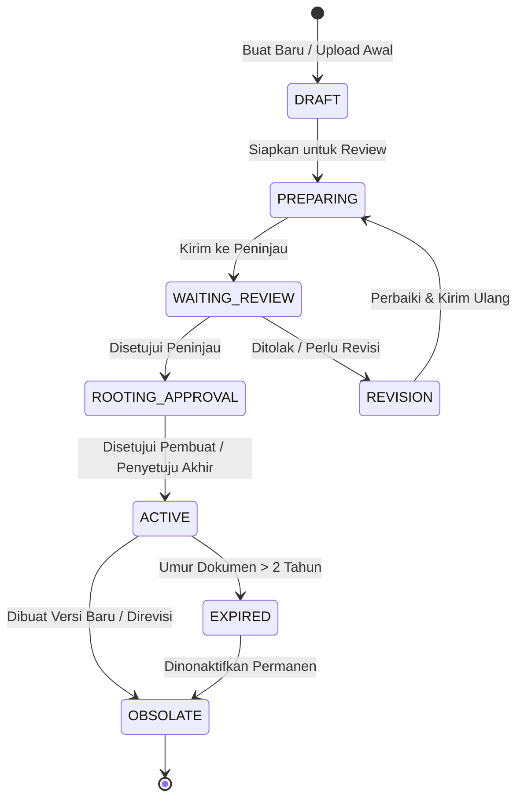
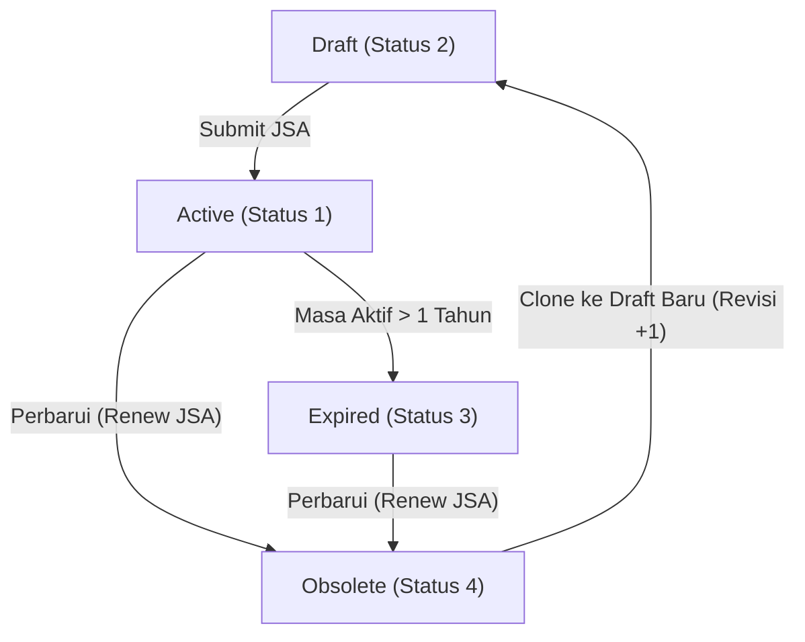
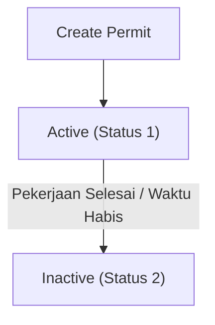
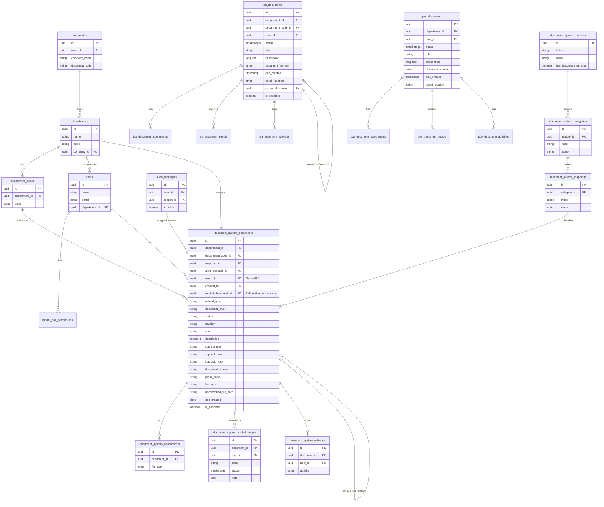

# 📂 AIMS: Document System Module PRD & Workflow Specification

Dokumen Persyaratan Produk (PRD) ini menjabarkan arsitektur, alur kerja, siklus hidup dokumen, sub-modul Job Safety Analysis (JSA), Permit to Work (PTW), serta konfigurasi Master Data pada modul **DocumentSystem** di platform AIMS.

---

## 📌 1. Gambaran Umum Modul

Modul **DocumentSystem** berfungsi sebagai repositori dokumen legal dan operasional perusahaan. Modul ini memastikan:
*   Penerapan nomor dokumen terstandarisasi.
*   Pemeriksaan alur peninjauan (*review workflow*) sebelum dokumen diterbitkan sebagai dokumen aktif.
*   Kontrol versi yang ketat (*revision tracking*) untuk menghindari penggunaan dokumen kedaluwarsa.
*   Pengelompokan dokumen keselamatan khusus kerja (JSA & PTW).

---

## 📂 2. Struktur Direktori Modul

Seluruh komponen logika dan visual untuk modul Document System berada di bawah direktori `Modules/DocumentSystem/`.

```bash
Modules/DocumentSystem/
├── Config/
│   └── config.php               # Konfigurasi internal modul Document System
├── Database/
│   ├── Migrations/             # Struktur database dokumen, JSA, PTW, kategori, dll.
│   └── Seeders/
│       ├── DocumentSystemDatabaseSeeder.php # Pemanggil seeder utama
│       └── PermissionSeeder.php             # Seeder permission guard 'document-system'
├── Entities/                   # Model Eloquent untuk data operasional Document System
│   ├── Document.php             # Model utama dokumen standar (SOP, TS, MN, WIN, FORM)
│   ├── Attachment.php           # File lampiran dokumen standar
│   ├── Activity.php             # Log histori/aktivitas dokumen
│   ├── ActivityAttachment.php   # Lampiran berkas aktivitas log
│   ├── InvitedPeople.php        # Daftar reviewer/approver yang diundang dalam alur dokumen
│   ├── Category.php             # Kategori pengelompokan dokumen
│   ├── JsaDocument.php          # Dokumen Job Safety Analysis (JSA)
│   ├── JsaDocumentActivity.php  # Log histori aktivitas JSA
│   ├── JsaDocumentAttachment.php # Lampiran berkas dokumen JSA
│   ├── JsaDocumentPeople.php    # Tim penyusun / peninjau dokumen JSA
│   ├── PtwDocument.php          # Dokumen Permit to Work (PTW)
│   ├── PtwDocumentActivity.php  # Log histori aktivitas PTW
│   ├── PtwDocumentAttachment.php # Lampiran berkas dokumen PTW
│   ├── PtwDocumentPeople.php    # Penanggung jawab / reviewer PTW
│   ├── Mapping.php              # Mapping dokumen referensi
│   ├── Module.php               # Klasifikasi modul utama
│   └── ModuleCategory.php       # Klasifikasi kategori modul
├── Http/
│   ├── Controllers/            # Controller HTTP standar & API
│   └── Livewire/               # Komponen frontend reaktif (Livewire)
│       ├── Auth/Login.php      # Login guard 'document-system'
│       ├── Dashboard/          # Statistik dokumen, review, draft, dll.
│       ├── ActiveDocument/     # Halaman penjelajah/unduh dokumen aktif
│       ├── Draft/              # Manajemen draft dokumen standar
│       ├── Maker/              # Halaman manajemen dokumen aktif bagi pembuat
│       ├── OnGoing/            # Halaman dokumen dalam proses review/approval
│       ├── Obsolate/           # Halaman dokumen kedaluwarsa/obsolete
│       ├── Review/             # Halaman peninjauan berkas bagi reviewer (CRS)
│       ├── Approval/           # Halaman persetujuan berkas bagi approver (PJA)
│       ├── Jsa/                # Modul pembuatan & verifikasi Job Safety Analysis (JSA)
│       ├── Ptw/                # Modul pembuatan & verifikasi Permit to Work (PTW)
│       └── Master/             # Manajemen kategori, level, dan tipe dokumen
├── Providers/
│   └── DocumentSystemServiceProvider.php # Registrasi Service & bindings
├── Resources/
│   ├── views/                  # Template visual Blade & Livewire
│   └── assets/                 # Aset CSS & JavaScript spesifik modul
└── Routes/
    └── web.php                 # Peta routing URL modul Document System
```

---

## 🔄 3. Siklus Hidup & Status Dokumen Standar

Setiap dokumen standar (SOP, Technical Standard, Manual, Work Instruction, Form) memiliki siklus hidup transisi status yang ketat:



### Matriks Status Dokumen Standar
| Kode Status | Nama Status (Sistem) | Deskripsi |
| :---: | :--- | :--- |
| **`1`** | **WAITING_REVIEW** | Dokumen telah diajukan dan sedang menunggu pemeriksaan oleh peninjau (reviewers). |
| **`2`** | **DRAFT** | Dokumen baru dibuat, file belum diunggah secara final, atau masih dalam tahap edit pembuat. |
| **`3`** | **ROOTING_REVIEW** | Dokumen disetujui peninjau dan sedang menunggu tanda tangan / persetujuan akhir dari para pimpinan. |
| **`4`** | **ON_REVISION** | Dokumen ditolak oleh reviewer/approver dan dikembalikan ke pembuat untuk diperbaiki. |
| **`5`** | **ACTIVE** | Dokumen resmi aktif dan dapat diunduh/dijadikan acuan operasional di lapangan. |
| **`6`** | **PREPARE_ROOTING_REVIEW** | Dokumen sedang dipersiapkan dan diatur daftar orang yang harus menyetujui (workflow configuration). |
| **`7`** | **EXPIRED** | Dokumen telah melewati batas masa berlaku (default: 2 tahun setelah tanggal pembuatan). |
| **`8`** | **OBSOLATE** | Dokumen lama yang sudah tidak berlaku lagi karena digantikan oleh revisi baru (Revision +1). |

### Tipe Dokumen (Document Level)
1.  **`1` - SOP**: Standard Operating Procedure.
2.  **`2` - TS**: Technical Standard.
3.  **`3` - MN**: Manual.
4.  **`4` - WIN**: Working Instruction.
5.  **`5` - FORM**: Form Standard.

---

## 🖥️ 4. Pengelompokan Tampilan Halaman (Standard Documents)

Rute web diatur di `Modules/DocumentSystem/Routes/web.php` dan dibagi berdasarkan kategori halaman:

### A. Active & Expired Document (Maker Page)
*   **Rute**: `document-systems.maker` ➔ `Modules\DocumentSystem\Http\Livewire\Maker\Maker`
*   **Fungsi**: Menampilkan seluruh dokumen yang memiliki status **Active (`5`)** dan **Expired (`7`)**. Halaman ini memfasilitasi pembuatan revisi baru (`documentReplicate()` yang meningkatkan nomor versi `revision + 1` dan mengubah status salinan baru menjadi `Draft`).

### B. Document on Review (Ongoing Page)
*   **Rute**: `document-systems.ongoing` ➔ `Modules\DocumentSystem\Http\Livewire\OnGoing\TableOnGoing`
*   **Fungsi**: Menampilkan dokumen yang sedang berjalan di dalam workflow persetujuan, mencakup status **Preparing (`6`)**, **Waiting Review (`1`)**, **Rooting Review (`3`)**, dan **Revision (`4`)**.

### C. Draft Document
*   **Rute**: `document-systems.draft` ➔ `Modules\DocumentSystem\Http\Livewire\Draft\Index`
*   **Fungsi**: Menampung dokumen berstatus **Draft (`2`)** yang baru diunggah oleh pembuat dan belum dikirimkan ke alur workflow.

### D. Obsolete Document
*   **Rute**: `document-systems.obsolate` ➔ `Modules\DocumentSystem\Http\Livewire\Obsolate\Index`
*   **Fungsi**: Menampilkan daftar arsip dokumen lama yang telah berstatus **Obsolete (`8`)** (tidak boleh diunduh untuk penggunaan operasional baru).

---

## 📋 5. Sub-Modul Job Safety Analysis (JSA)

JSA digunakan untuk menganalisis bahaya dari langkah-langkah pekerjaan tertentu sebelum pekerjaan dimulai.

*   **Model**: `Modules\DocumentSystem\Entities\JsaDocument`
*   **Masa Berlaku**: Default 1 tahun (`doc_created` + 1 tahun).
*   **Daftar Status JSA**:
    *   **`1` - ACTIVE**: JSA disetujui dan berlaku untuk pekerjaan di lapangan.
    *   **`2` - DRAFT**: JSA masih ditulis oleh pengawas/karyawan.
    *   **`3` - EXPIRED**: JSA melewati masa aktif 1 tahun.
    *   **`4` - OBSOLATE**: JSA lama yang sudah tidak berlaku/digantikan versi baru.

### Diagram Alur Kerja JSA:


### Pemetaan Rute JSA:
*   **Active JSA**: `/jsa/active` ➔ `Modules\DocumentSystem\Http\Livewire\Jsa\Active`
*   **Draft JSA**: `/jsa/draft` ➔ `Modules\DocumentSystem\Http\Livewire\Jsa\Draft`
*   **Create JSA**: `/jsa/create` ➔ `Modules\DocumentSystem\Http\Livewire\Jsa\CreateNewDocument`
*   **Obsolete JSA**: `/jsa/obsolate` ➔ `Modules\DocumentSystem\Http\Livewire\Jsa\Obsolate`

---

## 🔑 6. Sub-Modul Permit to Work (PTW)

PTW adalah dokumen izin kerja aman resmi yang diperlukan untuk pekerjaan berisiko tinggi (panas, ketinggian, ruang terbatas, listrik, dll.).

*   **Model**: `Modules\DocumentSystem\Entities\PtwDocument`
*   **Daftar Status PTW**:
    *   **`1` - ACTIVE**: Izin kerja sedang aktif dan berlaku di area kerja.
    *   **`2` - INACTIVE**: Izin kerja telah selesai masa berlakunya atau ditutup setelah pekerjaan rampung.

### Diagram Alur Kerja PTW:


### Pemetaan Rute PTW:
*   **Active PTW**: `/ptw/active` ➔ `Modules\DocumentSystem\Http\Livewire\Ptw\Active`
*   **Create PTW**: `/ptw/create` ➔ `Modules\DocumentSystem\Http\Livewire\Ptw\CreateNewDocument`
*   **Edit / Detail PTW**: `/ptw/edit/{id}` & `/ptw/detail/{id}/{type}`

---

## 🗃️ 7. Pengelolaan Master Data

Master data digunakan untuk mengonfigurasi taksonomi, hak akses modul, dan relasi pemetaan dokumen.

*   **Prefix URL**: `/master`

### Komponen Master Data:
1.  **Modules Management (`/master/modules`)**:
    *   *Livewire Component*: `Modules\DocumentSystem\Http\Livewire\Master\ModuleIndex`
    *   *Fungsi*: Mengatur daftar modul internal AIMS yang terdaftar dan terintegrasi dengan Document System.
2.  **Categories Management (`/master/categories`)**:
    *   *Livewire Component*: `Modules\DocumentSystem\Http\Livewire\Master\CategoriesIndex`
    *   *Fungsi*: Mengatur kategori dokumen (seperti SOP K3, Standar Lingkungan, Formulir Keuangan).
3.  **Mapping Management (`/master/mapping`)**:
    *   *Livewire Component*: `Modules\DocumentSystem\Http\Livewire\Master\MappingIndex`
    *   *Fungsi*: Memetakan kategori dokumen ke modul-modul spesifik agar dokumen tampil di modul yang tepat.
4.  **Document System Master (`/master/document-system`)**:
    *   *Livewire Component*: `Modules\DocumentSystem\Http\Livewire\Master\DocumentSystem`
    *   *Fungsi*: Konfigurasi umum kode prefix perusahaan, departemen, dan aturan penomoran dokumen otomatis.

---

## 🔐 8. Spesifikasi Roles & Permissions (Spatie)

Akses keamanan dan tindakan di modul **DocumentSystem** dibatasi menggunakan sistem **Spatie Roles & Permissions** yang terdaftar di bawah guard `document-system`.

### A. Daftar Peran (Roles) Utama & Kegunaan
1.  **`Document Systems - Maker`**:
    *   **Kegunaan**: Peran pengguna standar (karyawan/pengawas/pembuat dokumen) yang bertugas menginput data awal, mengunggah file draf dokumen, mengedit draf buatan sendiri, dan mengajukan dokumen ke dalam alur peninjauan (review workflow).
2.  **`Document Systems - Approval CRS` (Compliance, Risk & Safety / Corporate Responsibility & Safety)**:
    *   **Kegunaan**: Peran peninjau (Reviewer) tingkat departemen keselamatan K3LH. Bertugas memverifikasi draf dokumen untuk memastikan kepatuhan terhadap regulasi K3LH, standar teknis, dan kebijakan keselamatan sebelum diajukan ke tahap persetujuan akhir.
3.  **`Document Systems - Approval PJA` (Penanggung Jawab Area)**:
    *   **Kegunaan**: Peran penyetuju akhir (Approver / Area Manager). Berdasarkan regulasi keselamatan pertambangan/industri, PJA memiliki wewenang penuh atas operasional di areanya. Di sistem ini, PJA bertugas memberikan persetujuan final (sign-off) untuk mengaktifkan dokumen sehingga berstatus **Active** dan resmi berlaku di lapangan.
4.  **`Document Systems - Super Admin`**:
    *   **Kegunaan**: Administrator tertinggi modul Document System yang memiliki akses penuh tanpa batasan workflow. Super Admin berwenang mengelola **Master Data** (modul, kategori, pemetaan kategori), serta melakukan tindakan administratif khusus seperti menghapus dokumen (Soft Delete) di semua status.


### B. Matriks Hak Akses (Permissions)

#### 📄 Standard Documents Permission
*   **`Document System - View Active Document`**: Hak melihat dan mengunduh dokumen aktif.
*   **`Document System - View OnGoing Document`**: Hak memantau dokumen yang sedang berada di proses review / persetujuan.
*   **`Document System - View Obsolate Document`**: Hak melihat arsip dokumen usang.
*   **`Document System - View Draft Document`**: Hak mengakses menu draf sebelum dikirim ke peninjau.
*   **`Document System - Create Document`**: Hak membuat dokumen SOP/TS/MN/WIN/FORM baru.
*   **`Document System - Edit Document`**: Hak merubah detail metadata dokumen.
*   **`Document System - Delete Document`**: Hak menghapus dokumen dari database (Soft Delete).
*   **`Document System - Export Document`**: Hak mengekspor log dokumen dalam format Excel / PDF.

#### 📋 Job Safety Analysis (JSA) Permission
*   **`Document System - View Active JSA`**: Hak melihat JSA aktif.
*   **`Document System - View Obsolate JSA`**: Hak melihat arsip JSA usang.
*   **`Document System - View Draft JSA`**: Hak mengedit draf JSA.
*   **`Document System - Create JSA`**: Hak membuat formulir analisis keselamatan kerja baru.
*   **`Document System - Edit JSA`**: Hak mengubah konten langkah kerja & kontrol bahaya pada JSA.
*   **`Document System - Delete JSA`**: Hak menghapus JSA.
*   **`Document System - Export JSA`**: Hak mencetak / ekspor file JSA.

#### 🔑 Permit to Work (PTW) Permission
*   **`Document System - View Active PTW`**: Hak melihat surat izin kerja aktif.
*   **`Document System - Create PTW`**: Hak membuat pengajuan izin kerja aman baru.
*   **`Document System - Delete PTW`**: Hak menghapus data izin kerja.
*   **`Document System - Export PTW`**: Hak mencetak formulir PTW resmi.

#### ⚙️ Master Data & Approval Workflow Permission
*   **`Document System - Master Data`**: Hak akses eksklusif untuk membuka menu pengaturan kategori, pemetaan modul, dan konfigurasi penomoran prefix dokumen.
*   **`Document System - Approve Document Level 1`**: Hak peninjau (Reviewer/Section Head) untuk memvalidasi kesesuaian draf dokumen (Status `1` ke `3` atau `4`).
*   **`Document System - Approve Document Level 2`**: Hak penyetuju akhir (Approver/Department Head) untuk mengesahkan dokumen menjadi aktif (Status `3` ke `5`).

### C. Tabel Hubungan Roles & Permissions (Hak Akses Riil)

| Fitur / Modul | Nama Permission Spatie | Maker | Approval CRS | Approval PJA | Super Admin |
| :--- | :--- | :---: | :---: | :---: | :---: |
| **Standard Documents** | `Document System - View Active Document` | ✅ | ✅ | ✅ | ✅ |
| | `Document System - View OnGoing Document` | ❌ | ✅ | ✅ | ✅ |
| | `Document System - View Obsolate Document` | ❌ | ✅ | ❌ | ✅ |
| | `Document System - View Draft Document` | ✅ | ❌ | ❌ | ✅ |
| | `Document System - Create Document` | ✅ | ❌ | ❌ | ✅ |
| | `Document System - Edit Document` | ✅ | ❌ | ❌ | ✅ |
| | `Document System - Delete Document` | ❌ | ❌ | ❌ | ✅ |
| | `Document System - Export Document` | ❌ | ✅ | ❌ | ✅ |
| **Job Safety Analysis (JSA)** | `Document System - View Active JSA` | ✅ | ✅ | ✅ | ✅ |
| | `Document System - View Draft JSA` | ✅ | ❌ | ❌ | ✅ |
| | `Document System - View Obsolate JSA` | ❌ | ✅ | ❌ | ✅ |
| | `Document System - Create JSA` | ✅ | ❌ | ❌ | ✅ |
| | `Document System - Edit JSA` | ✅ | ❌ | ❌ | ✅ |
| | `Document System - Delete JSA` | ❌ | ❌ | ❌ | ✅ |
| | `Document System - Export JSA` | ❌ | ✅ | ❌ | ✅ |
| **Permit to Work (PTW)** | `Document System - View Active PTW` | ✅ | ✅ | ✅ | ✅ |
| | `Document System - Create PTW` | ✅ | ❌ | ❌ | ✅ |
| | `Document System - Delete PTW` | ❌ | ❌ | ❌ | ✅ |
| | `Document System - Export PTW` | ❌ | ✅ | ❌ | ✅ |
| **Approval Workflow** | `Document System - Approve Document Level 1` | ❌ | ✅ | ❌ | ✅ |
| | `Document System - Approve Document Level 2` | ❌ | ❌ | ✅ | ✅ |
| **Configuration** | `Document System - Master Data` | ❌ | ❌ | ❌ | ✅ |

### D. Rasionalisasi Pembagian Peran
1.  **`Document Systems - Maker`**: Berfokus penuh pada sisi penciptaan dokumen (pembongkaran masalah, penulisan langkah kerja). Mereka diizinkan membaca dokumen aktif sebagai acuan, membuat draf baru, serta mengedit file draf buatan sendiri. Mereka **tidak diizinkan** menyetujui dokumen atau menghapusnya.
2.  **`Document Systems - Approval CRS`**: Berperan sebagai jaminan mutu/kepatuhan (*Quality Assurance & Safety Compliance*). Mereka dapat membaca seluruh dokumen aktif, ongoing (sedang diajukan), maupun obsolete (arsip lama) untuk melakukan perbandingan. CRS memiliki hak khusus untuk mengekspor laporan dan melakukan **Approve Level 1** (pemeriksaan kepatuhan).
3.  **`Document Systems - Approval PJA`**: Berperan sebagai pemilik area kerja (*Area Owner*). PJA memiliki hak memantau dokumen ongoing yang butuh pengesahan operasional dan melakukan **Approve Level 2** (Final Sign-off). Untuk memudahkan pengerjaan, PJA dibebaskan dari kewajiban melihat draf awal/dokumen usang.
4.  **`Document Systems - Super Admin`**: Pemilik kendali penuh atas sistem. Berhak mengubah konfigurasi Master Data, memetakan kategori dokumen ke modul-modul lain di portal AIMS, serta melakukan *Soft Delete* / pembersihan data.

---

## 📝 9. Panduan Langkah-Langkah Operasional Form & Workflow

### A. Alur Pembuatan Dokumen Baru (SOP/TS/MN/WIN/FORM)
1.  **Akses Formulir**: User dengan peran **`Maker`** masuk ke halaman **Maker** dan mengklik tombol **Add Maker** (mengarahkan ke komponen `AddNewDocument`).
2.  **Input Informasi Dasar**:
    *   Pilih **Perusahaan** (Company) dan **Departemen** (Department) asal dokumen. Sistem akan membaca konfigurasi database untuk menghasilkan kode prefix penomoran dokumen secara otomatis (misalnya: `COMPANY-DEPT-`).
    *   Tentukan **PIC / Penanggung Jawab** dari daftar karyawan departemen terkait.
    *   Pilih **Modul** dan **Kategori** pemetaan dokumen di portal AIMS.
3.  **Tentukan Tipe Dokumen**:
    *   **SOP (Standard Operating Procedure)**: Masukkan nomor urut SOP. Format penomoran otomatis digabungkan dengan prefix departemen.
    *   **WIN (Work Instruction) / Form**: Tentukan SOP induk (*Parent Document*) terlebih dahulu dari daftar SOP yang aktif. Tulis nomor instruksi kerja / kode formulir baru.
    *   **TS (Technical Standard) / Manual**: Sistem otomatis memicu format penomoran global khusus (misal: `TS-COMPANY-DEPT-` atau `COMPANY-Manual-`).
4.  **Isi Konten & Metadata**:
    *   Tulis **Judul Dokumen** dan **Deskripsi Singkat**.
    *   Masukkan **Tanggal Pembuatan** (Doc Created). Sistem otomatis menghitung batas kedaluwarsa dokumen selama 2 tahun ke depan.
5.  **Otorisasi Alur Review**:
    *   Unggah berkas dokumen (PDF, Word, Excel, JPG, dll.) pada kolom dropzone file pendukung.
    *   Ketik nama/email pada kolom **Invited People** untuk menunjuk para pemeriksa/reviewers yang akan melakukan verifikasi draf dokumen.
6.  **Tindakan Akhir Pembuat**:
    *   **Save Draft (Status 2)**: Dokumen disimpan secara lokal. File lampiran dapat diubah kapan saja. Dokumen hanya terlihat di halaman Draft pembuat.
    *   **Kirim Review (Status 1)**: Dokumen dikunci dan dikirimkan ke dalam antrean **Ongoing Review** agar diperiksa oleh tim CRS.

### B. Alur Peninjauan Dokumen oleh CRS (Approval Level 1)
1.  User dengan peran **`Approval CRS`** membuka halaman **Ongoing** untuk memantau dokumen berstatus **Waiting Review (`1`)**.
2.  CRS membuka detail dokumen, mengunduh file draf, dan memeriksa kepatuhan aspek K3LH serta standar regulasi perusahaan.
3.  **Tolak (Reject / Revision - Status 4)**: Jika dokumen tidak memenuhi syarat, CRS menekan tombol Reject dan menulis alasan revisi. Status dokumen berubah menjadi **Revision**. Pembuat dokumen mendapat notifikasi, memperbaiki dokumen, dan mengajukannya kembali.
4.  **Setuju (Approve - Status 3)**: Jika draf dinilai layak, CRS menekan tombol Approve. Status dokumen berubah menjadi **Rooting Approval** dan diteruskan ke antrean Area Manager (PJA).

### C. Alur Pengesahan Dokumen oleh PJA (Approval Level 2)
1.  User dengan peran **`Approval PJA`** membuka antrean **Ongoing** dan mencari dokumen berstatus **Rooting Approval (`3`)**.
2.  PJA meneliti berkas draf dan hasil persetujuan tim CRS di sidebar histori aktivitas.
3.  **Approve & Publish (Status 5 - Active)**: PJA menekan tombol Approve Final. Sistem secara resmi merubah status dokumen menjadi **Active**. Versi dokumen terkunci, nomor revisi didaftarkan, dan file PDF final dipublikasikan agar dapat diakses secara publik oleh seluruh karyawan.

### D. Alur Pembuatan Job Safety Analysis (JSA)
1.  User masuk ke menu **JSA** -> klik **Create JSA**.
2.  Input informasi dasar: Judul Pekerjaan, Lokasi Kerja Detail, Departemen Terkait, Supervisor Pelaksana, dan APD (Alat Pelindung Diri) yang wajib digunakan.
3.  Isi tabel matriks JSA:
    *   **Langkah Pekerjaan (Job Steps)**: Urutan pelaksanaan tugas.
    *   **Potensi Bahaya (Potential Hazard)**: Risiko kecelakaan di tiap langkah.
    *   **Tindakan Pengendalian (Recommended Action)**: Cara kerja aman / kontrol risiko.
    *   **Penanggung Jawab**: Karyawan yang mengawasi kepatuhan kontrol.
4.  Unggah dokumen pendukung dan simpan. JSA yang disetujui berstatus **Active** dengan masa berlaku 1 tahun.

### E. Alur Pembuatan Surat Izin Kerja Aman (PTW)
1.  User masuk ke menu **PTW** -> klik **Create PTW**.
2.  Pilih jenis pekerjaan berisiko tinggi (Panas, Ketinggian, Ruang Terbatas, Listrik, Penggalian, dsb.).
3.  Input informasi kontraktor pelaksana, area kerja spesifik, tanggal mulai, dan perkiraan jam selesai pekerjaan.
4.  Unggah dokumen lampiran (JSA pendukung, checklist kelayakan alat, sertifikat kompetensi pekerja).
5.  Kirim pengajuan ke pengawas area. Setelah disetujui, PTW berstatus **Active** dan wajib ditempel di lokasi kerja. Setelah pekerjaan selesai, PTW ditutup dan berstatus **Inactive**.

---

## 📋 10. Contoh Data Masukan (Dummy Input Examples)

Sebagai referensi pengisian data pengujian (testing) maupun seeding database, berikut adalah contoh data dummy yang valid dan logis untuk masing-masing tipe dokumen di Document System:

### A. Contoh Dummy Dokumen Standar (SOP)
*   **Formulir Utama**:
    *   **Company**: `PT. Pamapersada Nusantara`
    *   **Department**: `Occupational Health & Safety (OHS)`
    *   **Document Level**: `Level 2 - Standard Operating Procedure (SOP)`
    *   **Document Type**: `SOP`
    *   **Document Number / Running Code**: `002` (Kode otomatis terformat: `PAMA-OHS-SOP-002`)
    *   **PIC**: `Budi Santoso`
    *   **Module**: `Safety Operations`
    *   **Category**: `SOP K3`
    *   **Title**: `Prosedur Bekerja Aman di Ketinggian (Working at Heights Procedure)`
    *   **Description**: `Prosedur standar mengenai penggunaan safety harness, penentuan angkur penambat, verifikasi scaffolding, serta mitigasi risiko jatuh dari ketinggian di atas 1.8 meter.`
    *   **Created Date**: `2026-06-12` (Masa berlaku terhitung otomatis 2 tahun hingga `2028-06-12`)
*   **Workflow / People Invited**:
    *   **Reviewer (CRS)**: `crs.safety.reviewer@pamapersada.com`
    *   **Approver (PJA / Project Manager)**: `pja.project.manager@pamapersada.com`
*   **Lampiran Berkas**:
    *   `SOP-Working-At-Heights.pdf` (Berkas panduan teks utama)
    *   `Checklist-Scaffolding-Inspection.xlsx` (Dokumen pendukung kelayakan scaffolding)

### B. Contoh Dummy Job Safety Analysis (JSA)
*   **Informasi Umum JSA**:
    *   **Job Title / Nama Pekerjaan**: `Pengelasan Konstruksi Tangki Air (Hot Work)`
    *   **Detail Location / Lokasi Kerja**: `Workshop Plant Main Building, Sektor 4B`
    *   **Department**: `Plant Maintenance`
    *   **Supervisor / Pengawas Kerja**: `Aditya Pratama`
    *   **Required PPE / APD Wajib**: `Kacamata Las (Welding Shield Shade 10-11), Safety Shoes, Welding Leather Apron, Leather Gloves, Double Lanyard Safety Harness, APAR Powder 6kg.`
*   **Matriks Langkah Analisis Keselamatan Kerja**:
    | No | Langkah Pekerjaan (Job Steps) | Potensi Bahaya (Potential Hazard) | Tindakan Pengendalian (Recommended Action) | Penanggung Jawab |
    | :--- | :--- | :--- | :--- | :--- |
    | 1 | Persiapan area & pembersihan bahan mudah terbakar | Kebakaran akibat percikan las menyentuh material mudah terbakar | Singkirkan material mudah terbakar dalam radius 10 meter, siapkan APAR di dekat welder | Aditya Pratama |
    | 2 | Pemasangan kabel las & grounding mesin las | Sengatan listrik (*electric shock*) karena isolasi kabel terkelupas | Periksa fisik kabel las sebelum dicolokkan, pastikan grounding dipasang pada material yang stabil | Teknisi Listrik |
    | 3 | Proses pengelasan plat besi tangki | Radiasi sinar las pada mata, terhirup asap beracun (*welding fumes*) | Gunakan tameng las gelap, gunakan blower hisap (*exhaust fan*) di area terbatas | Welder Utama |
*   **Lampiran Berkas**:
    *   `jsa-welding-water-tank-v1.pdf`

### C. Contoh Dummy Permit to Work (PTW)
*   **Formulir Izin Kerja**:
    *   **Permit Type / Jenis Pekerjaan**: `Hot Work Permit (Izin Kerja Panas)`
    *   **Contractor / Pelaksana**: `PT. Rekayasa Industri Utama`
    *   **Work Location / Detail Area**: `Fasilitas Fuel Station Utama, Sektor A-3`
    *   **Start Date & Time**: `2026-06-12 08:00`
    *   **End Date & Time**: `2026-06-12 17:00`
    *   **Parent JSA (Reference ID)**: `JSA-2026-OHS-004` (Hot Work JSA Pengelasan Tangki)
*   **Checklist Pengendalian Tambahan & Lampiran**:
    *   `JSA Terkait (Mandatory)`: `jsa_welding_solar_tank.pdf`
    *   `Sertifikat Welder / Pekerja Khusus`: `sertifikat_las_kelas1_antony.pdf`
    *   `Checklist Uji Gas Flammability (LEL 0%)`: `gas_test_solar_station_1206.pdf`
    *   `Izin Kerja di Area Sinar Matahari Langsung / Panas`: Ya (Checklist APAR & Fire Blanket aktif)

---

## 🗄️ 11. Arsitektur Database & Relasi (Database Schema & Relationships)

Bagian ini menjabarkan struktur tabel database, kolom, tipe data, serta hubungan antar-entitas (Entity Relationship) pada modul **DocumentSystem**.

### A. Diagram Hubungan Entitas (Entity Relationship Diagram - ERD)



### B. Daftar & Spesifikasi Tabel Database

#### 1. Tabel `document_system_documents`
Menampung berkas dokumen standar (SOP, TS, MN, WIN, FORM) beserta riwayat revisi dan status alur persetujuan.
*   **Relasi**:
    *   `department_id` ➔ `departments.id` (Many-to-One)
    *   `department_code_id` ➔ `department_codes.id` (Many-to-One)
    *   `mapping_id` ➔ `document_system_mappings.id` (Many-to-One)
    *   `area_manager_id` ➔ `area_managers.id` (Many-to-One)
    *   `user_id` ➔ `users.id` (Many-to-One, Pemilik Dokumen / PIC)
    *   `created_by` ➔ `users.id` (Many-to-One, Pembuat draf awal)
    *   `related_document_id` ➔ `document_system_documents.id` (Many-to-One, Referensi dokumen induk sebelum direvisi)

#### 2. Tabel `jsa_documents`
Menampung data Job Safety Analysis (JSA) beserta detail lokasi dan masa berlaku JSA (1 tahun).
*   **Relasi**:
    *   `department_id` ➔ `departments.id` (Many-to-One)
    *   `user_id` ➔ `users.id` (Many-to-One, Pengawas/Pembuat)
    *   `parent_document` ➔ `jsa_documents.id` (Many-to-One, Referensi JSA lama yang di-renew)

#### 3. Tabel `ptw_documents`
Menampung data Permit to Work (PTW) untuk izin kerja berisiko tinggi.
*   **Relasi**:
    *   `department_id` ➔ `departments.id` (Many-to-One)
    *   `user_id` ➔ `users.id` (Many-to-One, Pemohon/Pekerja)

#### 4. Tabel Klasifikasi Master Data (`document_system_modules`, `document_system_categories`, `document_system_mappings`)
Tabel penunjang untuk klasifikasi taksonomi dokumen dalam portal AIMS.
*   `document_system_categories.module_id` ➔ `document_system_modules.id` (Many-to-One)
*   `document_system_mappings.category_id` ➔ `document_system_categories.id` (Many-to-One)

#### 5. Tabel Lampiran & Alur Persetujuan
*   `document_system_attachments` (Lampiran Dokumen): `document_id` ➔ `document_system_documents.id` (Many-to-One)
*   `document_system_invited_people` (Reviewer): `document_id` ➔ `document_system_documents.id` (Many-to-One), `user_id` ➔ `users.id` (Many-to-One)
*   `document_system_activities` (Log Aktivitas): `document_id` ➔ `document_system_documents.id` (Many-to-One), `user_id` ➔ `users.id` (Many-to-One)

---

## 📌 12. Log Pembaruan Arsitektur & Penyimpanan (Update Log)

### Integrasi Upload & Preview File Komentar Revisi dengan Azure Blob Storage (Juni 2026)
Melakukan migrasi penyimpanan berkas revisi/komentar pada alur *Return with Comment* dari penyimpanan lokal ke Azure Blob Storage, serta mengintegrasikan modal pratinjau (*preview*) dinamis menggunakan SAS URI.

#### 1. Perubahan Database & Model
*   **Migration**: `2026_06_15_100000_add_blob_columns_to_activity_attachments_table.php`
    - Menambahkan kolom `blob_url` (string, nullable) dan `blob_response` (text, nullable) ke tabel `document_system_activities_attachments`.
*   **Model**: `Modules/DocumentSystem/Entities/ActivityAttachment.php`
    - Menambahkan `blob_url` dan `blob_response` ke dalam properti `$fillable` agar mendukung mass-assignment.

#### 2. Perubahan Logika Layanan (Services)
*   **Module Service**: `Modules/DocumentSystem/Services/DocumentSystemService.php`
    - **Fungsi Diubah**: `return($data)`
    - Mengintegrasikan helper `uploadToBlobStorage($file, $path)` untuk menyimpan berkas komentar ke Blob Storage dan mengisi data `blob_url` serta `blob_response`. Berkas lokal sementara di direktori `tmp` dihapus secara otomatis.
*   **App Service**: `app/Services/DocumentSystemService.php`
    - **Fungsi Diubah**: `return($data)`
    - Melakukan sinkronisasi perubahan logika yang sama dengan Module Service.

#### 3. Perubahan Pratinjau & Kontroler (Preview & Controller Support)
*   **Controller**: `Modules/DocumentSystem/Http/Controllers/GeneralController.php`
    - **Fungsi Diubah**: `getAttachmentSasUri($id, Request $request)` dan `previewAttachment($id, Request $request)`
    - Menambahkan penanganan `type = 'activity'` untuk memproses model `ActivityAttachment` (mengambil `blob_url` untuk di-generate SAS URI-nya atau di-stream secara inline).
*   **Livewire Components**: `DetailMaker.php` (Maker), `Detail.php` (JSA), dan `Detail.php` (PTW)
    - **Fungsi Diubah**: `detailItem($id)`
    - Jika data lampiran aktivitas memiliki `blob_url`, URL pratinjau akan diarahkan ke route `attachments.preview` dengan parameter `type=activity` serta query parameter `filename` (untuk membawa nama & ekstensi berkas).
*   **Livewire Blade View**: `Modules/DocumentSystem/Resources/views/livewire/maker/detail-maker.blade.php`
    - **Script Diubah**: Event Listener `detail-media`
    - Memperbarui parser javascript agar dapat mendeteksi nama file dan ekstensinya melalui query parameter `filename` jika path URL akhir (`/preview`) tidak menyertakan ekstensi berkas secara langsung. Hal ini memperbaiki masalah pratinjau yang menampilkan pesan *"Preview Tidak Tersedia"*.

---

## 🔄 13. Perintah Reset Database Khusus Modul (Module Database Reset Command)

Berikut adalah panduan perintah untuk melakukan reset database secara spesifik hanya untuk modul **DocumentSystem** tanpa mempengaruhi tabel modul lain di platform AIMS.

### A. Perintah Utama

Jalankan perintah berikut pada terminal di root direktori project:

```bash
php artisan module:migrate-refresh DocumentSystem --seed
```

Atau jalankan langkah demi langkah secara terpisah:

1. **Rollback & Reset tabel milik modul:**
   ```bash
   php artisan module:migrate-reset DocumentSystem
   ```
2. **Migrasi ulang seluruh tabel milik modul:**
   ```bash
   php artisan module:migrate DocumentSystem
   ```
3. **Mengisi ulang data awal (seeding) untuk modul:**
   ```bash
   php artisan module:seed DocumentSystem
   ```

### B. Detail Proses & Tabel yang Terpengaruh

#### 1. Migrasi Ulang (Migrations)
Sistem akan memuat seluruh file migrasi di dalam `Modules/DocumentSystem/Database/Migrations/`. Seluruh tabel transaksi dan relasi di bawah ini akan di-drop dan dibuat ulang:
* **Tabel Dokumen Standar**: `document_system_documents`, `document_system_attachments`, `document_system_invited_people`, `document_system_activities`
* **Tabel JSA (Job Safety Analysis)**: `jsa_documents`, `jsa_document_attachments`, `jsa_document_people`, `jsa_document_activities`
* **Tabel PTW (Permit to Work)**: `ptw_documents`, `ptw_document_attachments`, `ptw_document_people`, `ptw_document_activities`
* **Tabel Master Data**: `document_system_modules`, `document_system_categories`, `document_system_mappings`

#### 2. Seeding Data Awal
Setelah migrasi sukses, parameter `--seed` memanggil seeder utama `DocumentSystemDatabaseSeeder` yang menjalankan seeder-seeder internal berikut secara berurutan:
* **`DocumentPermissionSeederTableSeeder`**: Pendaftaran permissions Spatie dengan guard `document-system`.
* **`DocumentSystemTruncateSeederTableSeeder`**: Memastikan tabel bersih menggunakan perintah truncate dengan mematikan foreign key checks sementara.
* **`DocumentModuleSeederTableSeeder`**: Pengisian master data modul bawaan (Perencanaan, Organisasi, Implementasi, Dokumentasi) beserta kategori dan pemetaannya.
* **`DocumentSystemDummySeederTableSeeder`**: Pengisian data dummy awal untuk dokumen standar, JSA, dan PTW demi kebutuhan testing.
* **`DocumentSystemStatusDummySeeder`**: Konfigurasi data status workflow dokumen.


