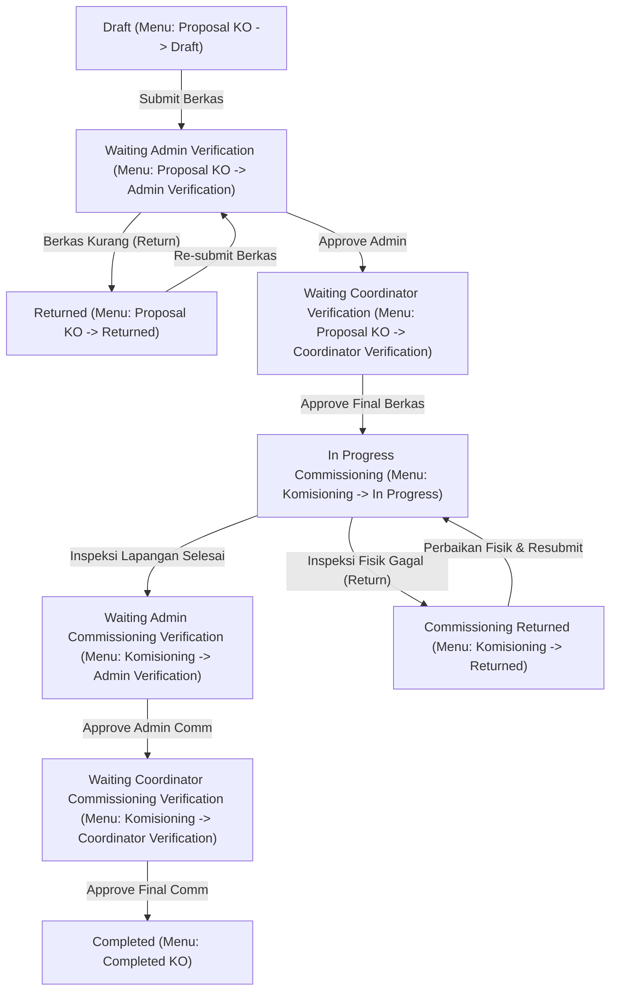
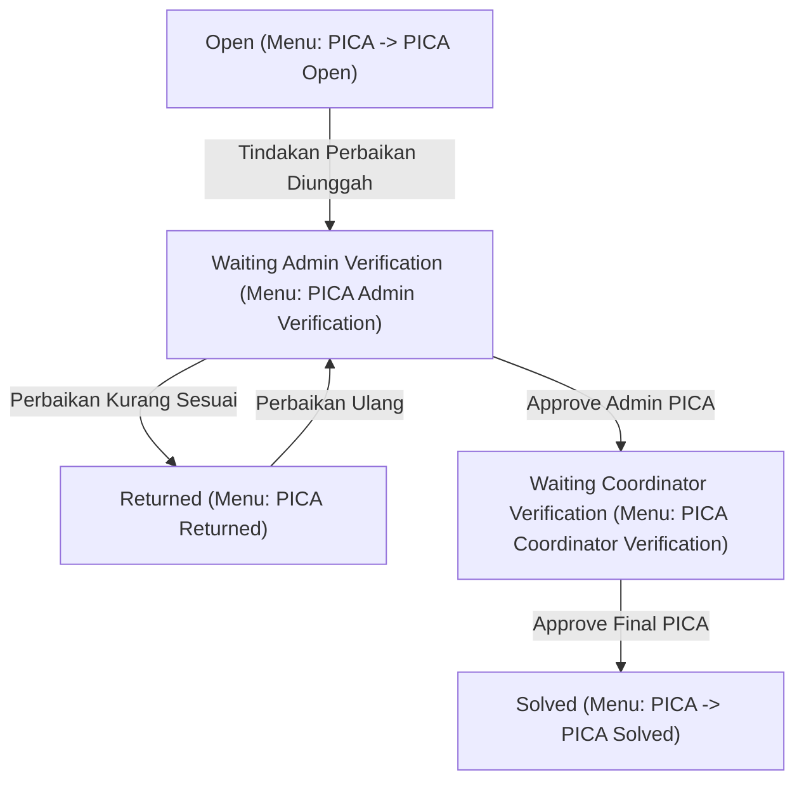
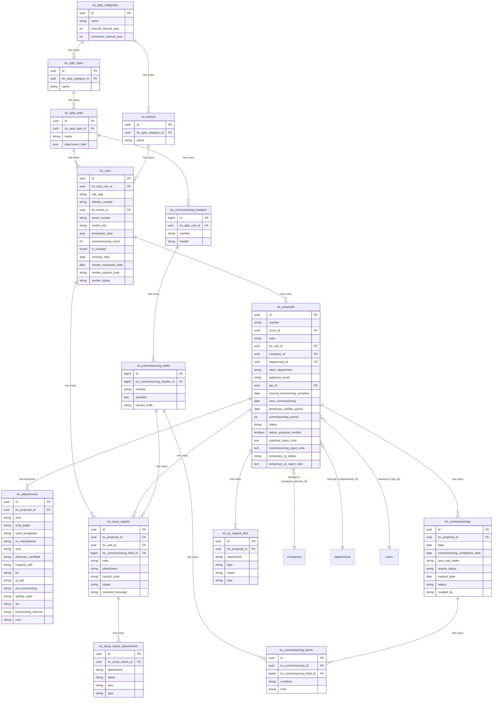

# 🛠️ Product Requirements Document (PRD) - Kelayakan Operasional (KO) Module

Modul **Kelayakan Operasional (KO)** di platform AIMS berfungsi untuk mengelola proses standardisasi kelayakan jalan (*roadworthiness*) dan kelayakan operasional dari unit, peralatan, kendaraan, maupun alat berat yang beroperasi di wilayah kerja perusahaan. Modul ini mencakup pendaftaran spesifikasi teknis unit, verifikasi dokumen administrasi pengajuan (Proposal), inspeksi fisik di lapangan (Commissioning), penerbitan stiker identitas unit (QR Code), pelaporan kerusakan pasca-inspeksi (PICA), serta proses penonaktifan unit (Revoke/Demob).

---

## 📂 1. Struktur Direktori Modul

Seluruh komponen logika dan visual untuk modul KO berada di bawah direktori `Modules/KO/`.

```bash
Modules/KO/
├── Config/
│   └── config.php               # Konfigurasi internal modul KO
├── Database/
│   ├── Migrations/             # Struktur database unit, proposal, commissioning, dan PICA
│   └── Seeders/
│       ├── KODatabaseSeeder.php    # Pemanggil seeder utama
│       ├── PermissionTableSeeder.php # Seeder permission guard 'ko'
│       └── SpipSeeder.php          # Data awal checklist kriteria kelayakan unit (SPIP)
├── Entities/                   # Model Eloquent untuk data operasional KO
│   ├── KoBrand.php             # Data brand unit/alat berat
│   ├── KoUnit.php              # Registrasi identitas unit (call sign, no lambung, dll.)
│   ├── KoProposal.php          # Form pengajuan kelayakan operasional
│   ├── KoAttachment.php        # Berkas berkas persyaratan administrasi unit
│   ├── KoCommissioning.php     # Hasil inspeksi commissioning unit
│   ├── KoCommissioningHeader.php # Header kriteria checklist
│   ├── KoCommissioningField.php  # Definisi field kriteria kelayakan
│   ├── KoCommissioningItem.php   # Nilai kelayakan unit per kriteria checklist
│   ├── KoQrRequestFiles.php    # Permohonan pencetakan stiker QR Code unit
│   ├── KoIssueReport.php       # Laporan kerusakan unit pasca-inspeksi (PICA)
│   ├── KoIssueReportAttachment.php # Lampiran bukti kerusakan PICA
│   ├── KoSpipCategory.php      # Kategori kelompok standar kelayakan unit
│   ├── KoSpipType.php          # Tipe kelompok standar kelayakan unit
│   └── KoSpipUnit.php          # Klasifikasi unit pada standar kelayakan
├── Http/
│   ├── Controllers/            # Controller handler standar
│   ├── Livewire/               # Komponen frontend reaktif (Livewire)
│   │   ├── Auth/Login.php      # Login guard 'ko'
│   │   ├── Dashboard/Dashboard.php # Panel ringkasan statistik status unit
│   │   ├── MasterLibrary/      # Manajemen data unit dan template checklist SPIP
│   │   ├── Ko/                 # Manajemen pengajuan proposal & lampiran kelayakan
│   │   ├── ProposalVerification/ # Verifikasi kelayakan berkas administratif
│   │   ├── Commissioning/      # Pelaksanaan inspeksi fisik unit di lapangan
│   │   ├── CommissioningVerification/ # Persetujuan hasil inspeksi lapangan
│   │   ├── RequestQR/          # Pengajuan dan pencetakan stiker QR Code unit
│   │   ├── IssueReport/        # Pengelolaan temuan kerusakan (PICA)
│   │   └── RevokeRequest/      # Manajemen pencabutan/penarikan izin unit (Demob)
│   └── Middleware/
├── Providers/
│   └── KOServiceProvider.php   # Registrasi Service & bindings
├── Resources/
│   ├── views/                  # Template visual Blade & Livewire
│   └── assets/                 # Aset CSS & JavaScript spesifik modul KO
└── Routes/
    └── web.php                 # Peta routing URL modul KO
```

---

## 🔄 2. Siklus Hidup & Status Alur Kerja (Workflow Lifecycles)

Ada 3 alur utama dalam siklus kelayakan operasional unit:

### A. Alur Siklus Hidup Pengajuan Proposal KO (Unit Commissioning)


### B. Alur Siklus Hidup Laporan Kerusakan Unit (PICA)


---

## 🗺️ 3. Struktur Menu & Pemetaan Halaman (Routes & Livewire)

Struktur navigasi pada sidebar modul KO dikelompokkan sebagai berikut:

### A. Menu: Master Library (Konfigurasi & Master Data)
| Nama Halaman | Akses Route | Livewire Component | Fungsi Bisnis |
| :--- | :--- | :--- | :--- |
| **Spip Category** | `/ko/master-library/spip-category` | `MasterLibrary\SpipCategory\SpipCategory` | Konfigurasi kategori besar standar kelayakan unit (misal: Heavy Equipment, Light Vehicle). |
| **Spip Type** | `/ko/master-library/spip-type` | `MasterLibrary\SpipType\SpipType` | Konfigurasi tipe standar kelayakan unit (misal: Excavator, LV Double Cabin). |
| **Spip Unit** | `/ko/master-library/spip-unit` | `MasterLibrary\SpipUnit\SpipUnit` | Template kriteria & definisi checklist inspeksi fisik unit di lapangan. |
| **Unit** | `/ko/master-library/unit` | `MasterLibrary\Unit\Unit` | Pendaftaran identitas fisik unit baru (no polisi, no lambung, call sign, brand, tahun buatan). |

### B. Menu: Proposal KO
| Nama Halaman | Akses Route | Livewire Component | Fungsi Bisnis |
| :--- | :--- | :--- | :--- |
| **Daftar KO** | `/ko/ko` | `Ko\Ko` | Menampilkan semua daftar pengajuan kelayakan operasional unit. |
| **Draft** | `/ko/ko/draft` | `Ko\Draft\KoDraft` | Tempat menyimpan draf pengajuan kelayakan sebelum dikirim berkasnya. |
| **Returned** | `/ko/ko/returned` | `Ko\Returned\KoReturned` | Menampung berkas proposal yang dikembalikan karena ada kekurangan dokumen administrasi. |
| **Admin Verification** | `/ko/proposal-verification/admin-verification` | `ProposalVerification\AdminVerification\AdminVerification` | Halaman kerja Admin untuk memeriksa kesesuaian berkas lampiran unit. |
| **Coordinator Verification**| `/ko/proposal-verification/coordinator-verification`| `ProposalVerification\CoordinatorVerification\CoordinatorVerification`| Halaman kerja Koordinator untuk memberikan approval kelayakan administrasi final. |

### C. Menu: Komisioning (Commissioning)
| Nama Halaman | Akses Route | Livewire Component | Fungsi Bisnis |
| :--- | :--- | :--- | :--- |
| **In Progress** | `/ko/commissioning` | `Commissioning\Commissioning` | Daftar unit yang lolos berkas administrasi dan siap dijadwalkan inspeksi fisik lapangan. |
| **Returned** | `/ko/commissioning/returned` | `Commissioning\ReturnedCommissioning` | Unit yang gagal uji fisik lapangan dan sedang dalam masa perbaikan temuan kerusakan. |
| **Admin Verification** | `/ko/commissioning-verification/admin` | `CommissioningVerification\AdminVerification\AdminVerification` | Verifikasi checklist hasil inspeksi fisik lapangan oleh Admin Commissioning. |
| **Coordinator Verification**| `/ko/commissioning-verification/coordinator`| `CommissioningVerification\CoordinatorVerification\CoordinatorVerification`| Approval final kelayakan fisik lapangan oleh Koordinator Commissioning. |

### D. Menu: Request QR Sementara
| Nama Halaman | Akses Route | Livewire Component | Fungsi Bisnis |
| :--- | :--- | :--- | :--- |
| **Request QR Sementara**| `/ko/request-qr` | `RequestQR\RequestQR` | Pengajuan cetak stiker QR Code sementara untuk unit yang lulus uji kelayakan. |
| **Request QR Verification**| `/ko/request-qr/coordinator-verification`| `RequestQR\CoordinatorVerification` | Halaman verifikasi dan persetujuan cetak QR Code oleh Koordinator. |
| **Approved QR** | `/ko/request-qr/approved-qr` | `RequestQR\ApprovedQR` | Halaman untuk mencetak/mengunduh PDF stiker QR Code yang telah disetujui. |

### E. Menu: PICA
| Nama Halaman | Akses Route | Livewire Component | Fungsi Bisnis |
| :--- | :--- | :--- | :--- |
| **PICA Open** | `/ko/issue-report` | `IssueReport\IssueReport` | Halaman pelaporan dan daftar temuan masalah kerusakan unit selama operasional. |
| **Returned** | `/ko/issue-report/returned` | `IssueReport\Returned` | Halaman perbaikan temuan PICA yang ditolak oleh verifikator karena kurang sesuai. |
| **Admin Verification** | `/ko/issue-report/admin-verification` | `IssueReport\AdminVerification` | Verifikasi perbaikan kerusakan unit oleh Admin/Safety Inspector. |
| **Coordinator Verification**| `/ko/issue-report/coordinator-verification`| `IssueReport\CoordinatorVerification`| Verifikasi perbaikan kerusakan unit tingkat akhir oleh Koordinator Safety. |
| **PICA Solved** | `/ko/issue-report/solved` | `IssueReport\Solved` | Arsip laporan kerusakan unit yang telah selesai diperbaiki dan diverifikasi. |

### F. Menu: Completed KO
| Nama Halaman | Akses Route | Livewire Component | Fungsi Bisnis |
| :--- | :--- | :--- | :--- |
| **Completed KO** | `/ko/ko/completed` | `Ko\Completed\KoCompleted` | Daftar unit yang resmi memegang izin kelayakan operasional aktif (Active QR Code). |

---

## 🔐 4. Spesifikasi Roles & Permissions (Spatie)

Keamanan akses di modul KO menggunakan **Spatie Roles & Permissions** di bawah guard `ko`.

### A. Hak Akses (Permissions) Spatie Modul KO
1.  **`KO - Login`**: Hak akses dasar untuk masuk ke portal modul Kelayakan Operasional.
2.  **`KO - Master Library`**: Hak untuk mengonfigurasi unit, brand, dan kriteria checklist inspeksi (SPIP).
3.  **`KO - Create Proposal`**: Hak bagi pemilik unit untuk membuat pengajuan berkas kelayakan baru.
4.  **`KO - Admin Proposal Verification`**: Hak bagi staf admin untuk memverifikasi lampiran administrasi proposal.
5.  **`KO - Coordinator Proposal Verification`**: Hak bagi koordinator untuk meluluskan berkas administrasi proposal.
6.  **`KO - Create Commissioning`**: Hak bagi tim safety inspector/komisioner untuk menginput hasil cek fisik lapangan.
7.  **`KO - Admin Commissioning Verification`**: Hak memverifikasi hasil input checklist cek fisik lapangan.
8.  **`KO - Coordinator Commissioning Verification`**: Hak memberikan persetujuan akhir hasil kelayakan operasional unit di lapangan.
9.  **`KO - Request Temporary QR`**: Hak mengajukan pencetakan stiker QR Code sementara.
10. **`KO - QR Request Verification`**: Hak menyetujui permohonan cetak stiker QR Code.
11. **`KO - Print Temporary QR`**: Hak mengunduh/mencetak berkas PDF stiker QR Code.
12. **`KO - Open PICA`**: Hak menginput temuan kerusakan/perbaikan unit baru.
13. **`KO - Admin PICA`**: Hak verifikator tingkat komisioner atas perbaikan temuan PICA.
14. **`KO - Coordinator PICA`**: Hak verifikator tingkat koordinator atas perbaikan temuan PICA.
15. **`KO - Solved PICA`**: Hak menutup status laporan kerusakan menjadi selesai diperbaiki.
16. **`KO - Admin Revoke Unit Verification`**: Hak admin memproses penarikan unit/demobilisasi alat.
17. **`KO - Coordinator Revoke Unit Verification`**: Hak koordinator mengesahkan penarikan unit/demobilisasi alat.
18. **`KO - Print QR`**: Hak mencetak QR code resmi unit yang berstatus Completed.

### B. Matriks Hubungan Roles & Permissions

| Fitur / Modul | Nama Permission Spatie | Keselamatan Operasional - Maker | Keselamatan Operasional - Verificator | Keselamatan Operasional - Koordinator KO | Keselamatan Operasional - Super Admin |
| :--- | :--- | :---: | :---: | :---: | :---: |
| **Login** | `KO - Login` | ✅ | ✅ | ✅ | ✅ |
| **Master Data** | `KO - Master Library` | ❌ | ❌ | ❌ | ✅ |
| **Demob Unit** | `KO - Admin Revoke Unit Verification` | ❌ | ✅ | ❌ | ✅ |
| | `KO - Coordinator Revoke Unit Verification` | ❌ | ❌ | ✅ | ✅ |
| **Proposal** | `KO - Create Proposal` | ✅ | ❌ | ❌ | ✅ |
| | `KO - Admin Proposal Verification` | ❌ | ✅ | ❌ | ✅ |
| | `KO - Coordinator Proposal Verification` | ❌ | ❌ | ✅ | ✅ |
| **Commissioning**| `KO - Create Commissioning` | ❌ | ✅ | ❌ | ✅ |
| | `KO - Admin Commissioning Verification` | ❌ | ✅ | ❌ | ✅ |
| | `KO - Coordinator Commissioning Verification`| ❌ | ❌ | ✅ | ✅ |
| **QR Code** | `KO - Request Temporary QR` | ✅ | ❌ | ❌ | ✅ |
| | `KO - QR Request Verification` | ❌ | ❌ | ✅ | ✅ |
| | `KO - Print Temporary QR` | ✅ | ✅ | ✅ | ✅ |
| | `KO - Print QR` | ✅ | ✅ | ✅ | ✅ |
| **PICA (Temuan)**| `KO - Open PICA` | ✅ | ✅ | ❌ | ✅ |
| | `KO - Admin PICA` | ❌ | ✅ | ❌ | ✅ |
| | `KO - Coordinator PICA` | ❌ | ❌ | ✅ | ✅ |
| | `KO - Solved PICA` | ❌ | ❌ | ✅ | ✅ |

---

## 📝 5. Panduan Langkah-Langkah Operasional Form & Workflow

### A. Langkah Pendaftaran Unit Baru
1.  User dengan akses Master Library masuk menu **Master Library -> Unit**.
2.  Klik **Add Unit**.
3.  Pilih **Klasifikasi SPIP** unit (didapat dari konfigurasi SpipUnit).
4.  Pilih **Brand** unit, masukkan **Nama Unit**, **Nomor Identitas** (No Polisi / No Lambung), **Call Sign**, **Tahun Produksi**, dan nomor rangka/mesin.
5.  Simpan data unit. Unit kini terdaftar di sistem AIMS dan siap diajukan dalam Proposal KO.

### B. Langkah Pengajuan Proposal Kelayakan (Proposal KO)
1.  User (**Pemilik Unit**) masuk menu **Proposal KO -> Daftar KO** -> klik **Create Proposal**.
2.  Pilih Unit yang telah didaftarkan sebelumnya.
3.  Sistem secara otomatis membaca masa berlaku internal interval berdasarkan klasifikasi SPIP unit tersebut.
4.  Unggah dokumen persyaratan administrasi pada komponen **Add Attachment** (misal: berkas STNK, bukti uji kelayakan eksternal, asuransi, dll.).
5.  Simpan sebagai **Draft** (terlihat di menu **Proposal KO -> Draft**), atau klik **Submit** untuk mengirim berkas pengajuan ke tim verifikator. Status proposal berubah menjadi *Waiting Admin Verification*.

### C. Langkah Verifikasi Berkas Pengajuan
1.  **Verifikasi Admin**:
    *   Admin Safety (**`KO - Admin Proposal Verification`**) memeriksa kelengkapan file administrasi yang diunggah di menu **Proposal KO -> Admin Verification**.
    *   Jika ada dokumen yang kedaluwarsa atau salah unggah, Admin menekan tombol **Return** dan menulis catatan perbaikan. Status proposal berubah menjadi **Returned** (dan masuk ke menu **Proposal KO -> Returned** milik pemilik unit).
    *   Jika sesuai, Admin menekan tombol **Approve**. Status proposal berlanjut ke verifikasi koordinator.
2.  **Verifikasi Koordinator**:
    *   Koordinator Safety (**`KO - Coordinator Proposal Verification`**) membuka menu **Proposal KO -> Coordinator Verification**.
    *   Koordinator memeriksa proposal akhir secara keseluruhan. Setelah divalidasi, Koordinator menekan tombol **Approve Final**. Status unit berubah menjadi **In Progress Commissioning** (dan masuk ke menu **Komisioning -> In Progress**).

### D. Langkah Pelaksanaan Commissioning Lapangan (Cek Fisik)
1.  Inspektur Safety / Komisioner (**`KO - Create Commissioning`**) membawa perangkat mobile/tablet ke lapangan dan membuka menu **Komisioning -> In Progress**.
2.  Pilih unit yang akan diuji fisik, klik **Conduct Commissioning**.
3.  Sistem menampilkan checklist kelayakan fisik unit berdasarkan template SPIP yang valid.
4.  Komisioner memeriksa tiap kriteria checklist dan mengisinya dengan pilihan **Layak**, **Tidak Layak**, atau **N/A** (Not Applicable), serta melampirkan foto temuan jika ada bagian yang rusak.
5.  Setelah cek fisik selesai:
    *   **Lulus**: Jika semua kriteria kritis lulus uji, Komisioner mengirim hasil pengujian. Status pengujian berubah menjadi *Waiting Commissioning Verification*. Setelah diverifikasi di menu **Komisioning -> Admin Verification** dan **Komisioning -> Coordinator Verification**, status unit berubah menjadi **Completed** (masuk ke menu **Completed KO**) dan QR Code permanen diterbitkan.
    *   **Tidak Lulus (Temuan)**: Jika terdapat temuan kritis yang membahayakan keselamatan, Komisioner menekan tombol **Reject / Return**. Status unit menjadi **Commissioning Returned** (masuk ke menu **Komisioning -> Returned**). Pemilik unit harus memperbaiki kerusakan fisik unit tersebut sebelum mengajukan re-commissioning.

### E. Langkah Pelaporan & Perbaikan Kerusakan (PICA)
1.  Jika di tengah operasional terdapat kerusakan pada unit aktif, user membuka menu **PICA -> PICA Open** -> klik **Report Issue**.
2.  Tulis detail kerusakan, klasifikasi masalah, dan unggah foto bukti kerusakan unit. Laporan berstatus **Open**.
3.  Pemilik unit melakukan perbaikan fisik di bengkel/lapangan. Setelah selesai diperbaiki, pemilik mengunggah foto bukti perbaikan dan berkas pendukung pada laporan PICA tersebut. Laporan beralih ke verifikasi komisioner.
4.  Setelah diverifikasi di menu **PICA Admin Verification** dan **PICA Coordinator Verification**, status laporan berubah menjadi **Solved** (masuk ke arsip menu **PICA -> PICA Solved**). Unit dapat beroperasi normal kembali di lapangan.

---

## 🗄️ 6. Skema Database & Relasi Entitas (Database Relationships)

### A. Diagram Relasi Entitas (ERD - Entity Relationship Diagram)

Berikut adalah diagram relasi antar tabel pada modul Kelayakan Operasional (KO) serta hubungannya dengan tabel master eksternal di platform AIMS menggunakan Mermaid.js:



### B. Daftar Hubungan & Deskripsi Tabel Relasional

Berikut adalah penjelasan detail mengenai masing-masing tabel relasional dan jenis hubungannya:

#### 1. Tabel Master Kriteria & Spesifikasi SPIP (Standar Kesiapan Operasi)
*   **`ko_spip_categories`**
    *   **Deskripsi**: Kategori besar spesifikasi standar unit (misal: *Light Vehicle*, *Heavy Equipment*). Mengatur interval wajib komisioning.
    *   **Relasi**: `hasMany` ke `ko_spip_types` dan `ko_brands`.
*   **`ko_spip_types`**
    *   **Deskripsi**: Tipe detail di bawah kategori (misal: *LV Double Cabin*, *Excavator*).
    *   **Relasi**: `belongsTo` ke `ko_spip_categories`, `hasMany` ke `ko_spip_units`.
*   **`ko_spip_units`**
    *   **Deskripsi**: Definisi checklist kelayakan spesifik untuk jenis unit tertentu. Menyimpan data field lampiran dinamis dalam format JSON.
    *   **Relasi**: `belongsTo` ke `ko_spip_types`, `hasMany` ke `ko_units` dan `ko_commissioning_headers`.
*   **`ko_brands`**
    *   **Deskripsi**: Daftar merk / pabrikan unit (misal: Toyota, Caterpillar, Komatsu).
    *   **Relasi**: `belongsTo` ke `ko_spip_categories`, `hasMany` ke `ko_units`.

#### 2. Tabel Operasional & Transaksional Modul
*   **`ko_units`**
    *   **Deskripsi**: Registrasi fisik unit operasional yang beroperasi di wilayah kerja. Menyimpan detail call sign, no lambung, serial number, serta status penangguhan (*revoke*).
    *   **Relasi**:
        *   `belongsTo` ke `ko_spip_units` (`ko_spip_unit_id`)
        *   `belongsTo` ke `ko_brands` (`ko_brand_id`)
        *   `hasMany` ke `ko_proposals` (`ko_unit_id`)
        *   `hasMany` ke `ko_issue_reports` (`ko_unit_id`)
*   **`ko_proposals`**
    *   **Deskripsi**: Pengajuan uji kelayakan berkas administratif dan fisik unit.
    *   **Relasi Internal**:
        *   `belongsTo` ke `ko_units` (`ko_unit_id`)
        *   `hasMany` ke `ko_attachments` (`ko_proposal_id`)
        *   `hasMany` ke `ko_commissionings` (`ko_proposal_id`)
        *   `hasMany` ke `ko_issue_reports` (`ko_proposal_id`)
        *   `hasMany` ke `ko_qr_request_files` (`ko_proposal_id`)
    *   **Relasi Eksternal**:
        *   `belongsTo` ke `companies` (`company_id` & `ccow_id`)
        *   `belongsTo` ke `departments` (`department_id`)
        *   `belongsTo` ke `users` (`pjo_id` - Penanggung Jawab Operasional)
*   **`ko_attachments`**
    *   **Deskripsi**: Menyimpan file berkas dokumen legal/persyaratan administratif unit yang diajukan (STNK, KIR, SLO, dll.).
    *   **Relasi**: `belongsTo` ke `ko_proposals` (`ko_proposal_id`).
*   **`ko_commissioning_headers`**
    *   **Deskripsi**: Menyimpan judul kategori kelompok checklist kelayakan fisik (misal: *Sistem Rem*, *Kondisi Cabin*).
    *   **Relasi**: `belongsTo` ke `ko_spip_units`, `hasMany` ke `ko_commissioning_fields`.
*   **`ko_commissioning_fields`**
    *   **Deskripsi**: Pertanyaan-pertanyaan detail kelayakan fisik di bawah setiap header grup checklist.
    *   **Relasi**: `belongsTo` ke `ko_commissioning_headers`, `hasMany` ke `ko_commissioning_items`.
*   **`ko_commissionings`**
    *   **Deskripsi**: Catatan transaksi hasil pelaksanaan commissioning fisik unit di lapangan oleh inspector.
    *   **Relasi**: `belongsTo` ke `ko_proposals`, `hasMany` ke `ko_commissioning_items`.
*   **`ko_commissioning_items`**
    *   **Deskripsi**: Penilaian per kriteria pertanyaan checklist lapangan (*Layak*, *Tidak Layak*, *N/A*) beserta catatan tambahannya.
    *   **Relasi**: `belongsTo` ke `ko_commissionings` dan `ko_commissioning_fields`.
*   **`ko_issue_reports`**
    *   **Deskripsi**: Pelaporan temuan kerusakan unit (PICA) pasca-komisioning maupun saat operasional berlangsung.
    *   **Relasi**:
        *   `belongsTo` ke `ko_proposals` (`ko_proposal_id`)
        *   `belongsTo` ke `ko_units` (`ko_unit_id`)
        *   `belongsTo` ke `ko_commissioning_fields` (`ko_commissioning_field_id` - jika terkait kriteria checklist tertentu)
        *   `hasMany` ke `ko_issue_report_attachments` (`ko_issue_report_id`)
*   **`ko_issue_report_attachments`**
    *   **Deskripsi**: Unggahan foto bukti kerusakan dan bukti perbaikan unit bermasalah.
    *   **Relasi**: `belongsTo` ke `ko_issue_reports` (`ko_issue_report_id`).
*   **`ko_qr_request_files`**
    *   **Deskripsi**: Mengelola file bukti permohonan stiker QR Code sementara untuk unit yang lulus uji.
    *   **Relasi**: `belongsTo` ke `ko_proposals` (`ko_proposal_id`).

