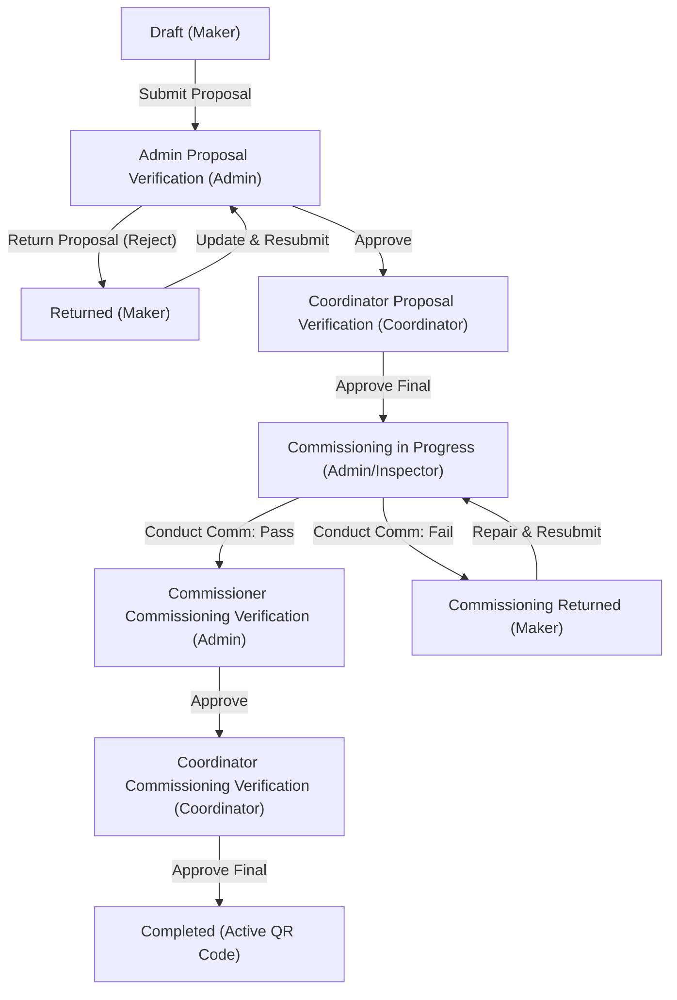

# Kelayakan Operasional (KO) Submission & Approval Workflow

This document details the complete submission, review, and approval workflow for the **Kelayakan Operasional (KO)** module. It explains how the roles, permissions, database structures, and state transitions are configured for testing purposes using the following designated users:
- **Maker** (Owner Unit): `ko.maker@alamtri.com` and `fadjri.wivindi@alamtri.com`
- **Admin / Inspector** (Safety Officer): `ko.admin@alamtri.com`
- **Coordinator** (Approver / PJO): `ko.coordinator@alamtri.com`

---

## 1. User & Access Matrix Configuration

The following database relationships, permissions, and roles have been validated and are active for testing the KO lifecycle:

| User Role | Email | Password | Role Name (Spatie) | Guard / Permissions Mapping | Area Mapping / Setup / Active Users |
| :--- | :--- | :--- | :--- | :--- | :--- |
| **Maker** | `ko.maker@alamtri.com`<br>`fadjri.wivindi@alamtri.com` | `password` | `Keselamatan Operasional - Maker` | `ko` guard:<br>- `KO - Login`<br>- `KO - Create Proposal`<br>- `KO - Request Temporary QR`<br>- `KO - Print Temporary QR`<br>- `KO - Print QR`<br>- `KO - Open PICA` | **Active Makers:**<br>- Fadjri Wivindi (`fadjri.wivindi@alamtri.com`) |
| **Admin / Inspector** | `ko.admin@alamtri.com`<br>*(and 10 active database users)* | `password` | `Keselamatan Operasional - Verificator` | `ko` guard:<br>- `KO - Login`<br>- `KO - Admin Revoke Unit Verification`<br>- `KO - Admin Proposal Verification`<br>- `KO - Create Commissioning`<br>- `KO - Admin Commissioning Verification`<br>- `KO - Print Temporary QR`<br>- `KO - Print QR`<br>- `KO - Open PICA`<br>- `KO - Admin PICA` | **Active Inspectors / Verifiers:**<br>- Rahman Widodo (`rahman.widodo@alamtri.com`)<br>- Krisna Dewantara (`krisna.dewantara@alamtri.com`)<br>- Hengky P. Simanullang (`hengky.simanullang@alamtri.com`)<br>- Indra Gunawan (`indra.gunawan@alamtri.com`)<br>- Rahmandana E. Saputra (`rahmandana.saputra@alamtri.com`)<br>- Reri Aringga (`reri.aringga@alamtri.com`)<br>- Fuad Firmansyah (`fuad.firmansyah@alamtri.com`)<br>- Ari Suwarna (`ari.suwarna@alamtri.com`)<br>- Faza Surya Garuda (`faza.garuda@alamtri.com`)<br>- Febrianto D. Hosea (`febrianto.hosea@alamtri.com`)<br>- Afrizal Fakhmy (`afrizal.fakhmy@alamtri.com`) |
| **Coordinator** | `ko.coordinator@alamtri.com`<br>*(and 3 active database users)* | `password` | `Keselamatan Operasional - Koordinator KO` | `ko` guard:<br>- `KO - Login`<br>- `KO - Coordinator Revoke Unit Verification`<br>- `KO - Coordinator Proposal Verification`<br>- `KO - Coordinator Commissioning Verification`<br>- `KO - QR Request Verification`<br>- `KO - Print Temporary QR`<br>- `KO - Print QR`<br>- `KO - Coordinator PICA`<br>- `KO - Solved PICA` | **Active Coordinators:**<br>- Jajang Nurzaman (`jajang.zaman@alamtri.com`)<br>- Raras Adha Widyanusa (`raras.widyanusa@alamtri.com`)<br>- Ari Suwarna (`ari.suwarna@alamtri.com`) |

---

## 2. Kelayakan Operasional Workflow Stages

The workflow transitions a unit from pendaftaran (registration) through administrative verification and field inspection to a fully certified operasional state.



### Stage 1: Proposal Creation & Submission (Maker)
* **Status**: `Draft` -> `Admin Proposal Verification`
* **Action**: Maker selects a registered Unit, uploads administrative attachments (STNK, KIR, etc.), and submits.
* **Code Example**:
  ```php
  $proposal->update([
      'status' => KoStatus::AdminProposalVerification,
  ]);
  ```

### Stage 2: Admin Document Verification (Admin)
* **Status**: `Admin Proposal Verification` -> `Coordinator Proposal Verification` OR `Returned`
* **Action**: Admin Safety reviews file attachments. If they are correct, they approve. If incorrect, they return with a reject note.

### Stage 3: Coordinator Document Approval (Coordinator)
* **Status**: `Coordinator Proposal Verification` -> `Commissioning in Progress`
* **Action**: Coordinator Safety reviews the administrative validation and assigns a final schedule for the physical field inspection.

### Stage 4: Conduct Field Commissioning (Admin/Inspector)
* **Status**: `Commissioning in Progress` -> `Commissioner Commissioning Verification` OR `Commissioning Returned`
* **Action**: Inspector uses a tablet to check off the physical SPIP checklist items (Layak, Tidak Layak, N/A). 
* If the unit fails safety-critical items, it transitions to `Commissioning Returned` so the owner can repair the physical unit.

### Stage 5: Commissioning Approval & QR Generation (Coordinator)
* **Status**: `Commissioner Commissioning Verification` -> `Completed`
* **Action**: Coordinator validates the checklist results and approves the commissioning.
* The system automatically flags the unit as active and generates the official QR Code.

---

## 3. Database Seeding

We have created a dedicated Laravel Seeder [KODummySeeder.php](file:///c:/laragon/www/aims/Modules/KO/Database/Seeders/KODummySeeder.php) that populates the database with test users, Spatie roles/permissions, and 7 proposal scenarios representing every active state:

1. **`KO/2026/0001`**: **Draft** (Editable in Maker's draft view).
2. **`KO/2026/0002`**: **Admin Proposal Verification** (Visible in Admin's document queue).
3. **`KO/2026/0003`**: **Returned** (Rejected by admin, visible in Maker's returned view with note: *"Dokumen STNK buram, mohon unggah ulang foto yang jelas."*).
4. **`KO/2026/0004`**: **Coordinator Proposal Verification** (Visible in Coordinator's document queue).
5. **`KO/2026/0005`**: **Commissioning in Progress** (Visible in Commissioning checklist conduct view).
6. **`KO/2026/0006`**: **Commissioning Returned** (Rejected during field test, visible in Maker's returned queue with note: *"Rem tangan tidak berfungsi dengan baik, ganti kampas rem."*).
7. **`KO/2026/0007`**: **Completed** (Approved unit with generated QR Code data).

### How to Run the Seeder

To run this seeder and populate your development database, execute the following command:

```powershell
php artisan db:seed --class="Modules\KO\Database\Seeders\KODummySeeder"
```

### How to Run the Programmatic Simulation

To execute the end-to-end KO flow programmatically and verify the database operations:

```powershell
php scratch/test_ko_query.php
```

For more info about the module requirements, database tables, and entity relationship diagrams, please refer to the main module PRD [aims_ko_prd.md](file:///c:/laragon/www/aims/agent/module%20PRD%20or%20Workflow/aims_ko_prd.md).
