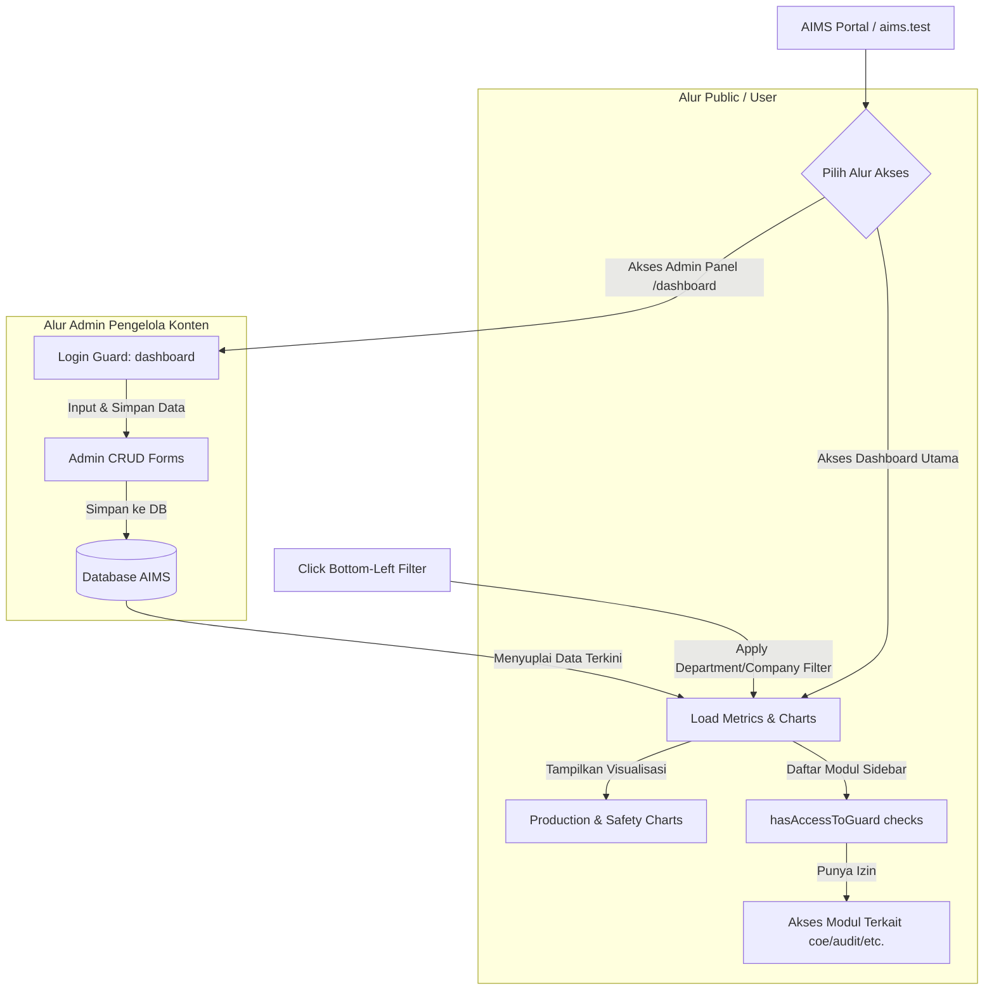
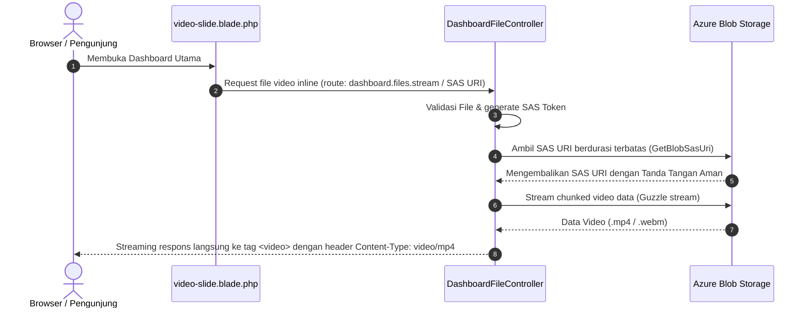

# 📊 AIMS — Main Dashboard Workflow Documentation

This document describes the workflow, layout structure, and permission-based navigation of the main **AIMS Public Landing Dashboard** (`/` route).

---

## 1. Dashboard Workflow Diagram

Below is the user workflow starting from the main portal, showing how modules are dynamically displayed based on access privileges, and how Admin inputs populate the dashboard data.



---

## 2. Dynamic Sidebar Navigation (Access Control)

The left sidebar (`dashboard-sidebar.blade.php`) dynamically checks user capabilities before rendering specific module shortcuts.

### 2.1 Mekanisme Autentikasi Spatie Multi-Guard
Hak akses sidebar dikontrol menggunakan method helper `hasAccessToGuard(string $guard)` pada Model [User.php](file:///c:/laragon/www/aims/app/Models/User.php#L118-L126):

```php
public function hasAccessToGuard(string $guard): bool
{
    if (in_array($guard, ['web', 'admin', 'dashboard'])) {
        return true;
    }

    return $this->roles()->where('guard_name', $guard)->exists()
        || $this->permissions()->where('guard_name', $guard)->exists();
}
```

Jika pengguna yang sedang aktif tidak memiliki peran (*role*) atau izin (*permission*) dengan `guard_name` yang terdaftar di database, menu terkait akan **disembunyikan sepenuhnya** dari menu navigasi.

### 2.2 Matriks Pemetaan Modul & Guard Spatie

| Nama Menu Sidebar | Key Guard (`guard_name` di Database) | Syarat Kemunculan |
| :--- | :--- | :--- |
| **Dashboard AIMS** | `web` / `dashboard` | Universal Access (Akses Bebas) |
| **Calendar Of Event** | `coe` | User memiliki role/permission pada guard `coe` |
| **Document System** | `document-system` | User memiliki role/permission pada guard `document-system` |
| **Safety Accountability Program** | `sap` | User memiliki role/permission pada guard `sap` |
| **Field Leadership** | `field-leadership` | User memiliki role/permission pada guard `field-leadership` |
| **Inspection** | `kplh` | User memiliki role/permission pada guard `kplh` |
| **Audit** | `audit` | User memiliki role/permission pada guard `audit` |
| **Management Risk** | `ibpr-and-bowtie` | User memiliki role/permission pada guard `ibpr-and-bowtie` |
| **Compliance Regulation** | `kpp` | User memiliki role/permission pada guard `kpp` |
| **Medical Check Up** | `mcu` | User memiliki role/permission pada guard `mcu` |
| **Contractor Safety Management** | `csms` | User memiliki role/permission pada guard `csms` |
| **Safety Operation** | `ko` | User memiliki role/permission pada guard `ko` |
| **PICA** | `pica` | User memiliki role/permission pada guard `pica` |

---

## 3. Main Dashboard Sections

### 3.1 Top Metrics Summary Cards
Displays high-level KPI trends with directional indicator carets (UP / DOWN):
*   **Project to Date**: Total days active/registered.
*   **Manhours**: Accumulated working hours.
*   **Day After Last LTI**: Count of safe days since the last Lost Time Injury.
*   **Manpower**: Registered workforce count.

### 3.2 Production Charts (YTD & MTD)
*   **Production YTD**: Represents monthly trends from January to December for five operations:
    *   Coal Shipping
    *   Waste Removal
    *   Coal Mining
    *   Coal Hauling
    *   Coal Barged
*   **Production MTD**: Renders the month-to-date target completion ratio (e.g. 0% Actual vs Target).

### 3.3 Interactivity & Filtering
*   **Global Filter**: Accessed via the **Filter** button at the bottom-left of the sidebar, enabling users to customize the metrics and charts based on company, department, or date range.

---

## 4. Sumber Data Dashboard & Chart

Data yang ditampilkan pada halaman utama dashboard dikumpulkan secara dinamis dari berbagai modul sistem melalui pemanggilan API internal atau Controller masing-masing modul di fungsi `moduleChart()` pada [Index.php](file:///c:/laragon/www/aims/app/Http/Livewire/MainDashboard/Public/Index.php):

| Widget / Chart | Model / Controller | Sumber Data Utama / Fungsi |
| :--- | :--- | :--- |
| **Top Metrics Cards** <br>*(Project to Date, Manhours, LTI, Manpower)* | `App\Models\MainDashboard\General` | Membaca record terakhir yang aktif dari tabel `generals` database. |
| **Calendar Of Event List** | `Modules\Coe\Http\Controllers\CoeController` | Fungsi `getAllIn($request)` mengambil agenda kegiatan K3LH. |
| **Production YTD & MTD** | `App\Http\Controllers\Api\DashboardController` | Fungsi `Production($request)` membaca data realisasi produksi bulanan. |
| **Document System Summary** | `Modules\DocumentSystem\Http\Controllers\MainDashboard\MainDashboardController` | Fungsi `index($request)` menghitung jumlah dokumen terdaftar. |
| **Safety Accountability Program (SAP)** | `Modules\Sap\Http\Controllers\Api\ApiController` | Fungsi `ApiDashboard($request)` untuk kalkulasi pencapaian program keselamatan. |
| **Safety Accountability Program (SAP) Charts** | `Modules\Sap\Http\Controllers\Api\ApiController` | Mengambil data grafik YTD melalui `SapCategoryAll`, `SapMonthly`, dan `SapDepartments`. |
| **Field Leadership (FLS)** | `Modules\FieldLeadership\Http\Controllers\MainDashboard\MainDashboardController` | Fungsi `mainDashboard($request)` untuk summary laporan FLS. |
| **Inspection (Kplh)** | `Modules\Kplh\Http\Controllers\KplhController` | Fungsi `getAllIn($request)` untuk rangkuman temuan inspeksi lapangan. |
| **Audit** | `Modules\Audit\Http\Controllers\Api\AuditController` | Fungsi `dashboard($request)` mengembalikan total temuan dan status audit bundle. |
| **Safety Operation (KO)** | `Modules\KO\Http\Controllers\Api\DashboardController` | Fungsi `Index($request)` untuk data insiden operasional. |
| **Management Risk (MR)** | `Modules\IbprAndBowtie\Http\Controllers\DashboardController` | Fungsi `index($request)` untuk visualisasi risiko IBPR. |
| **Compliance Regulation (CR)** | `Modules\KPP\Http\Controllers\Api\DashboardController` | Fungsi `index($request)` untuk status pemenuhan regulasi KPP. |
| **Medical Check Up (MCU)** | `Modules\Mcu\Http\Controllers\McuController` | Fungsi `getAllIn($request)` untuk visualisasi status kesehatan fit/unfit pekerja. |
| **Contractor Safety Management (CSMS)** | `Modules\CSMS\Http\Controllers\DashboardController` | Fungsi `dashboardIndex($request)` untuk penilaian kontraktor terdaftar. |

---

## 5. Struktur Folder File Dashboard

Berikut adalah pemetaan folder dan file penting yang menyusun Main Dashboard pada AIMS:

```
├── app
│   └── Http
│       └── Livewire
│           └── MainDashboard
│               └── Public
│                   └── Index.php (Livewire controller utama untuk halaman landing dashboard)
│
├── resources
│   └── views
│       ├── layouts
│       │   ├── main-dashboard
│       │   │   └── dashboard-white.blade.php (Master layout pembungkus halaman dashboard)
│       │   └── sidebar
│       │       └── dashboard-sidebar.blade.php (Left sidebar menu dinamis berbasis RBAC)
│       │
│       └── livewire
│           └── main-dashboard
│               └── public
│                   ├── index.blade.php (View utama yang menyusun grid layout dashboard)
│                   └── widgets (Widget visualiasi grafis / charts)
│                       ├── video-slide.blade.php (Widget video slider promosi)
│                       ├── calendar-of-event-list.blade.php (Widget daftar agenda)
│                       ├── production-ytd-chart.blade.php (Grafik YTD Production)
│                       ├── production-mtd.blade.php (Grafik MTD Production)
│                       ├── safety-performance-chart.blade.php (Grafik Safety KPI)
│                       ├── strategic-project.blade.php (Widget daftar project strategis)
│                       ├── news-update.blade.php (Widget feed berita terbaru)
│                       ├── penghargaan-k3lh.blade.php (Widget K3LH Award)
│                       ├── incident-notification.blade.php (Notifikasi insiden K3LH)
│                       ├── kegiatan-k3lh.blade.php (Jadwal/Agenda kegiatan K3LH)
│                       └── sap-ytd.blade.php (Grafik YTD pencapaian program SAP)
```

---

## 6. Alur Input Administrator Konten Dashboard

Untuk memperbarui dan mengisi data/grafik pada Main Dashboard, Administrator melakukan input melalui rute ber-prefix `/dashboard` dengan guard `auth:dashboard` yang memetakan form input ke tabel database sebagai berikut:

| Route / Prefix | Form Input & Action | Deskripsi Update |
| :--- | :--- | :--- |
| `/dashboard/general` | **General Form (CRUD)** | Mengisi angka numerik dan indikator tren (`UP` / `DOWN`) untuk Project to Date, Manhours, Day After Last LTI, dan Manpower. |
| `/dashboard/production` | **Production Form (CRUD)** | Mengisi angka target dan realisasi bulanan yang menyuplai data untuk grafik **Production YTD** dan **Production MTD**. |
| `/dashboard/k3lh-activities` | **K3LH Activities Form (CRUD)** | Menambahkan detail agenda kegiatan K3LH yang akan ditampilkan di list kegiatan terbawah dashboard. |
| `/dashboard/news-and-update` | **News & Update Form (CRUD)** | Mengunggah artikel berita K3LH (judul, gambar banner, konten). |
| `/dashboard/incident-notification`| **Incident Notification Form (CRUD)**| Membuat list peringatan/notifikasi bahaya insiden kerja K3LH. |
| `/dashboard/k3lh-award` | **K3LH Award Form (CRUD)** | Memasukkan pencapaian penghargaan K3LH yang diraih perusahaan. |
| `/dashboard/strategic_project` | **Strategic Project Form (CRUD)** | Mengisi capaian milestone proyek strategis yang sedang berjalan. |
| `/dashboard/safety_performance` | **Safety Performance Form (CRUD)** | Menginput metrik grafik bulanan/tahunan performa safety (LTI, etc.). |
| `/dashboard/slideshow` / `banner` | **Media Upload Form (CRUD)** | Mengupload file media promosi untuk slideshow banner utama. |

---

## 7. Integrasi Azure Blob Storage & Video Streaming

Untuk meningkatkan performa, skalabilitas, dan efisiensi penyimpanan, seluruh unggahan file media (gambar banner, slideshow, berita, dan file video promosi) pada Admin Panel Main Dashboard diintegrasikan dengan Azure Blob Storage menggunakan helper `uploadToBlobStorage()`.

### 7.1 Alur Unggah File Media (Upload Flow)
Pada form CRUD Admin Panel (contohnya [Slideshow Create](file:///c:/laragon/www/aims/app/Http/Livewire/MainDashboard/Slideshow/Create.php)), alur upload menggunakan mekanisme berikut:
1. **Livewire Temporary Upload**: Admin mengunggah file media melalui input file (`$this->file`), Livewire menyimpannya sementara di folder temporary lokal.
2. **Azure API Upload**: Sistem memanggil helper `uploadToBlobStorage($filename, $filePathTemp, $directPath)` untuk mengirimkan berkas langsung ke Azure Blob Container (`aims-cntr`).
3. **Penyimpanan Metadata**: Database menyimpan alamat URL lengkap blob (`blob_url` / `url`) beserta response payload JSON Azure (`blob_response`).

### 7.2 Alur Pemutaran & Preview Video (Streaming Flow)
Berbeda dengan modul *Audit* yang menampilkan file via modal/popup preview, media pada Main Dashboard (seperti video promosi pada Slideshow, Banner, dan News) **ditampilkan secara langsung (inline) di halaman utama (Home)** pada masing-masing widget/carousel agar dapat langsung dilihat oleh pengunjung tanpa perlu mengeklik tombol preview atau membuka modal.

Pemutaran video menggunakan HTML5 `<video>` yang terintegrasi dengan Azure Blob Storage dilakukan menggunakan metode streaming/secure access berikut:



*   **Tanpa Modal (Inline Rendering)**: File gambar render menggunakan tag `` dengan source langsung dari URL streaming / SAS URI. File video dimuat langsung ke tag `<video>` menggunakan source stream yang aman.
*   **SAS URI Generation**: Sistem menggunakan helper `GetBlobSasUri($container, $filePath, $expirationMinutes)` untuk menghasilkan URL ber-token yang aman dan kedaluwarsa secara otomatis (misal: 15 menit).
*   **Chunked Response Streaming**: Controller menyajikan video ke elemen HTML5 `<video>` melalui Guzzle stream buffer secara bertahap (chunked streaming), sehingga browser dapat melakukan buffering video dengan mulus tanpa membebani memori server atau membiarkan tautan asli Blob Storage terekspos langsung secara publik.
*   **Fallback Lokal**: Jika status upload blob gagal atau kolom `blob_url` kosong, sistem akan otomatis mengembalikan berkas dari local public storage (`Storage::disk('public')`).

