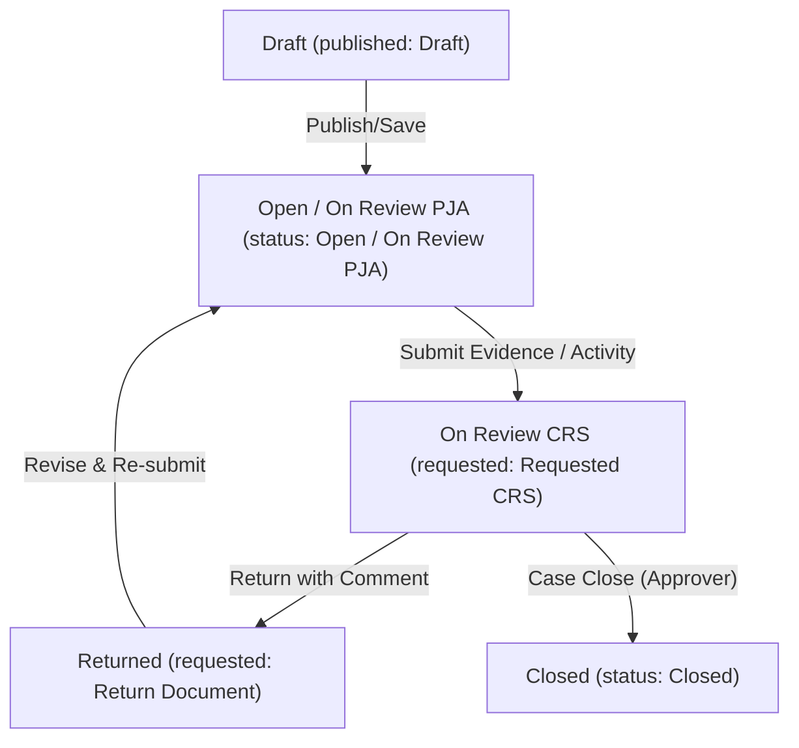

# Pica (Corrective Action & Preventive Action) Submission & Approval Workflow

This document details the complete submission, review, approval, and closure workflow for the **Pica (Corrective Action & Preventive Action)** module. It explains how the roles, permissions, database structures, and state transitions are configured for users in the system.

---

## 1. User & Access Matrix Configuration

The following database relations, permissions, and roles control access to the PICA lifecycle:

| Back-Office Role Name | Guard / Spatie Permissions Mapping | Key Workflow Function / Page Access |
| :--- | :--- | :--- |
| **PICA - Maker** | `pica` guard:<br>- `Pica - IBPR View Draft`<br>- `Pica - Inspeksi KPLH View Draft`<br>- `Pica - Audit View Draft`<br>- `Pica - PJA View Draft` | Creates PICA records. Can view drafts, returns, and create active documents. |
| **PICA - Approval PJA** | `pica` guard:<br>- `Pica - PJA View Request Review`<br>- `Pica - PJA View Draft` | Reviews PICA records assigned to their area. Updates corrective action implementation progress. |
| **PICA - Approval CRS** | `pica` guard:<br>- `Pica - CRS View Request Review`<br>- `Pica - Field Leadership View Document`<br>- `Pica - Field Leadership Approve Document` | Performs final review, issues returns, or signs off to mark cases as **Closed** (Case Close action). |
| **PICA - Super Admin** | `pica` guard:<br>- All permissions under `pica` guard | Full administrative access to manage all Pica documents, bypass review cycles, and execute bulk operations. |

### Page Access Matrix

| Route Name | Controller / Livewire Component | Description / Access Rules |
| :--- | :--- | :--- |
| `pica::dashboard` | [DashboardPage](file:///c:/laragon/www/aims/Modules/Pica/Http/Livewire/Dashboard/DashboardPage.php) | Overview of Pica status distribution (charts, stats). |
| `pica::listing.active-document.index` | [ActiveDocumentPage](file:///c:/laragon/www/aims/Modules/Pica/Http/Livewire/Listing/ActiveDocument/ActiveDocumentPage.php) | Lists all published Picas (`status` is Open, On Review PJA, Overdue, Closed). |
| `pica::listing.draft-document.index` | [DraftPage](file:///c:/laragon/www/aims/Modules/Pica/Http/Livewire/Listing/Draft/DraftPage.php) | Lists Pica documents still in `Draft` state. |
| `pica::listing.return-document.index` | [ReturnDocumentPage](file:///c:/laragon/www/aims/Modules/Pica/Http/Livewire/Listing/ReturnDocument/ReturnDocumentPage.php) | Lists returned documents (`requested` = Return Document). |
| `pica::listing.review-crs.index` | [CrsPage](file:///c:/laragon/www/aims/Modules/Pica/Http/Livewire/Listing/Crs/CrsPage.php) | CRS queue for pending reviews (`requested` = Requested CRS). |

---

## 2. Pica State Lifecycle

Pica documents act as central tracking items linked polymorphically to different finding sources.



### State Transitions

#### 1. Draft Stage
* **`published`**: `PicaStatus::Draft`
* **`status`**: `PicaStatus::Open`

#### 2. Active / On Review PJA Stage
* **`published`**: `PicaStatus::Publish`
* **`status`**: `PicaStatus::OnReviewPja`
* **`requested`**: `PicaStatus::RequestedPja`
* **Action**: Assigned PJA performs the required corrective actions and uploads proof / activities.

#### 3. On Review CRS Stage
* **`published`**: `PicaStatus::Publish`
* **`status`**: `PicaStatus::Open` or `PicaStatus::OnReviewPja`
* **`requested`**: `PicaStatus::RequestedCrs`
* **Action**: Awaiting Safety/CRS validation.

#### 4. Return Document Stage
* **`requested`**: `PicaStatus::ReturnDocument`
* **Action**: Safety/CRS rejects the implementation/evidence, prompting the PJA to perform additional modifications.

#### 5. Closed Stage
* **`status`**: `PicaStatus::Closed`
* **Action**: Final approval. Once closed, the system automatically marks the linked source item (Field Leadership Risk, Inspeksi KPLH, or Audit Non-Conformance) as **Close**.

---

## 3. Poly-morph Source Integration

Pica links to external Modules through a polymorphic relation defined in the [Pica](file:///c:/laragon/www/aims/Modules/Pica/Entities/Pica.php) pivot model:
* **`picaable_id`** / **`picaable_type`** connects `PicaDocument` to finding records.

When a PICA is marked as **Closed**, the system automatically triggers updates across source models:

### 3.1 Field Leadership
* **Source Table/Model**: `FieldLeadershipRisk`
* **Closure Action**: Sets `status` to `FieldLeadershipType::Close`. If all risks under the parent `FieldLeadership` header are closed, the parent header `status` is automatically updated to `Close`.

### 3.2 Inspeksi KPLH
* **Source Table/Model**: `InspectionRisks`
* **Closure Action**: Sets `status` to `Close`. If all labels/risks under the parent `InspectionData` are closed, the parent `pica_status` is updated to `Close`.

### 3.3 Audit
* **Source Table/Model**: `AuditCriteriaNonConfirmance`
* **Closure Action**: Sets `status` to `Close`.

---

## 4. Programmatic Workflow Simulation

The following Laravel Eloquent simulation details how states transition programmatically:

```php
use Modules\Pica\Entities\PicaDocument;
use App\Enums\Pica\PicaStatus;
use App\Enums\PicaSource;

// 1. Create Pica Draft
$pica = PicaDocument::create([
    'identity_id' => 'FL062026-FL000001',
    'source' => PicaSource::FieldLeadership,
    'type' => 'Hazard Report',
    'date' => now()->toDateString(),
    'company_id' => $companyId,
    'section_id' => $sectionId,
    'location_id' => $locationId,
    'pja_id' => $pjaId,
    'pjo_id' => $pjoId,
    'auditor' => 'Fadjri Wivindi',
    'non_compliance' => 'Hazard found near workstation.',
    'published' => PicaStatus::Draft,
    'status' => PicaStatus::Open,
]);

// 2. Publish & Send to PJA for Review
$pica->update([
    'published' => PicaStatus::Publish,
    'requested' => PicaStatus::RequestedPja,
    'status' => PicaStatus::OnReviewPja,
]);

// 3. PJA Updates Corrective Action & Submits to CRS
$pica->activities()->create([
    'description' => 'Corrective action implemented. Barrier installed.',
    'user_id' => $pjaUserId,
]);
$pica->update([
    'requested' => PicaStatus::RequestedCrs,
]);

// 4. CRS / Approver Closes Case & Updates Source
DB::transaction(function() use ($pica) {
    $pica->update([
        'status' => PicaStatus::Closed,
    ]);

    $pica->activities()->create([
        'description' => 'Case Closed',
        'user_id' => $approverUserId,
    ]);

    // Handle polymorphic source update (Example: Field Leadership)
    if ($pica->source == PicaSource::FieldLeadership && !empty($pica->pica)) {
        $risk = \Modules\FieldLeadership\Entities\FieldLeadershipRisk::find($pica->pica->source_id);
        $risk->update(['status' => 'Close']);
    }
});
```

---

## 5. Pica Module Folder Structure

The structure of the `Modules/Pica` directory is organized as follows:

```
Modules/Pica/
├── Config/
│   └── config.php                      # Module configuration settings
├── Database/
│   ├── Migrations/                     # Migration files defining database schemas
│   └── Seeders/                        # Seeders for default/test data and Spatie permissions
├── Entities/                           # Eloquent Models defining data structures
│   ├── Pica.php                        # Polymorphic link table connecting PicaDocument to source models
│   ├── PicaActivity.php                # Activity log tracks steps, notes, and progress of PICA lifecycle
│   ├── PicaActivityFile.php            # Links attachments/files to specific Pica activities
│   ├── PicaAuditor.php                 # Relates auditors/inspectors to PICA documents
│   ├── PicaDocument.php                # Core document schema containing finding info, status, and target dates
│   └── PicaFile.php                    # General files uploaded for a PicaDocument
├── Http/
│   ├── Controllers/                    # Standard HTTP Controllers
│   ├── Livewire/                       # Livewire components driving the dynamic UI pages
│   │   ├── Dashboard/
│   │   │   └── DashboardPage.php       # Handles charts and analytical overview of Pica status distribution
│   │   ├── Layouts/                    # Livewire-specific layouts
│   │   ├── Listing/
│   │   │   ├── ActiveDocument/         # Handles viewing, creating, editing, and detailing active Pica files
│   │   │   ├── Crs/                    # CRS-only detail review, comment return, and approval/case close actions
│   │   │   ├── Draft/                  # Listing for unpublished/draft Pica files
│   │   │   └── ReturnDocument/         # Listing for returned Pica files
│   │   └── LoginPage/
│   │       └── LoginPage.php           # User authentication login interface
│   ├── Middleware/                     # Middleware filters (e.g. auth guards)
│   └── Requests/                       # Form Request validation classes
├── Providers/                          # Service Providers
│   ├── PicaServiceProvider.php         # registers module configurations, views, and translations
│   └── RouteServiceProvider.php        # registers routing maps
├── Resources/
│   ├── assets/                         # Static assets (JS/SASS)
│   └── views/                          # Blade templates
│       ├── components/                 # Reusable blade components
│       ├── layouts/                    # Navigation and structure layouts (header, sidebar)
│       └── livewire/                   # Page-specific views corresponding to Livewire components
├── Routes/
│   └── web.php                         # Route definitions mapping URLs to components/controllers
├── Tests/                              # Unit/Feature test cases
├── composer.json                       # Module composer configuration
├── module.json                         # Modules manager metadata
└── package.json                        # Frontend dependencies configuration
```

