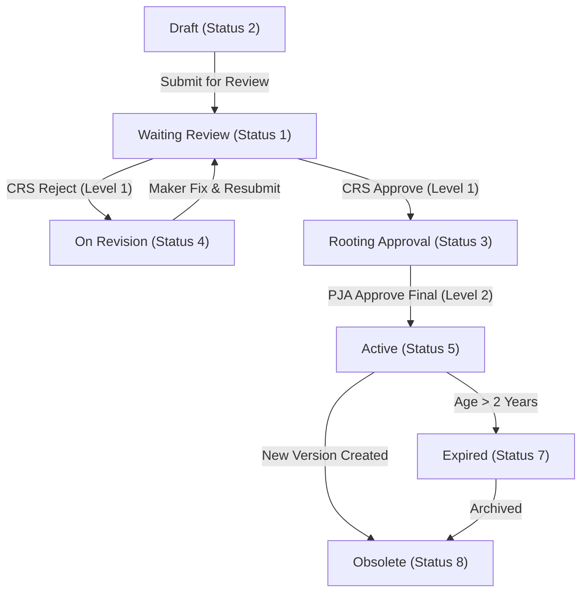

# Document System Submission & Approval Workflow

This document details the complete submission, review, and approval workflow for the **Document System** module. It explains how the roles, permissions, database structures, and state transitions are configured in the database for the active system users:
- **Maker** (Document Originator): Fadjri Wivindi (`fadjri.wivindi@alamtri.com`)
- **Reviewer** (Compliance, Risk & Safety - CRS): Aprilya Noreza Haloho (`aprilya.haloho@alamtri.com`)
- **Approver** (Penanggung Jawab Area - PJA): Zakaria Anoi (`zakaria.anoi@alamtri.com`), Rahmad Taufik Siregar (`rahmad.siregar@alamtri.com`), Sahrul (`sahrul@alamtri.com`)
- **Super Admin**: Guntur Pasaribu (`guntur.pasaribu@alamtri.com`), Monas Kristiawan (`monas.kristiawan@alamtri.com`)

---

## 1. User & Access Matrix Configuration

The following database relationships, permissions, and roles have been validated and are active:

| User Role | Email | User ID | Spatie Role Name | Guard / Permissions Mapping | Key Workflow Function |
| :--- | :--- | :--- | :--- | :--- | :--- |
| **Maker** | `fadjri.wivindi@alamtri.com` | `a1f079a4-a373-4b19-9fda-d3592f7907d9` | `Document Systems - Maker` | `document-system` guard:<br>- `Document System - View Draft Document`<br>- `Document System - Create Document`<br>- `Document System - Edit Document` | Uploads initial SOP, TS, MN, WIN, or Form; creates JSA and PTW drafts; responds to revision notes. |
| **Reviewer (CRS)** | `aprilya.haloho@alamtri.com` | `a1f27487-17f6-4065-ad16-1473244e9198` | `Document Systems - Approval CRS` | `document-system` guard:<br>- `Document System - View OnGoing Document`<br>- `Document System - Export Document`<br>- `Document System - Approve Document Level 1` | OHS / Safety compliance review. Performs Level 1 validation and forwards to PJA or rejects back to Maker. |
| **Approver (PJA)** | `zakaria.anoi@alamtri.com`<br>`rahmad.siregar@alamtri.com`<br>`sahrul@alamtri.com` | `a1f080e2-e013-45fd-9309-de7456f70516`<br>`a1f08273-82b2-44a1-b3d1-c1b6fdd88d4c`<br>`a1f48a39-cff6-4a24-b2e9-b88b9bed9a62` | `Document Systems - Approval PJA` | `document-system` guard:<br>- `Document System - View OnGoing Document`<br>- `Document System - Approve Document Level 2` | Area Manager final sign-off. Approves Level 2 to make the document Active and publicly downloadable. |
| **Super Admin** | `guntur.pasaribu@alamtri.com`<br>`monas.kristiawan@alamtri.com` | `a1f07d2b-90d1-496d-b352-4bdadf2c4f44`<br>`a1f488b7-047a-4917-b7b0-fd3de62d1752` | `Document Systems - Super Admin` | All permissions under `document-system` guard, including:<br>- `Document System - Master Data`<br>- `Document System - Delete Document` | Manages categories, system prefix codes, and mapping indices. Bypasses standard workflow stages. |

---

## 2. Document State Lifecycle

Standard documents (SOP, Technical Standard, Manual, Work Instruction, Form) transition through specific statuses during their lifecycle:



### Stage 1: Creation & Submission (Maker)
* **Status**: `DRAFT` (2) ➔ `WAITING_REVIEW` (1)
* **Action**: Maker fills in document metadata (Company, Department, SOP title), uploads files, invites reviewers, and submits.

### Stage 2: Compliance Validation (CRS Reviewer)
* **Status**: `WAITING_REVIEW` (1) ➔ `ROOTING_REVIEW` (3) OR `ON_REVISION` (4)
* **Action**: CRS reviewer validates formatting and safety regulations. Approving changes status to `ROOTING_REVIEW`; rejecting returns the draft to the Maker (`ON_REVISION`) with review comments.

### Stage 3: Final Approval & Sign-Off (PJA Approver)
* **Status**: `ROOTING_REVIEW` (3) ➔ `ACTIVE` (5)
* **Action**: Area Manager (PJA) executes final sign-off. The document becomes active, locks its revision state, and is published globally.

---

## 3. JSA & PTW Workflows

In addition to standard documents, the Document System hosts specialized modules:

### Job Safety Analysis (JSA) Workflow
JSA documents are used to identify steps, hazards, and controls before starting work.
* **Masa Berlaku**: 1 year.
* **States**:
  - `2` (DRAFT) ➔ Created by supervisors.
  - `1` (ACTIVE) ➔ Approved and implemented in the field.
  - `3` (EXPIRED) ➔ Active period exceeds 1 year.
  - `4` (OBSOLATE) ➔ Superseded by a newer revision.

### Permit to Work (PTW) Workflow
PTW forms authorize high-risk activities (hot work, confined space, electrical).
* **States**:
  - `1` (ACTIVE) ➔ Work authorized and currently ongoing.
  - `2` (INACTIVE) ➔ Permit expired or signed off as closed.

---

## 4. Watermarking & Storage Specifications

The Document System applies digital watermarks to PDF attachments during specific phases of the workflow (e.g. during Rooting Review/PJA review and final publishing) to ensure document control and integrity.

### Watermark Asset Locations
- **Final Approved Watermark**: `public/images/watermark.png`
  - Applied during transition to Rooting Review (`ROOTING_REVIEW`) and finalized during final approval (`ACTIVE`).
- **Uncontrolled Format Watermark**: `public/images/uncontrolled.png`
  - Applied on the formatting/compliance review detail page (`ReviewDetail`) when a reviewer generates uncontrolled copies.

### Watermarked File Storage Paths
- **Final Active Document Attachments**:
  - **Internal Storage Path**: `storage/app/public/document_systems/{document_id}/Final-{original_filename}`
  - **Public Link / Symlink Path**: `public/storage/document_systems/{document_id}/Final-{original_filename}`
  - **Database Status Flag**: Marked active via `status = true` in the `attachments` table.
- **Uncontrolled Review Copies**:
  - **Internal Storage Path**: `storage/app/document-systems-files/uncontrolled/{original_filename}`
  - **Database Reference**: Linked to activity attachments in the `activity_attachments` table.

---

## 5. Database Seeding

We have a dedicated database seeder [DocumentSystemDummySeederTableSeeder.php](file:///c:/laragon/www/aims/Modules/DocumentSystem/Database/Seeders/DocumentSystemDummySeederTableSeeder.php) that populates the database with:
- Spatie permissions and role mappings under the `document-system` guard.
- Mappings for `Safety Operations` module and `SOP K3` category.
- **Active Document (SOP)**: `MAC-IT-002` ("Working at Heights Procedure").
- **Active Job Safety Analysis (JSA)**: `JSA-2026-OHS-004` ("Hot Work Welding").
- **Active Permit to Work (PTW)**: `PTW-2026-06-12-001` ("Hot Work Permit").

### How to Run the Seeder

Execute the following command to populate your local database:

```powershell
php artisan db:seed --class="Modules\DocumentSystem\Database\Seeders\DocumentSystemDummySeederTableSeeder"
```

### How to Run the Programmatic Simulation

To execute the end-to-end Document System workflow programmatically and verify the database operations:

```powershell
php scratch/test_document_system_query.php
```

For more info about the module requirements, database tables, and entity relationship diagrams, please refer to the main module PRD [aims_document_system_prd.md](file:///c:/laragon/www/aims/agent/module%20PRD%20or%20Workflow/aims_document_system_prd.md).
