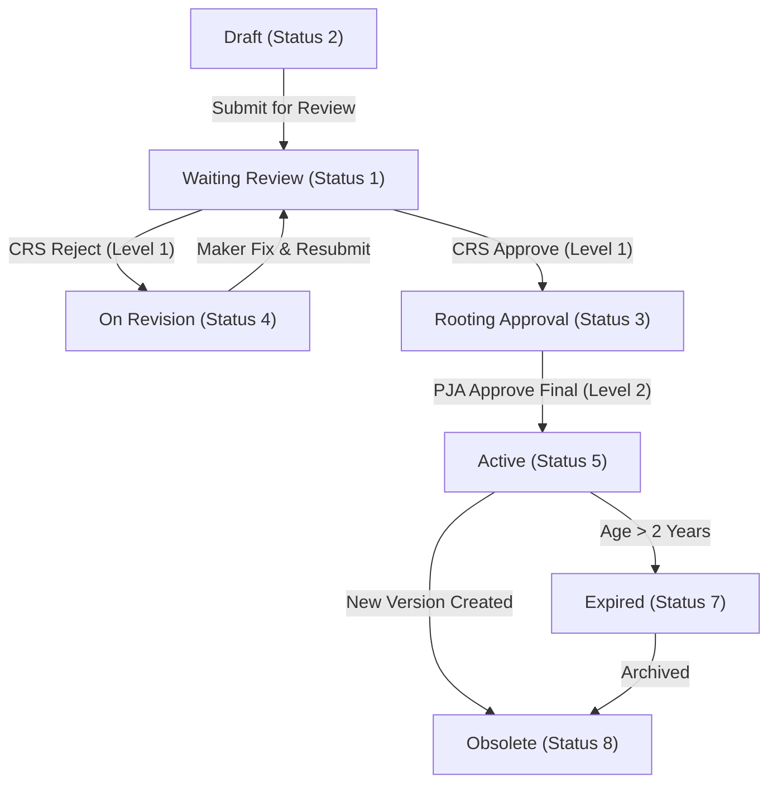
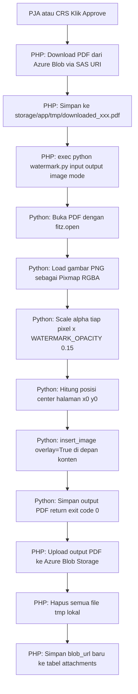

# Document System Submission & Approval Workflow

This document details the complete submission, review, and approval workflow for the **Document System** module. It explains how the roles, permissions, database structures, and state transitions are configured in the database for the active system users:
- **Maker** (Document Originator): Fadjri Wivindi (`fadjri.wivindi@alamtri.com`)
- **Reviewer** (Compliance, Risk & Safety - CRS): Aprilya Noreza Haloho (`aprilya.haloho@alamtri.com`)
- **Approver** (Penanggung Jawab Area - PJA): Zakaria Anoi (`zakaria.anoi@alamtri.com`), Rahmad Taufik Siregar (`rahmad.siregar@alamtri.com`), Sahrul (`sahrul@alamtri.com`)
- **Super Admin**: Guntur Pasaribu (`guntur.pasaribu@alamtri.com`), Monas Kristiawan (`monas.kristiawan@alamtri.com`)

---

## 1. User & Access Matrix Configuration

The following database relationships, permissions, and roles have been validated and are active:

| User Role | Email | User ID | Spatie Role Name | Guard / Permissions Mapping | Key Workflow Function |
| :--- | :--- | :--- | :--- | :--- | :--- |
| **Maker** | `fadjri.wivindi@alamtri.com` | `a1f079a4-a373-4b19-9fda-d3592f7907d9` | `Document Systems - Maker` | `document-system` guard:<br>- `Document System - View Draft Document`<br>- `Document System - Create Document`<br>- `Document System - Edit Document` | Uploads initial SOP, TS, MN, WIN, or Form; creates JSA and PTW drafts; responds to revision notes. |
| **Reviewer (CRS)** | `aprilya.haloho@alamtri.com` | `a1f27487-17f6-4065-ad16-1473244e9198` | `Document Systems - Approval CRS` | `document-system` guard:<br>- `Document System - View OnGoing Document`<br>- `Document System - Export Document`<br>- `Document System - Approve Document Level 1` | OHS / Safety compliance review. Performs Level 1 validation and forwards to PJA or rejects back to Maker. |
| **Approver (PJA)** | `zakaria.anoi@alamtri.com`<br>`rahmad.siregar@alamtri.com`<br>`sahrul@alamtri.com` | `a1f080e2-e013-45fd-9309-de7456f70516`<br>`a1f08273-82b2-44a1-b3d1-c1b6fdd88d4c`<br>`a1f48a39-cff6-4a24-b2e9-b88b9bed9a62` | `Document Systems - Approval PJA` | `document-system` guard:<br>- `Document System - View OnGoing Document`<br>- `Document System - Approve Document Level 2` | Area Manager final sign-off. Approves Level 2 to make the document Active and publicly downloadable. |
| **Super Admin** | `guntur.pasaribu@alamtri.com`<br>`monas.kristiawan@alamtri.com` | `a1f07d2b-90d1-496d-b352-4bdadf2c4f44`<br>`a1f488b7-047a-4917-b7b0-fd3de62d1752` | `Document Systems - Super Admin` | All permissions under `document-system` guard, including:<br>- `Document System - Master Data`<br>- `Document System - Delete Document` | Manages categories, system prefix codes, and mapping indices. Bypasses standard workflow stages. |

---

## 2. Document State Lifecycle

Standard documents (SOP, Technical Standard, Manual, Work Instruction, Form) transition through specific statuses during their lifecycle:



### Stage 1: Creation & Submission (Maker)
* **Status**: `DRAFT` (2) ➔ `WAITING_REVIEW` (1)
* **Action**: Maker fills in document metadata (Company, Department, SOP title), uploads files, invites reviewers, and submits.

### Stage 2: Compliance Validation (CRS Reviewer)
* **Status**: `WAITING_REVIEW` (1) ➔ `ROOTING_REVIEW` (3) OR `ON_REVISION` (4)
* **Action**: CRS reviewer validates formatting and safety regulations. Approving changes status to `ROOTING_REVIEW`; rejecting returns the draft to the Maker (`ON_REVISION`) with review comments.

### Stage 3: Final Approval & Sign-Off (PJA Approver)
* **Status**: `ROOTING_REVIEW` (3) ➔ `ACTIVE` (5)
* **Action**: Area Manager (PJA) executes final sign-off. The document becomes active, locks its revision state, and is published globally.

---

## 3. JSA & PTW Workflows

In addition to standard documents, the Document System hosts specialized modules:

### Job Safety Analysis (JSA) Workflow
JSA documents are used to identify steps, hazards, and controls before starting work.
* **Masa Berlaku**: 1 year.
* **States**:
  - `2` (DRAFT) ➔ Created by supervisors.
  - `1` (ACTIVE) ➔ Approved and implemented in the field.
  - `3` (EXPIRED) ➔ Active period exceeds 1 year.
  - `4` (OBSOLATE) ➔ Superseded by a newer revision.

### Permit to Work (PTW) Workflow
PTW forms authorize high-risk activities (hot work, confined space, electrical).
* **States**:
  - `1` (ACTIVE) ➔ Work authorized and currently ongoing.
  - `2` (INACTIVE) ➔ Permit expired or signed off as closed.

---

## 4. Watermarking & Storage Specifications

The Document System applies digital watermarks to PDF attachments during specific phases of the workflow (e.g. during Rooting Review/PJA review and final publishing) to ensure document control and integrity.

### Watermark Asset Locations
- **Final Approved Watermark**: `public/images/watermark.png`
  - Applied during transition to Rooting Review (`ROOTING_REVIEW`) and finalized during final approval (`ACTIVE`).
- **Uncontrolled Format Watermark**: `public/images/uncontrolled.png`
  - Applied on the formatting/compliance review detail page (`ReviewDetail`) when a reviewer generates uncontrolled copies.

### Watermarked File Storage Paths
- **Final Active Document Attachments**:
  - **Internal Storage Path**: `storage/app/public/document_systems/{document_id}/Final-{original_filename}`
  - **Public Link / Symlink Path**: `public/storage/document_systems/{document_id}/Final-{original_filename}`
  - **Database Status Flag**: Marked active via `status = true` in the `attachments` table.
- **Uncontrolled Review Copies**:
  - **Internal Storage Path**: `storage/app/document-systems-files/uncontrolled/{original_filename}`
  - **Database Reference**: Linked to activity attachments in the `activity_attachments` table.

---

## 5. Database Seeding

We have a dedicated database seeder [DocumentSystemDummySeederTableSeeder.php](file:///c:/laragon/www/aims/Modules/DocumentSystem/Database/Seeders/DocumentSystemDummySeederTableSeeder.php) that populates the database with:
- Spatie permissions and role mappings under the `document-system` guard.
- Mappings for `Safety Operations` module and `SOP K3` category.
- **Active Document (SOP)**: `MAC-IT-002` ("Working at Heights Procedure").
- **Active Job Safety Analysis (JSA)**: `JSA-2026-OHS-004` ("Hot Work Welding").
- **Active Permit to Work (PTW)**: `PTW-2026-06-12-001` ("Hot Work Permit").

### How to Run the Seeder

Execute the following command to populate your local database:

```powershell
php artisan db:seed --class="Modules\DocumentSystem\Database\Seeders\DocumentSystemDummySeederTableSeeder"
```

### How to Run the Programmatic Simulation

To execute the end-to-end Document System workflow programmatically and verify the database operations:

```powershell
php scratch/test_document_system_query.php
```

For more info about the module requirements, database tables, and entity relationship diagrams, please refer to the main module PRD [aims_document_system_prd.md](file:///c:/laragon/www/aims/agent/module%20PRD%20or%20Workflow/aims_document_system_prd.md).

---

## 6. Migrasi Upload ke Azure Blob Storage

> **Tanggal Implementasi**: 2026-06-15

Seluruh proses upload file pada module DocumentSystem telah dimigrasikan dari **local storage** ke **Azure Blob Storage**, menggunakan fungsi helper `uploadToBlobStorage()` yang tersedia di [general.php](file:///c:/laragon/www/aims/app/Helpers/general.php).

### Fungsi Helper yang Digunakan

```php
// Lokasi: app/Helpers/general.php
uploadToBlobStorage(string $filename, string $filePathTemp, string $directPath): array
```

**Parameter:**
| Parameter | Keterangan |
|-----------|------------|
| `$filename` | Nama file yang akan disimpan di blob |
| `$filePathTemp` | Path lokal file sementara sebelum di-upload |
| `$directPath` | Direktori tujuan di dalam container blob |

**Return value:**
```php
[
    'fileBlobUrl'      => string|null,  // URL publik file di blob
    'fileBlobPathName' => string|null,  // Path/nama file di blob
    'blobResponse'     => array|null,   // Raw response dari blob API
]
```

**Konfigurasi blob** (diambil dari tabel `app_settings`):
- `blob_api_login_url` — endpoint login blob API
- `blob_api_login_username` / `blob_api_login_password` — kredensial
- `blob_api_upload_url` — endpoint upload blob API
- Container: `compliancems-cntr`
- Prefix path: `complianceCMS/` (production) atau `test/` (local)

---

### Rincian Perubahan per File

#### 6.1 [JsaService.php](file:///c:/laragon/www/aims/Modules/DocumentSystem/Services/JsaService.php)

**Fungsi**: `handle_upload_document($documents, $document_id)`

| | Versi Lama (di-comment) | Versi Baru (aktif) |
|---|---|---|
| **Storage** | Local — `Storage::disk('public')->move(...)` ke `public/storage/jsa/{id}/` | Azure Blob — `uploadToBlobStorage(...)` ke direktori `jsa/{id}/` |
| **Cleanup** | `Storage::disk('public')->delete(...)` | `File::delete($filePathTemp)` setelah upload blob |
| **DB `path`** | `public_path('storage/jsa/{id}/{filename}')` | `$blobResult['fileBlobPathName']` (fallback ke relative path) |
| **DB `blob_url`** | — | `$blobResult['fileBlobUrl']` |
| **DB `blob_response`** | — | `json_encode($blobResult['blobResponse'])` |

```php
// LAMA (di-comment):
// Storage::disk('public')->move('tmp/jsa/' . $documents[$b]['name'], 'jsa/' . $document_id . '/' . $documents[$b]['name']);
// $model_document->path = public_path('storage/jsa/' . $document_id . '/' . $documents[$b]['name']);

// BARU (aktif):
$blobResult = uploadToBlobStorage($documents[$b]['name'], $filePathTemp, 'jsa/' . $document_id . '/');
$model_document->path          = $blobResult['fileBlobPathName'] ?? ('jsa/' . $document_id . '/' . $documents[$b]['name']);
$model_document->blob_url      = $blobResult['fileBlobUrl'] ?? null;
$model_document->blob_response = $blobResult['blobResponse'] ? json_encode($blobResult['blobResponse']) : null;
```

---

#### 6.2 [PtwService.php](file:///c:/laragon/www/aims/Modules/DocumentSystem/Services/PtwService.php)

**Fungsi**: `handle_upload_document($documents, $document_id)`

| | Versi Lama (di-comment) | Versi Baru (aktif) |
|---|---|---|
| **Storage** | Local — `Storage::disk('public')->move(...)` ke `public/storage/ptw/{id}/` | Azure Blob — `uploadToBlobStorage(...)` ke direktori `ptw/{id}/` |
| **Cleanup** | `Storage::disk('public')->delete(...)` | `File::delete($filePathTemp)` setelah upload blob |
| **DB `path`** | `public_path('storage/ptw/{id}/{filename}')` | `$blobResult['fileBlobPathName']` (fallback ke relative path) |
| **DB `blob_url`** | — | `$blobResult['fileBlobUrl']` |
| **DB `blob_response`** | — | `json_encode($blobResult['blobResponse'])` |

```php
// LAMA (di-comment):
// Storage::disk('public')->move('tmp/ptw/' . $documents[$b]['name'], 'ptw/' . $document_id . '/' . $documents[$b]['name']);
// $model_document->path = public_path('storage/ptw/' . $document_id . '/' . $documents[$b]['name']);

// BARU (aktif):
$blobResult = uploadToBlobStorage($documents[$b]['name'], $filePathTemp, 'ptw/' . $document_id . '/');
$model_document->path          = $blobResult['fileBlobPathName'] ?? ('ptw/' . $document_id . '/' . $documents[$b]['name']);
$model_document->blob_url      = $blobResult['fileBlobUrl'] ?? null;
$model_document->blob_response = $blobResult['blobResponse'] ? json_encode($blobResult['blobResponse']) : null;
```

---

#### 6.3 [DocumentSystemService.php](file:///c:/laragon/www/aims/Modules/DocumentSystem/Services/DocumentSystemService.php)

Tiga blok upload diubah dalam satu file:

##### 6.3.1 Fungsi `store()` — Upload Dokumen Baru

**Konteks**: Dipanggil saat Maker menyimpan draft dokumen baru (SOP, TS, MN, WIN, Form).

| | Versi Lama (di-comment) | Versi Baru (aktif) |
|---|---|---|
| **Storage** | Local — `Storage::disk('public')->move(...)` ke `public/storage/document_systems/{id}/` | Azure Blob — `uploadToBlobStorage(...)` ke `document_systems/{id}/` |
| **Cleanup** | `Storage::disk('public')->delete(...)` | `File::delete($filePathTemp)` setelah upload blob |
| **DB kolom baru** | — | `blob_url`, `blob_response` ditambahkan |

##### 6.3.2 Fungsi `update()` — Update Dokumen Existing

**Konteks**: Dipanggil saat Maker mengedit dan menyimpan ulang dokumen yang sudah ada.

Perubahan identik dengan `store()` — blok lokal di-comment, diganti `uploadToBlobStorage`.

##### 6.3.3 Fungsi `handle_document_rooting_approval()` — Upload Setelah Watermarking

**Konteks**: Dipanggil saat PJA (Approver) mem-finalisasi dokumen ke status `ACTIVE`. File PDF diberi watermark terlebih dahulu sebelum disimpan.

| | Versi Lama (di-comment) | Versi Baru (aktif) |
|---|---|---|
| **Output watermark** | `storage/app/public/document_systems/{id}/Final-{filename}` (langsung ke public) | `storage/app/tmp/document_systems/{id}/Final-{filename}` (temporary, dihapus setelah upload) |
| **Storage** | File tetap di local public storage | Upload ke blob via `uploadToBlobStorage(...)` setelah watermark |
| **Cleanup** | Tidak ada | `File::delete($output_file)` setelah blob upload sukses |
| **DB `path`** | `public_path('storage/document_systems/{id}/Final-{filename}')` | `$blobResult['fileBlobPathName']` (fallback ke relative path) |
| **DB `blob_url`** | — | `$blobResult['fileBlobUrl']` |
| **DB `blob_response`** | — | `json_encode($blobResult['blobResponse'])` |

```php
// LAMA (di-comment):
// $output_file = storage_path('app/public/document_systems/' . $id . '/' . $final_filename);
// $model_document->path = public_path('storage/document_systems/' . $id . '/' . $final_filename);

// BARU (aktif):
$output_file = storage_path('app/tmp/document_systems/' . $id . '/' . $final_filename); // tmp lokal
$blobResult  = uploadToBlobStorage($final_filename, $output_file, 'document_systems/' . $id . '/');
File::delete($output_file); // hapus tmp setelah upload
$model_document->path          = $blobResult['fileBlobPathName'] ?? ('document_systems/' . $id . '/' . $final_filename);
$model_document->blob_url      = $blobResult['fileBlobUrl'] ?? null;
$model_document->blob_response = $blobResult['blobResponse'] ? json_encode($blobResult['blobResponse']) : null;
```

---

### Ringkasan Direktori Blob per Tipe Dokumen

| Tipe Dokumen | Direktori di Blob | Container |
|---|---|---|
| SOP / TS / MN / WIN / Form | `complianceCMS/document_systems/{document_id}/` | `compliancems-cntr` |
| JSA | `complianceCMS/jsa/{document_id}/` | `compliancems-cntr` |
| PTW | `complianceCMS/ptw/{document_id}/` | `compliancems-cntr` |
| Watermarked Final (Rooting Approval) | `complianceCMS/document_systems/{document_id}/Final-{filename}` | `compliancems-cntr` |

> **Environment local**: Prefix berubah dari `complianceCMS/` menjadi `test/` secara otomatis (via `config('app.env') === 'local'` di fungsi `uploadToBlobStorage`).

---

### Fungsi yang TIDAK Diubah

| Fungsi | Alasan |
|--------|--------|
| `temporary_upload()` di semua Service | Hanya menyimpan file ke folder `tmp/` lokal sebagai staging sebelum final upload. Tidak perlu blob. |
| `uploadTmpFile()` di Livewire controllers | Hanya memanggil `temporary_upload()` service, bukan upload final. |
| `move_file()` di DocumentSystemService | Digunakan untuk memindahkan file revision/proof ke activity folder — masih local storage. |
| `setWaterMark()` di ReviewDetail | Sudah di-comment versi blob-nya, versi lokal masih aktif untuk uncontrolled copy. |

---

## 7. Migrasi Watermarking & Upload Uncontrolled/Final ke Azure Blob Storage

> **Tanggal Implementasi**: 2026-06-16

Proses watermarking file final saat Rooting Approval dan uncontrolled copy saat CRS Approval telah dimigrasikan sepenuhnya agar mendukung Azure Blob Storage (mengunduh file dari blob, memberi watermark secara lokal, lalu mengunggahnya kembali ke Azure Blob Storage).

### 7.1 Rincian Perubahan per File

#### 7.1.1 [DocumentSystemService.php](file:///c:/laragon/www/aims/Modules/DocumentSystem/Services/DocumentSystemService.php)

**Fungsi**: `handle_document_rooting_approval($files, $id, $add_watermark)`

- **Penanganan Source**: Jika file memiliki `blob_url`, file diunduh terlebih dahulu menggunakan `GetBlobSasUri` ke path temporary lokal `storage_path('app/tmp/downloaded_...')`. Jika tidak ada `blob_url`, fallback ke file lokal.
- **Pembersihan**: File temporary lokal yang diunduh langsung dihapus menggunakan `File::delete($temp_download_file)` setelah selesai diproses.

#### 7.1.2 [ReviewDetail.php (Module)](file:///c:/laragon/www/aims/Modules/DocumentSystem/Http/Livewire/Review/ReviewDetail.php)

**Fungsi**: `setWaterMark($attach)`

- **Penanganan Source & Upload**:
  1. Mendeteksi properti `blob_url` dari attachment.
  2. Mengunduh file ke folder temporary lokal.
  3. Membubuhkan watermark menggunakan **DomPDF**.
  4. Mengunggah file berwatermark uncontrolled tersebut ke Blob Storage dengan target direktori `document-systems-files/uncontrolled/`.
  5. Menghapus file temporary lokal.
  6. Mengembalikan URL Blob yang baru untuk disimpan langsung pada kolom `uncontrolled_file_path` di database.

#### 7.1.3 [ReviewDetail.php (App)](file:///c:/laragon/www/aims/app/Http/Livewire/DocumentSystems/Review/ReviewDetail.php)

**Fungsi**: `setWaterMark($attach)`

- **Penanganan Source & Upload**: Identik dengan versi Module, namun proses watermarking menggunakan library **Fpdi**. File temporer dihapus setelah diunggah ke Blob Storage, dan mengembalikan URL Blob baru untuk disimpan ke `uncontrolled_file_path`.

### 7.2 Snippet Perubahan Kode

#### 7.2.1 [DocumentSystemService.php](file:///c:/laragon/www/aims/Modules/DocumentSystem/Services/DocumentSystemService.php)
```php
    public function handle_document_rooting_approval($files, $id, $add_watermark)
    {
        // Normalize files array to ensure consistent keys (supporting both database columns and request inputs)
        $normalizedFiles = [];
        foreach ($files as $fileItem) {
            $normalizedFiles[] = [
                'id'        => $fileItem['id'] ?? null,
                'file_name' => $fileItem['file_name'] ?? $fileItem['name'] ?? null,
                'file_size' => $fileItem['file_size'] ?? $fileItem['size'] ?? 0,
                'file_type' => $fileItem['file_type'] ?? $fileItem['ext'] ?? null,
                'blob_url'  => $fileItem['blob_url'] ?? null,
            ];
        }
        $files = $normalizedFiles;

        // update status current attachment to inactive
        Attachment::where('document_id', $id)
            ->update(['status' => false]);

        $document = Document::find($id);

        // add watermark to file request, then upload to blob storage
        for ($a = 0; $a < count($files); $a++) {
            $temp_download_file = null;
            if (!empty($files[$a]['blob_url'])) {
                $url = $files[$a]['blob_url'];
                if (strpos($url, 'blob.core.windows.net') !== false) {
                    $parsedUrl = parse_url($url);
                    $path = ltrim($parsedUrl['path'] ?? '', '/');
                    $parts = explode('/', $path, 2);
                    if (count($parts) === 2) {
                        $container = $parts[0];
                        $filePath = $parts[1];
                        $sasResult = GetBlobSasUri($container, $filePath, 15);
                        if ($sasResult && !empty($sasResult['blobUriSas'])) {
                            $url = $sasResult['blobUriSas'];
                        }
                    }
                }
                try {
                    $fileContent = file_get_contents($url);
                    if ($fileContent !== false) {
                        $temp_download_file = storage_path('app/tmp/downloaded_' . uniqid() . '_' . $files[$a]['file_name']);
                        if (!File::exists(dirname($temp_download_file))) {
                            File::makeDirectory(dirname($temp_download_file), 0755, true);
                        }
                        File::put($temp_download_file, $fileContent);
                        $file = $temp_download_file;
                    } else {
                        if (isset($files[$a]['id'])) {
                            $file = public_path('storage/document_systems/' . $id . '/' . $files[$a]['file_name']);
                        } else {
                            $file = public_path('storage/tmp/document_systems/' . $files[$a]['file_name']);
                        }
                    }
                } catch (\Throwable $e) {
                    \Log::error("handle_document_rooting_approval: Failed to download source file from blob: " . $e->getMessage());
                    if (isset($files[$a]['id'])) {
                        $file = public_path('storage/document_systems/' . $id . '/' . $files[$a]['file_name']);
                    } else {
                        $file = public_path('storage/tmp/document_systems/' . $files[$a]['file_name']);
                    }
                }
            } else {
                if (isset($files[$a]['id'])) {
                    $file = public_path('storage/document_systems/' . $id . '/' . $files[$a]['file_name']);
                } else {
                    $file = public_path('storage/tmp/document_systems/' . $files[$a]['file_name']);
                }
            }
            $text_image  = public_path('images/watermark.png');

            if ($add_watermark) {
                if (strpos($files[$a]['file_name'], 'Final-') === 0) {
                    $final_filename = $files[$a]['file_name'];
                } else {
                    $final_filename = 'Final-' . $files[$a]['file_name'];
                }
            } else {
                $final_filename = $files[$a]['file_name'];
            }

            // Temp output path (local storage sementara sebelum upload ke blob)
            $output_file = storage_path('app/tmp/document_systems/' . $id . '/' . $final_filename);

            // Ensure destination directory exists
            $destination_dir = dirname($output_file);
            if (!File::exists($destination_dir)) {
                File::makeDirectory($destination_dir, 0755, true);
            }

            $watermark_success = false;
            $already_watermarked = ($add_watermark && strpos($files[$a]['file_name'], 'Final-') === 0);

            if ($already_watermarked) {
                if (File::exists($file)) {
                    if ($file !== $output_file) {
                        File::copy($file, $output_file);
                    }
                    $watermark_success = true;
                }
            } else {
                if (File::exists($file)) {
                    try {
                        $orientation = $this->detect_pdf_orientation($file);
                        $data = [
                            'watermark'  => $text_image,
                        ];

                        $pdf = \Barryvdh\DomPDF\Facade\Pdf::loadView('document_system_final.final_pdf', $data)
                            ->setPaper('a4', $orientation);

                        $pdf->save($output_file);
                        $watermark_success = true;
                    } catch (\Throwable $e) {
                        \Log::warning("DomPDF generation failed for file {$files[$a]['file_name']} in document ID {$id}. Falling back to copying original file. Error: " . $e->getMessage());
                    }
                }
            }

            if (!$watermark_success) {
                // Fallback: copy the original file directly to output file destination without watermark
                if (File::exists($file)) {
                    File::copy($file, $output_file);
                } else {
                    if ($temp_download_file && File::exists($temp_download_file)) {
                        File::delete($temp_download_file);
                    }
                    return $files[$a]['file_name'] . ' file not exist';
                }
            }

            if ($temp_download_file && File::exists($temp_download_file)) {
                File::delete($temp_download_file);
            }

            // ============================================================
            // UPLOAD KE BLOB STORAGE
            // ============================================================
            $directPath = 'document_systems/' . $id . '/';

            $blobResult = uploadToBlobStorage(
                $final_filename,   // filename
                $output_file,      // filePathTemp (local file hasil watermark)
                $directPath        // folder di blob
            );

            // Hapus file temp lokal setelah upload ke blob
            if (File::exists($output_file)) {
                File::delete($output_file);
            }

            // Log warning jika blob upload gagal
            if (!$blobResult['fileBlobUrl']) {
                \Log::warning("handle_document_rooting_approval: Blob upload failed for file {$final_filename} in document ID {$id}.");
            }

            // ============================================================
            // SIMPAN ATTACHMENT KE DATABASE
            // ============================================================
            $model_document = new Attachment();
            $model_document->document_id   = $id;
            $model_document->file_name     = $final_filename;
            $model_document->file_size     = $files[$a]['file_size'];
            $model_document->file_type     = $files[$a]['file_type'];
            $model_document->path          = $blobResult['fileBlobPathName'] ?? ('document_systems/' . $id . '/' . $final_filename);
            $model_document->blob_url      = $blobResult['fileBlobUrl'] ?? null;
            $model_document->blob_response = $blobResult['blobResponse'] ? json_encode($blobResult['blobResponse']) : null;
            $model_document->status        = true;
            $model_document->save();
        }
    }
```

#### 7.2.2 [ReviewDetail.php (Module)](file:///c:/laragon/www/aims/Modules/DocumentSystem/Http/Livewire/Review/ReviewDetail.php)
```php
    protected function setWaterMark($attach)
    {
        $file = public_path($attach->path);
        $text_image = public_path('images/uncontrolled.png');
        $temp_download_file = null;

        // If the file is stored in Blob Storage, download it locally first
        if (!empty($attach->blob_url)) {
            $url = $attach->blob_url;
            if (strpos($url, 'blob.core.windows.net') !== false) {
                $parsedUrl = parse_url($url);
                $path = ltrim($parsedUrl['path'] ?? '', '/');
                $parts = explode('/', $path, 2);
                if (count($parts) === 2) {
                    $container = $parts[0];
                    $filePath = $parts[1];
                    $sasResult = GetBlobSasUri($container, $filePath, 15);
                    if ($sasResult && !empty($sasResult['blobUriSas'])) {
                        $url = $sasResult['blobUriSas'];
                    }
                }
            }
            try {
                $fileContent = file_get_contents($url);
                if ($fileContent !== false) {
                    $temp_download_file = storage_path('app/tmp/downloaded_' . uniqid() . '_' . $attach->file_name);
                    if (!\Illuminate\Support\Facades\File::exists(dirname($temp_download_file))) {
                        \Illuminate\Support\Facades\File::makeDirectory(dirname($temp_download_file), 0755, true);
                    }
                    \Illuminate\Support\Facades\File::put($temp_download_file, $fileContent);
                    $file = $temp_download_file;
                }
            } catch (\Exception $e) {
                \Log::error("setWaterMark: Failed to download source file from blob: " . $e->getMessage());
            }
        }

        // Temp output path sebelum upload ke blob
        $path = 'app/tmp/document-systems-files/uncontrolled/';
        $storagePath = storage_path($path);
        if (!is_dir($storagePath)) {
            mkdir($storagePath, 0755, true);
        }

        $fileOutput = storage_path($path . $attach->file_name);
        $watermark_success = false;

        if (file_exists($file)) {
            try {
                $orientation = $this->detect_pdf_orientation($file);
                $data = [
                    'watermark' => $text_image,
                ];

                $pdf = \Barryvdh\DomPDF\Facade\Pdf::loadView('document_system_final.final_pdf', $data)
                    ->setPaper('a4', $orientation);

                $pdf->save($fileOutput);
                $watermark_success = true;
            } catch (\Throwable $e) {
                \Log::warning("DomPDF watermarking failed for file {$attach->file_name}. Falling back to copying original file. Error: " . $e->getMessage());
            }
        }

        // Fallback: copy original jika watermark gagal
        if (!$watermark_success) {
            if (file_exists($file)) {
                copy($file, $fileOutput);
                $watermark_success = true;
            } else {
                \Log::error("setWaterMark: source file not found for {$attach->file_name}");
            }
        }

        // Hapus file temp download sumber jika ada
        if ($temp_download_file && file_exists($temp_download_file)) {
            unlink($temp_download_file);
        }

        // UPLOAD KE BLOB STORAGE
        $uncontrolled_path = 'document-systems-files/uncontrolled/' . $attach->file_name;
        if ($watermark_success && file_exists($fileOutput)) {
            $directPath = 'document-systems-files/uncontrolled/';
            $blobResult = uploadToBlobStorage(
                $attach->file_name,   // filename
                $fileOutput,          // filePathTemp (local file hasil watermark)
                $directPath           // folder di blob
            );

            // Hapus file temp lokal setelah upload
            unlink($fileOutput);

            if ($blobResult['fileBlobUrl']) {
                $uncontrolled_path = $blobResult['fileBlobUrl']; // Simpan URL blob langsung ke uncontrolled_file_path
            } else {
                \Log::warning("setWaterMark: Blob upload failed for file {$attach->file_name}.");
            }
        }

        return $uncontrolled_path;
    }
```

#### 7.2.3 [ReviewDetail.php (App)](file:///c:/laragon/www/aims/app/Http/Livewire/DocumentSystems/Review/ReviewDetail.php)
```php
    protected function setWaterMark($attach)
    {
        $file = public_path($attach->path);
        $text_image = public_path('images/uncontrolled.png'); 
        $temp_download_file = null;

        // If the file is stored in Blob Storage, download it locally first
        if (!empty($attach->blob_url)) {
            $url = $attach->blob_url;
            if (strpos($url, 'blob.core.windows.net') !== false) {
                $parsedUrl = parse_url($url);
                $path = ltrim($parsedUrl['path'] ?? '', '/');
                $parts = explode('/', $path, 2);
                if (count($parts) === 2) {
                    $container = $parts[0];
                    $filePath = $parts[1];
                    $sasResult = GetBlobSasUri($container, $filePath, 15);
                    if ($sasResult && !empty($sasResult['blobUriSas'])) {
                        $url = $sasResult['blobUriSas'];
                    }
                }
            }
            try {
                $fileContent = file_get_contents($url);
                if ($fileContent !== false) {
                    $temp_download_file = storage_path('app/tmp/downloaded_' . uniqid() . '_' . $attach->file_name);
                    if (!\Illuminate\Support\Facades\File::exists(dirname($temp_download_file))) {
                        \Illuminate\Support\Facades\File::makeDirectory(dirname($temp_download_file), 0755, true);
                    }
                    \Illuminate\Support\Facades\File::put($temp_download_file, $fileContent);
                    $file = $temp_download_file;
                }
            } catch (\Exception $e) {
                \Log::error("setWaterMark: Failed to download source file from blob: " . $e->getMessage());
            }
        }

        // Temp output path sebelum upload ke blob
        $path = 'app/tmp/document-systems-files/uncontrolled/';
        $storagePath = storage_path($path);
        if (!is_dir($storagePath)) {
            mkdir($storagePath, 0755, true);
        }

        $fileOutput = storage_path($path . $attach->file_name);
        $watermark_success = false;

        if (file_exists($file)) {
            try {
                // Set source PDF file 
                $pdf = new Fpdi(); 
                $pagecount = $pdf->setSourceFile($file); 

                // Add watermark image to PDF pages 
                for ($i = 1; $i <= $pagecount; $i++) { 
                    $tpl = $pdf->importPage($i); 
                    $size = $pdf->getTemplateSize($tpl); 
                    $pdf->addPage($size['orientation'] ?? 'P', [$size['width'], $size['height']]); 
                    $pdf->useTemplate($tpl, 0, 0, $size['width'], $size['height'], TRUE); 
                     
                    //Put the watermark 
                    $xxx_final = ($size['width'] - 170); 
                    $yyy_final = ($size['height'] - 200); 
                    if (file_exists($text_image)) {
                        $pdf->Image($text_image, $xxx_final, $yyy_final, 0, 0, 'png');
                    }
                } 
                $pdf->Output('F', $fileOutput);
                $watermark_success = true;
            } catch (\Throwable $e) {
                \Log::warning("Review uncontrolled watermarking failed for file {$attach->file_name}. Falling back to copying original file. Error: " . $e->getMessage());
            }
        }

        // Fallback: copy original jika watermark gagal
        if (!$watermark_success) {
            if (file_exists($file)) {
                copy($file, $fileOutput);
                $watermark_success = true;
            } else {
                \Log::error("setWaterMark: source file not found for {$attach->file_name}");
            }
        }

        // Hapus file temp download sumber jika ada
        if ($temp_download_file && file_exists($temp_download_file)) {
            unlink($temp_download_file);
        }

        // UPLOAD KE BLOB STORAGE
        $uncontrolled_path = 'document-systems-files/uncontrolled/' . $attach->file_name;
        if ($watermark_success && file_exists($fileOutput)) {
            $directPath = 'document-systems-files/uncontrolled/';
            $blobResult = uploadToBlobStorage(
                $attach->file_name,   // filename
                $fileOutput,          // filePathTemp (local file hasil watermark)
                $directPath           // folder di blob
            );

            // Hapus file temp lokal setelah upload
            unlink($fileOutput);

            if ($blobResult['fileBlobUrl']) {
                $uncontrolled_path = $blobResult['fileBlobUrl']; // Simpan URL blob langsung ke uncontrolled_file_path
            } else {
                \Log::warning("setWaterMark: Blob upload failed for file {$attach->file_name}.");
            }
        }

        return $uncontrolled_path;
    }
```

---

## 8. Bug Report: Preview Blob File Selalu 404

> **Tanggal Ditemukan**: 2026-06-16  
> **Status**: ✅ Fixed

### 8.1 Deskripsi Error

Setiap kali user mengklik preview attachment di halaman Detail Maker (dan halaman lain yang menggunakan `previewBlobFile()`), muncul error di log:

```
local.ERROR: Preview error: Client error:
`GET https://amcblobapp.blob.core.windows.net/compliancems-cntr/test/document_systems/{uuid}//{filename}.pdf`
resulted in a `404 The specified resource does not exist.`
```

Error ini terjadi di [`GeneralController.php`](file:///c:/laragon/www/aims/Modules/DocumentSystem/Http/Controllers/GeneralController.php) — method `previewAttachment()`.

---

### 8.2 Root Cause Chain (3 Bug Berantai)

#### Bug #1 — Double Slash `//` pada Blob URL saat Upload

**File**: [`app/Helpers/general.php`](file:///c:/laragon/www/aims/app/Helpers/general.php) — fungsi `uploadToBlobStorage()`

**Penyebab**: `$directPath` yang dikirim dari service selalu berakhir dengan `/` (contoh: `document_systems/{uuid}/`). Di dalam `uploadToBlobStorage`, prefix env digabungkan langsung:

```php
// SEBELUM (bermasalah):
$DirectoryPath = 'test/' . $directPath;
// → 'test/document_systems/{uuid}/'
// Blob API menggabungkan: DirectoryPath + "/" + filename
// → 'test/document_systems/{uuid}//filename.pdf'  ← DOUBLE SLASH
```

`blobUri` yang dikembalikan dari upload API pun sudah mengandung double slash dan tersimpan ke kolom `blob_url` di database.

**Fix**:
```php
// SESUDAH (fixed):
$DirectoryPath = config('app.env') === 'local'
    ? 'test/' . rtrim($directPath, '/')
    : 'complianceCMS/' . rtrim($directPath, '/');
// → 'test/document_systems/{uuid}' ← tanpa trailing slash
// Blob API: 'test/document_systems/{uuid}/filename.pdf' ✓
```

---

#### Bug #2 — Double Slash pada `blob_url` Lama yang Sudah Tersimpan di DB

**File**: [`GeneralController.php`](file:///c:/laragon/www/aims/Modules/DocumentSystem/Http/Controllers/GeneralController.php) — method `getAttachmentSasUri()` & `previewAttachment()`

**Penyebab**: Data yang sudah tersimpan di DB sebelum Bug #1 diperbaiki memiliki `blob_url` dengan `//`. Saat di-parse, `$filePath` yang dikirim ke `GetBlobSasUri` pun mengandung `//`, menyebabkan API SAS gagal menemukan file.

**Fix**:
```php
// Normalize double slashes sebelum dikirim ke GetBlobSasUri
$filePath = preg_replace('/\/+/', '/', $parts[1]);
```

---

#### Bug #3 — `%20` (URL-Encoded Space) Menyebabkan `"Path Not Found"` di SAS API

**File**: [`GeneralController.php`](file:///c:/laragon/www/aims/Modules/DocumentSystem/Http/Controllers/GeneralController.php) — method `getAttachmentSasUri()` & `previewAttachment()`

**Penyebab**: Nama file yang mengandung spasi (contoh: `WIN-AMI-MIS-06-002 Supervisi Remote Access Vendor.pdf`) disimpan di `blob_url` sebagai URL-encoded (`%20`). Ketika path di-parse dengan `parse_url()` dan dikirim ke `GetBlobSasUri`, Azure SAS API menerima `%20` — sementara file di Azure sebenarnya tersimpan dengan spasi literal.

Log konfirmasi dari `GetBlobSasUri` result:
```json
{
  "statusCode": 500,
  "blobUriSas": null,
  "isError": true,
  "errorMessage": "Path Not Found"
}
```

Karena SAS gagal, `$url` tidak diupdate → kode jatuh ke plain `blob_url` tanpa SAS token → Guzzle GET ke Azure tanpa auth → **404**.

**Fix**:
```php
// Decode URL-encoding (%20 → spasi) sebelum dikirim ke GetBlobSasUri
$filePath = urldecode(preg_replace('/\/+/', '/', $parts[1]));
```

---

#### Bug #4 — Gagal Overlay Watermark pada PDF Menggunakan DomPDF atau FPDI (Versi PDF > 1.4)

**File**:
- [`DocumentSystemService.php` (Module)](file:///c:/laragon/www/aims/Modules/DocumentSystem/Services/DocumentSystemService.php) — `handle_document_rooting_approval()`
- [`DocumentSystemService.php` (App)](file:///c:/laragon/www/aims/app/Services/DocumentSystemService.php) — `handle_document_rooting_approval()`
- [`ReviewDetail.php` (Module)](file:///c:/laragon/www/aims/Modules/DocumentSystem/Http/Livewire/Review/ReviewDetail.php) — `setWaterMark()`
- [`ReviewDetail.php` (App)](file:///c:/laragon/www/aims/app/Http/Livewire/DocumentSystems/Review/ReviewDetail.php) — `setWaterMark()`

**Penyebab**:
1. **DomPDF** dirancang untuk men-generate file PDF baru dari HTML, sehingga tidak memiliki fitur bawaan untuk mengimpor halaman PDF yang sudah ada dan menimpanya dengan watermark/gambar overlay.
2. **FPDI** versi gratis (free parser) hanya mendukung format PDF versi 1.4 kebawah. Jika dokumen PDF yang diupload bertipe PDF 1.5, 1.6, atau 1.7 (format modern), FPDI akan melempar exception `"This PDF document probably uses a compression technique which is not supported by the free parser compatible with FPDI."`

**Fix**:
Migrasi implementasi watermarking menggunakan **mPDF** (`mpdf/mpdf`). mPDF memiliki parser internal berbasis FPDI yang dapat mengimpor file PDF versi modern hingga versi 1.7 secara mulus tanpa lisensi tambahan.
```php
$mpdf = new \Mpdf\Mpdf([
    'mode' => 'utf-8',
    'format' => 'A4',
    'margin_left' => 0,
    'margin_right' => 0,
    'margin_top' => 0,
    'margin_bottom' => 0,
]);
$pageCount = $mpdf->setSourceFile($file);
for ($i = 1; $i <= $pageCount; $i++) {
    $tplId = $mpdf->importPage($i);
    $size = $mpdf->getTemplateSize($tplId);
    $mpdf->AddPage($size['orientation'], '', '', '', '', 0, 0, 0, 0, 0, 0, '', '', '', '', '', '', '', '', '', [$size['width'], $size['height']]);
    $mpdf->useTemplate($tplId);

    if (file_exists($text_image)) {
        // Gambar watermark diletakkan sesuai koordinat yang diinginkan
        $mpdf->Image($text_image, $xxx_final, $yyy_final, 0, 0, 'png', '', true, false);
    }
}
$mpdf->Output($output_file, \Mpdf\Output\Destination::FILE);
```

---

### 8.3 Ringkasan Perubahan File

| File | Perubahan |
|------|-----------|
| [`app/Helpers/general.php`](file:///c:/laragon/www/aims/app/Helpers/general.php) | `rtrim($directPath, '/')` sebelum prefix env — fix root cause double slash |
| [`GeneralController.php`](file:///c:/laragon/www/aims/Modules/DocumentSystem/Http/Controllers/GeneralController.php) | `urldecode(preg_replace('/\/+/', '/', $parts[1]))` di `getAttachmentSasUri()` & `previewAttachment()` — fix double slash data lama + fix %20 encoding |
| [`Modules/DocumentSystem/Services/DocumentSystemService.php`](file:///c:/laragon/www/aims/Modules/DocumentSystem/Services/DocumentSystemService.php) | Migrasi watermarking ke `mPDF` di `handle_document_rooting_approval()` |
| [`app/Services/DocumentSystemService.php`](file:///c:/laragon/www/aims/app/Services/DocumentSystemService.php) | Migrasi watermarking ke `mPDF` di `handle_document_rooting_approval()` |
| [`Modules/DocumentSystem/Http/Livewire/Review/ReviewDetail.php`](file:///c:/laragon/www/aims/Modules/DocumentSystem/Http/Livewire/Review/ReviewDetail.php) | Migrasi watermarking ke `mPDF` di `setWaterMark()` |
| [`app/Http/Livewire/DocumentSystems/Review/ReviewDetail.php`](file:///c:/laragon/www/aims/app/Http/Livewire/DocumentSystems/Review/ReviewDetail.php) | Migrasi watermarking ke `mPDF` di `setWaterMark()` |

### 8.4 Dampak Fix

- **Bug #1**: Upload file baru setelah fix akan menghasilkan `blob_url` dengan path yang benar (tanpa `//`). Berlaku untuk semua tipe dokumen: SOP/TS/MN/WIN/Form, JSA, PTW, dan watermarked final.
- **Bug #2**: Data lama dengan `//` di `blob_url` tetap bisa dipreview karena normalisasi dilakukan saat runtime.
- **Bug #3**: File dengan spasi di nama (semua environment) dapat di-preview dan di-generate SAS-nya dengan benar.
- **Bug #4**: Dokumen PDF versi 1.5 - 1.7+ sekarang dapat di-watermark secara dinamis tanpa error kompresi, dan halaman asli dokumen tetap ter-overlay dengan sempurna (bukan halaman kosong/baru).


---

## 9. Implementasi Python Watermarking (`watermark.py`)

> **Tanggal Implementasi**: 2026-06-16
> **Status**: ✅ Active — Menggantikan pendekatan DomPDF & FPDI

Proses watermarking PDF telah dimigrasikan sepenuhnya ke **Python script** menggunakan library **PyMuPDF (`fitz`)**, menggantikan pendekatan sebelumnya yang menggunakan DomPDF (tidak bisa overlay PDF yang sudah ada) dan FPDI (terbatas PDF versi ≤ 1.4).

---

### 9.1 Lokasi Script

```
app/Helpers/watermark.py
```

File: [`watermark.py`](file:///c:/laragon/www/aims/app/Helpers/watermark.py)

---

### 9.2 Cara Kerja Script

Script menerima 4 argumen dari command line:

```bash
python watermark.py <input_pdf> <output_pdf> <watermark_image> <mode>
```

| Argumen | Keterangan |
|---------|-----------|
| `input_pdf` | Path lengkap file PDF sumber |
| `output_pdf` | Path lengkap file PDF output (hasil watermark) |
| `watermark_image` | Path gambar watermark `.png` |
| `mode` | `rooting` (Final Approve) atau `review` (Uncontrolled Copy) |

**Proses internal per halaman:**
1. Buka PDF sumber dengan `fitz.open(input_pdf)`
2. Untuk setiap halaman: baca dimensi halaman visual → hitung posisi tengah visual (`dest_rect`).
3. Muat gambar watermark sebagai `Pixmap` RGBA.
4. Scale alpha channel setiap pixel dengan nilai opacity (`WATERMARK_OPACITY`).
5. Kalikan `dest_rect` dengan `page.derotation_matrix` agar koordinat visual tengah terpetakan dengan benar pada koordinat unrotated asli halaman.
6. Dapatkan rotasi halaman (`comp_rotate = page.rotation`) dan gunakan sebagai parameter `rotate` saat menyisipkan gambar agar watermark tetap tegak dan rata (terbaca) bagi pembaca.
7. Insert gambar ke halaman menggunakan `dest_rect` hasil pemetaan, `rotate=comp_rotate`, dan `overlay=True`.
8. Simpan PDF output ke path yang ditentukan.

**Parameter konfigurasi (edit langsung di script):**

```python
# Opacity: 0.0 = tak terlihat, 1.0 = opaque penuh
WATERMARK_OPACITY = 0.15   # saat ini: 15% — sangat transparan

# Ukuran max watermark terhadap dimensi halaman (berdasarkan orientasi)
# Portrait (Lebih Besar): 70% dari dimensi halaman
# Landscape (Lebih Kecil): 60% dari dimensi halaman
is_landscape = page_w > page_h
max_w = page_w * (0.60 if is_landscape else 0.70)
max_h = page_h * (0.60 if is_landscape else 0.70)
```

---

### 9.3 Gambar Watermark yang Digunakan

| Mode | Gambar | Path Lengkap |
|------|--------|-------------|
| `rooting` — Rooting Approval & Final Approve | `watermark.png` | `public/images/watermark.png` |
| `review` — Uncontrolled Copy oleh CRS Reviewer | `uncontrolled.png` | `public/images/uncontrolled.png` |

---

### 9.4 Dipanggil dari Mana Saja

#### 9.4.1 Rooting Approval & Final Approve

**File**: [`Modules/DocumentSystem/Services/DocumentSystemService.php`](file:///c:/laragon/www/aims/Modules/DocumentSystem/Services/DocumentSystemService.php)
**Fungsi**: `handle_document_rooting_approval($files, $id, $add_watermark)`

```php
$scriptPath = app_path('Helpers/watermark.py');
$cmd = "python " . escapeshellarg($scriptPath)
     . " " . escapeshellarg($file)          // input: PDF lokal (download dari blob)
     . " " . escapeshellarg($output_file)   // output: PDF tmp lokal
     . " " . escapeshellarg($text_image)    // public/images/watermark.png
     . " rooting";
exec($cmd, $outputCmd, $returnVar);
```

**Dipicu oleh**: `submit_document($id)` saat PJA menekan tombol **Final Approve**.
Sejak 2026-06-16, watermark **selalu dijalankan** untuk semua attachment (tidak ada skip meski file sudah ada prefix `Final-`).

---

#### 9.4.2 Uncontrolled Copy (CRS Reviewer)

**File (Module)**: [`Modules/DocumentSystem/Http/Livewire/Review/ReviewDetail.php`](file:///c:/laragon/www/aims/Modules/DocumentSystem/Http/Livewire/Review/ReviewDetail.php)
**File (App)**: [`app/Http/Livewire/DocumentSystems/Review/ReviewDetail.php`](file:///c:/laragon/www/aims/app/Http/Livewire/DocumentSystems/Review/ReviewDetail.php)
**Fungsi**: `setWaterMark($attach)`

```php
$scriptPath = app_path('Helpers/watermark.py');
$cmd = "python " . escapeshellarg($scriptPath)
     . " " . escapeshellarg($file)          // input: PDF lokal (download dari blob)
     . " " . escapeshellarg($fileOutput)    // output: PDF tmp lokal
     . " " . escapeshellarg($text_image)    // public/images/uncontrolled.png
     . " review";
exec($cmd, $outputCmd, $returnVar);
```

**Dipicu oleh**: `saveToApproved()` saat CRS Reviewer menekan tombol approve.

---

### 9.5 Alur Lengkap Watermarking



---

### 9.6 Instalasi yang Dibutuhkan

> [!IMPORTANT]
> Semua instalasi berikut harus dilakukan di **server** tempat Laravel berjalan. Python dan PyMuPDF harus tersedia dan dapat diakses oleh web server process (Apache / Nginx / PHP-FPM).

#### 1. Python 3.8+

Python harus terinstall dan dapat dipanggil via perintah `python`.

**Cek instalasi:**
```bash
python --version
# Expected: Python 3.8.x atau lebih baru
```

**Install di Windows:**
- Download dari https://www.python.org/downloads/
- Centang "Add Python to PATH" saat instalasi
- Verifikasi: buka Command Prompt baru, jalankan `python --version`

**Install di Linux (Ubuntu/Debian):**
```bash
sudo apt update && sudo apt install python3 python3-pip -y
# Buat alias jika diperlukan:
sudo ln -s /usr/bin/python3 /usr/bin/python
```

---

#### 2. PyMuPDF (`pymupdf` / `fitz`)

Library utama untuk membaca, memodifikasi, dan menyimpan file PDF. Mendukung PDF versi 1.0 hingga 1.7+.

**Install:**
```bash
pip install pymupdf
```

**Atau dengan pip3 di Linux:**
```bash
pip3 install pymupdf
```

**Cek instalasi:**
```bash
python -c "import fitz; print(fitz.version)"
# Expected: ('1.27.x', '1.27.x', None)
```

> [!NOTE]
> PyMuPDF mendukung **semua versi PDF** termasuk yang dikompresi (PDF 1.5–1.7+). Ini alasan utama migrasi dari FPDI (terbatas PDF ≤ 1.4) dan DomPDF (hanya generate PDF baru, tidak bisa overlay).

**Kebutuhan sistem PyMuPDF:**

| Requirement | Detail |
|-------------|--------|
| Python | ≥ 3.8 |
| OS | Windows, Linux, macOS (cross-platform) |
| Disk space | ~50 MB (termasuk MuPDF engine bundled) |
| Dependencies eksternal | Tidak ada (semua bundled) |

---

#### 3. PHP `exec()` Tidak Di-disable

Script Python dipanggil dari PHP via fungsi `exec()`. Pastikan tidak diblokir di `php.ini`:

```ini
; php.ini — pastikan exec TIDAK ada di disable_functions
; Cari baris ini dan hapus 'exec' dari daftar jika ada:
disable_functions = pcntl_alarm,pcntl_fork,...
```

**Cek dari Laravel Tinker:**
```php
php artisan tinker
>>> function_exists('exec')
=> true   // harus bernilai true

>>> exec('python --version', $out); print_r($out);
// Expected: Array ( [0] => Python 3.x.x )
```

---

#### 4. Tidak Ada Package Composer Tambahan

Script Python tidak memerlukan package PHP baru. Semua dependensi ada di sisi Python:

| Library PHP | Status | Keterangan |
|-------------|--------|------------|
| `barryvdh/laravel-dompdf` | Masih terinstall | Digunakan di bagian lain (bukan watermark) |
| `setasign/fpdi` | Masih terinstall | Ada di composer, tidak digunakan aktif untuk watermark |
| `mpdf/mpdf` | Masih terinstall | Versi implementasi lama |
| **PyMuPDF (Python pip)** | **DIGUNAKAN AKTIF** | Watermark semua tipe dokumen |

---

### 9.7 Test Watermark Secara Manual

Untuk memverifikasi watermark berjalan benar tanpa melalui UI:

```powershell
# Windows — di dalam folder root project Laravel
python app\Helpers\watermark.py `
  "public\NamaFile.pdf" `
  "public\test_output.pdf" `
  "public\images\watermark.png" `
  rooting
```

```bash
# Linux — di dalam folder root project Laravel
python app/Helpers/watermark.py \
  "public/NamaFile.pdf" \
  "public/test_output.pdf" \
  "public/images/watermark.png" \
  rooting
```

**Output yang diharapkan:**
```
Success
```

---

### 9.8 Troubleshooting

| Masalah | Kemungkinan Penyebab | Solusi |
|---------|---------------------|--------|
| `python: command not found` | Python tidak ada di PATH | Install Python, pastikan PATH diset |
| `ModuleNotFoundError: No module named 'fitz'` | PyMuPDF belum diinstall | `pip install pymupdf` |
| `Error opening source PDF` | File tidak ditemukan atau corrupt | Cek apakah download dari blob berhasil |
| `Error saving output PDF: Permission denied` | File output sedang dibuka di viewer | Tutup PDF viewer, ganti nama file output |
| `Python watermarking script returned error code 1` | Script error runtime | Jalankan manual dari CLI untuk lihat error |
| Watermark tidak terlihat | Opacity terlalu rendah atau `overlay=False` | Naikkan `WATERMARK_OPACITY`, pastikan `overlay=True` |
| Watermark menutupi teks (terlalu gelap) | Opacity terlalu tinggi | Turunkan `WATERMARK_OPACITY` (contoh: `0.10`) |
| Watermark terlalu besar | Nilai max_w/max_h terlalu besar | Sesuaikan pengali portrait (0.70) atau landscape (0.60) di script |
| `exec()` tidak berfungsi di PHP | `disable_functions` di php.ini memblokir `exec` | Edit `php.ini`, hapus `exec` dari daftar, restart server |
