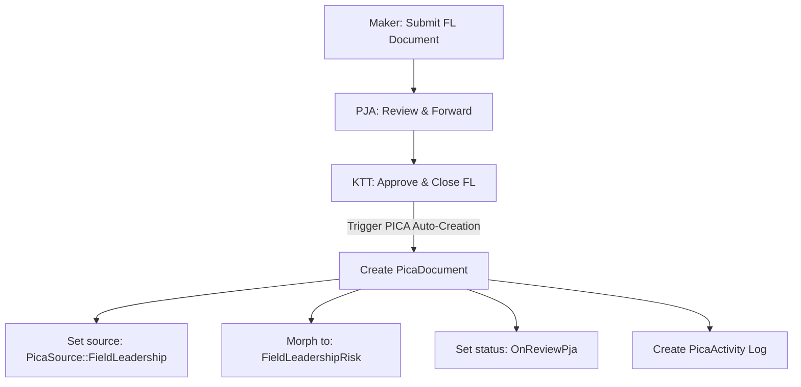
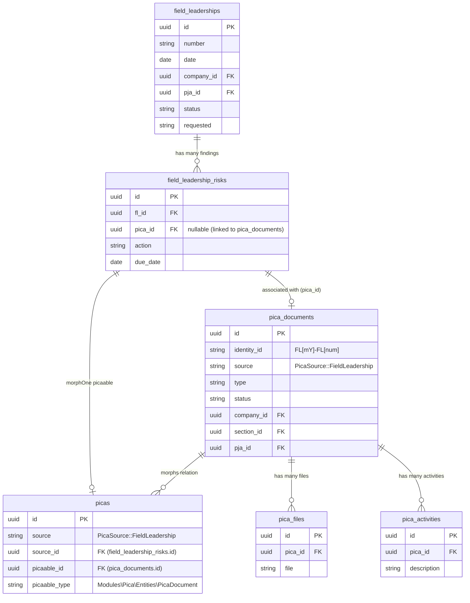

# Field Leadership Submission & Approval Workflow

This document details the complete submission, review, and approval workflow for the **Field Leadership** module. It explains how the roles, permissions, database structures, and state transitions are configured for the specified users:
- **Maker**: Fadjri Wivindi (`fadjri.wivindi@alamtri.com`)
- **Reviewer / PJA**: Zakaria Anoi (`zakaria.anoi@alamtri.com`)
- **Approver / KTT**: Rahmad Taufik Siregar (`rahmad.siregar@alamtri.com`)

---

## 1. User & Access Matrix Configuration

The following database relationships and configurations have been validated and are active:

| User Role | Email | User ID | Employee ID | Guard/Permissions | Area Manager Mapping / Approval Setup |
| :--- | :--- | :--- | :--- | :--- | :--- |
| **Maker** (Observer) | `fadjri.wivindi@alamtri.com` | `a1f079a4-a373-4b19-9fda-d3592f7907d9` | `a1f079a4-b4ec-4e6a-a2ce-e7684bbe42c9` | `field-leadership` guard:<br>- `Field Leadsership - Create`<br>- `Field Leadsership - View Active`<br>- `Field Leadsership - View Draft`<br>- `Field Leadsership - Read`<br>- `Field Leadsership - Update` | Observes the IT area, creates, and submits documents. |
| **Reviewer** (PJA) | `zakaria.anoi@alamtri.com` | `a1f080e2-e013-45fd-9309-de7456f70516` | `a20355ac-e228-4c33-bdb8-a68a71abfa06` | `field-leadership` guard:<br>- `Field Leadsership - View Request Review For PJA`<br>- `Field Leadsership - View Draft For PJA`<br>- `Field Leadsership - Read`<br>- `Field Leadsership - Update` | Registered as the **Area Manager** for **IT** Section (`a1f685e3-e386-4f54-8dba-2181866dac8b`). |
| **Approver** (KTT) | `rahmad.siregar@alamtri.com` | `a1f08273-82b2-44a1-b3d1-c1b6fdd88d4c` | `a1f0829a-b492-4410-b6cf-9ed0d7f09ea7` | `field-leadership` guard:<br>- `Field Leadsership - View Request Review For Approval`<br>- `Field Leadsership - Read` | Assigned as the `user_id` on **PT Maruwai Coal** (`a1f078e5-ed47-4e84-b3c1-9f659cc93a4e`). |

---

## 2. Programmatic Workflow Simulation

We wrote a complete PHP execution script inside [scratch/test_query.php](file:///c:/laragon/www/aims/scratch/test_query.php) that programmatically transitions a document through all three stages.

### Stage 1: Document Creation & Submission (Maker)
*   **Action**: Maker (`Fadjri Wivindi`) creates the document, enters observation details, adds positive/risk findings, and submits it.
*   **State Transition**:
    *   `status` is set to `FieldLeadershipType::Open`
    *   `requested` is set to `FieldLeadershipType::RequestedPja`
*   **Code Example**:
    ```php
    $fl = FieldLeadership::create([
        'number'     => 'FL-MAC-SIMULATE-0001',
        'date'       => now()->toDateString(),
        'company_id' => $company->id,
        'pja_id'     => $pja->id, // Zakaria Anoi (Area Manager)
        'status'     => FieldLeadershipType::Open,
        'requested'  => FieldLeadershipType::RequestedPja,
        'created_by' => $makerUser->employee->id,
    ]);
    ```

### Stage 2: PJA Review & Forward to Approval (Reviewer/PJA)
*   **Action**: Reviewer (`Zakaria Anoi`) reviews the document and submits it to KTT.
*   **State Transition**:
    *   `status` is set to `FieldLeadershipType::OnReviewApproval`
    *   `requested` is set to `FieldLeadershipType::RequestedApproval`
*   **Code Example**:
    ```php
    $fl->update([
        'status'    => FieldLeadershipType::OnReviewApproval,
        'requested' => FieldLeadershipType::RequestedApproval,
    ]);
    ```

### Stage 3: Final Approval & Closure (KTT)
*   **Action**: KTT (`Rahmad Taufik Siregar`) approves and closes the case.
*   **State Transition**:
    *   `status` is set to `FieldLeadershipType::Close`
    *   `requested` is set to `FieldLeadershipType::Approved`
*   **Code Example**:
    ```php
    $fl->update([
        'status'    => FieldLeadershipType::Close,
        'requested' => FieldLeadershipType::Approved,
    ]);
    ```

---

## 3. Database Seeding

We have created a dedicated Laravel Seeder [FieldLeadershipWorkflowSeeder.php](file:///c:/laragon/www/aims/Modules/FieldLeadership/Database/Seeders/FieldLeadershipWorkflowSeeder.php) that populates the database with 3 documents, each representing one of the active workflow stages:

1.  `FL-MAC-130626-FADJRI-01`: **Awaiting PJA Review** (Visible in Zakaria's PJA Request Review queue).
2.  `FL-MAC-130626-FADJRI-02`: **Awaiting Approval** (Visible in Rahmad's KTT Approval queue).
3.  `FL-MAC-130626-FADJRI-03`: **Approved & Closed** (Archived/Closed case).

---

## 4. PICA Integration Workflow

When a **Field Leadership** document is approved by the Approver (KTT) or processed by the PJA, the system automatically creates follow-up actions in the **PICA (Corrective Action)** module.

### How PICA Data is Created (Script Details)

Inside the approval logic (for example, in [DetailRequestApprovalPage.php](file:///c:/laragon/www/aims/Modules/FieldLeadership/Http/Livewire/Listing/Approval/DetailRequestApprovalPage.php#L141-L192)), the system iterates through each hazard/risk finding (`FieldLeadershipRisk`):

```php
foreach ($this->field->risks as $key => $value) {
    // 1. Create a PicaDocument record representing the corrective action task
    $picaDocument = $value->pica()->create([
        'identity_id' => $this->generateIdentityId($this->field->created_at), // Generates FL[mY]-FL[increment_number]
        'source' => PicaSource::FieldLeadership,
        'type' => $this->field->type,
        'date' => Carbon::parse($this->field->date)->format('Y-m-d'),
        'ccow_id' => $this->field->ccow_id,
        'company_id' => $this->field->company_id,
        'section_id' => $this->field->section_id,
        'location_id' => $this->field->area_location_id,
        'location_detail' => $this->field->detail_location,
        'company_detail' => $this->field->detail_company,
        'pja_id' => $this->field->pja_id,
        'pjo_id' => $this->field->pjo_id,
        'auditor' => auth()->user()->name,
        'non_compliance_root_cause' => $this->field->non_compliance_root,
        'corrective_action' => $value['action'],
        'target_settlement_date' => Carbon::parse($value['due_date'])->format('Y-m-d'),
        'settlement_date' => Carbon::parse($value['due_date'])->format('Y-m-d'),
        'requested' => PicaStatus::NewRequest,
        'published' => PicaStatus::Publish,
        'status' => $this->field->status,
    ]);

    // 2. Create the Pica polymorphic record to link the task back to the Field Leadership risk source
    $picaDocument->pica()->create([
        'source' => PicaSource::FieldLeadership,
        'source_id' => $value->id,
        'picaable_id' => $picaDocument->id,
        'picaable_type' => FieldLeadershipRisk::class,
    ]);

    // 3. Clone files associated with the risk over to picaFiles
    foreach ($value->files as $key => $file) {
        $picaDocument->picaFiles()->create([
            'file' => $file->file,
            'size' => $file->size,
            'type' => FieldLeadershipType::RiskFinding
        ]);
    }

    // 4. Record initial workflow activity history
    $picaDocument->activities()->create([
        'description' => 'New Request',
        'user_id' => Auth::user()->id,
    ]);
}
```

### Visual Workflow Flowchart



---

## 5. ERD Database Diagram (Field Leadership to PICA)

Berikut adalah visualisasi hubungan database (*Entity Relationship Diagram*) antara entitas **Field Leadership** dan entitas **PICA** menggunakan format Mermaid.js:


