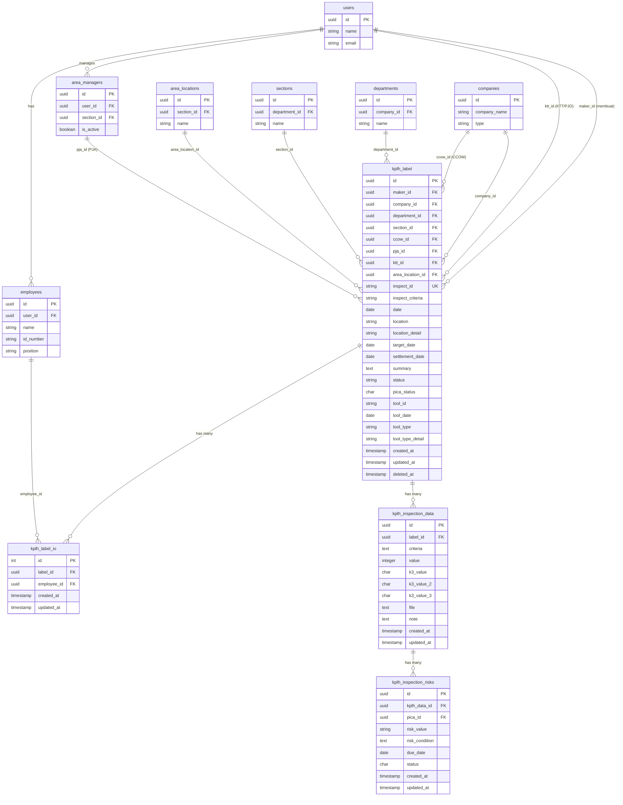
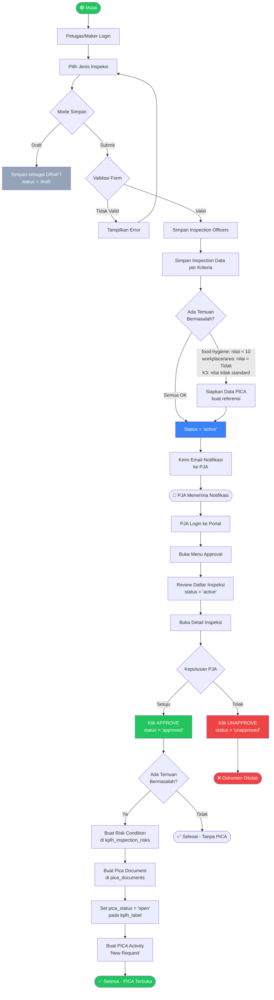
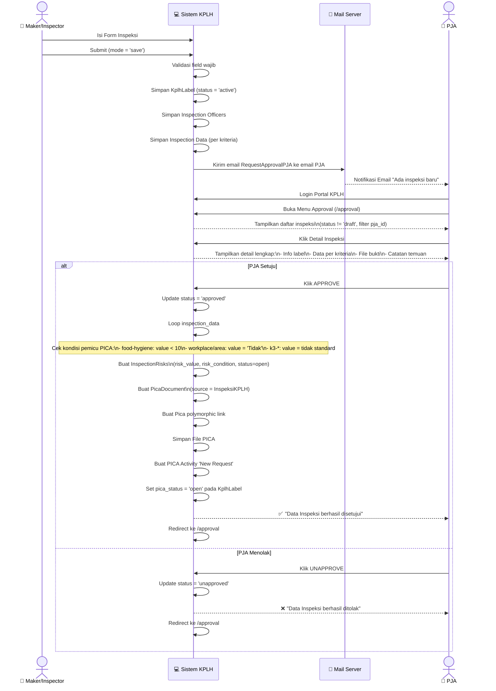
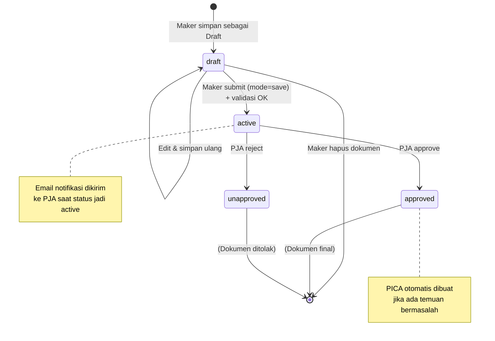
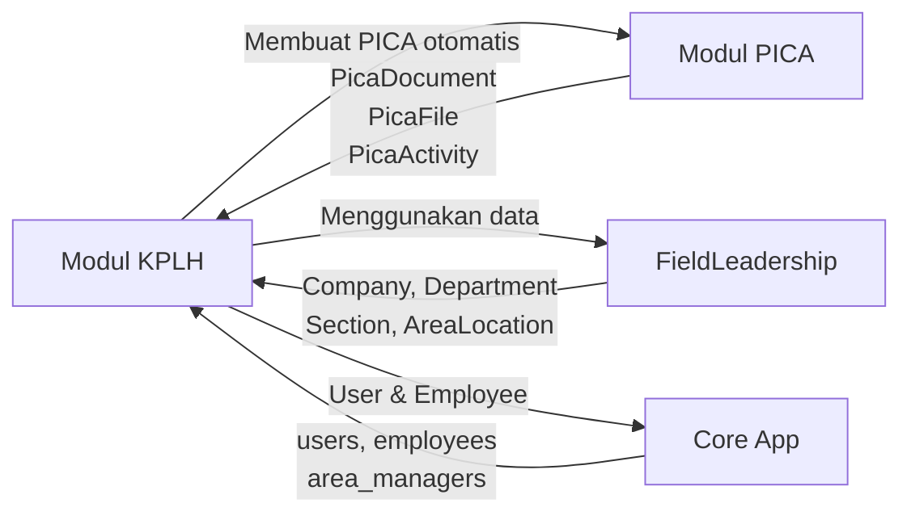

# 📋 Dokumentasi Modul KPLH (Keselamatan, Perlindungan Lingkungan Hidup)

> **Sistem AIMS** — Modul Inspeksi K3LH

---

## 1. 🗂️ Struktur Folder

```
Modules/Kplh/
├── Config/
├── Console/
├── Database/
│   ├── Migrations/
│   │   ├── 2023_06_02_092233_kplh_label.php                    # Tabel utama kplh_label
│   │   ├── 2023_06_26_065055_kplh_label_inspection_officers.php # Tabel kplh_label_io
│   │   ├── 2023_07_30_162317_kplh_inspection_data.php           # Tabel kplh_inspection_data
│   │   ├── 2023_07_30_163840_kplh_inspection_risks.php          # Tabel kplh_inspection_risks
│   │   ├── 2023_07_30_163841_kplh_inspection_risks_file.php     # Field file risks
│   │   ├── 2023_08_02_*.php                                     # Tambahan field timestamps, summary, company
│   │   ├── 2023_08_04_*.php                                     # Tambahan field value K3
│   │   ├── 2023_08_08_*.php                                     # Tambahan field k3_value
│   │   ├── 2023_08_09_090428_kplh_label_make_sures.php          # Consolidasi semua field utama
│   │   ├── 2023_08_20_*.php                                     # K3 option field
│   │   ├── 2023_08_23_102853_kplh_label_add_k3.php             # Field tool_id, tool_date, tool_type
│   │   ├── 2023_08_24_*.php                                     # Tambahan field K3 detail
│   │   ├── 2023_09_*.php                                        # K3 value tambahan
│   │   └── 2023_11_20_104826_kplh_add_status.php               # Field pica_status & risk status
│   ├── Seeders/
│   └── factories/
├── Entities/
│   ├── KplhLabel.php           # Model utama dokumen inspeksi
│   ├── KplhLabelIO.php         # Model inspection officers
│   ├── InspectionData.php      # Model detail data inspeksi
│   └── InspectionRisks.php     # Model temuan risiko → PICA
├── Http/
│   ├── Controllers/
│   │   ├── KplhController.php  # API Controller utama
│   │   └── AuthController.php  # Autentikasi mobile
│   ├── Livewire/
│   │   ├── Dashboard.php       # Halaman dashboard statistik
│   │   ├── Lists.php           # Daftar semua inspeksi
│   │   ├── Auth/
│   │   │   └── Login.php
│   │   ├── FoodHygiene/
│   │   │   ├── Add.php         # Tambah inspeksi food hygiene
│   │   │   ├── Edit.php
│   │   │   └── Lists.php
│   │   ├── AreaMaintank/
│   │   │   ├── Add.php
│   │   │   ├── Edit.php
│   │   │   └── Lists.php
│   │   ├── AreaJetty/
│   │   │   ├── Add.php
│   │   │   ├── Edit.php
│   │   │   └── Lists.php
│   │   ├── WeeklyWorkplace/
│   │   │   ├── Add.php
│   │   │   ├── Edit.php
│   │   │   └── Lists.php
│   │   ├── K3/
│   │   │   ├── Lists.php
│   │   │   ├── Apar/           # APAR (Alat Pemadam Api Ringan)
│   │   │   │   ├── Add.php
│   │   │   │   └── Edit.php
│   │   │   ├── Apab/           # APAB (Alat Pemadam Api Beroda)
│   │   │   │   ├── Add.php
│   │   │   │   └── Edit.php
│   │   │   ├── Hydrant/
│   │   │   │   ├── Add.php
│   │   │   │   └── Edit.php
│   │   │   ├── Hr/             # Hose Rail
│   │   │   │   ├── Add.php
│   │   │   │   └── Edit.php
│   │   │   └── Ew/             # Eye Wash
│   │   │       ├── Add.php
│   │   │       └── Edit.php
│   │   └── PJA/
│   │       ├── Approval.php        # Halaman list approval PJA
│   │       └── DetailApproval.php  # Detail + aksi approve/unapprove
│   ├── Middleware/
│   └── Requests/
├── Providers/
│   └── KplhServiceProvider.php
├── Resources/
│   ├── LabelResource.php
│   ├── assets/
│   ├── lang/
│   └── views/
│       ├── layouts/
│       │   ├── app.blade.php
│       │   └── no-header.blade.php
│       └── livewire/
│           ├── dashboard.blade.php
│           ├── lists.blade.php
│           ├── food-hygiene/
│           ├── area-maintank/
│           ├── area-jetty/
│           ├── weekly-workplace/
│           ├── k3/
│           └── p-j-a/
│               ├── approval.blade.php
│               └── detail-approval.blade.php
├── Routes/
│   ├── api.php     # Endpoint API mobile (Sanctum auth)
│   └── web.php     # Rute web Livewire
├── Tests/
├── View/
├── module.json
├── composer.json
└── package.json
```

---

## 2. 🗄️ ERD (Entity Relationship Diagram)



### Keterangan Tabel

#### `kplh_label` — Dokumen Inspeksi Utama
| Field | Tipe | Keterangan |
|---|---|---|
| `id` | UUID PK | ID unik dokumen |
| `maker_id` | UUID FK → users | User yang membuat inspeksi |
| `company_id` | UUID FK → companies | Perusahaan yang diinspeksi |
| `department_id` | UUID FK → departments | Departemen |
| `section_id` | UUID FK → sections | Section |
| `ccow_id` | UUID FK → companies | Perusahaan CCOW (internal) |
| `pja_id` | UUID FK → area_managers | Penanggung Jawab Area |
| `ktt_id` | UUID FK → users | KTT / PJO |
| `area_location_id` | UUID FK → area_locations | Lokasi area |
| `inspect_id` | string UNIQUE | Nomor dokumen (INSP-ddmmYYYY-000001) |
| `inspect_criteria` | string | Jenis inspeksi (lihat enum di bawah) |
| `date` | date | Tanggal inspeksi |
| `location_detail` | string | Detail lokasi |
| `summary` | text | Ringkasan temuan |
| `status` | string | `draft` / `active` / `approved` / `unapproved` |
| `pica_status` | char | Status PICA terkait (`open` / `closed`) |
| `tool_id` | string | ID alat (khusus K3) |
| `tool_date` | date | Tanggal alat (khusus K3) |
| `tool_type` | string | Jenis alat K3 |

#### Jenis Inspeksi (`inspect_criteria`)
| Nilai | Label |
|---|---|
| `food-hygiene` | Inspeksi Food Hygiene |
| `workplace` | Inspeksi Tempat Kerja Mingguan |
| `area-maintank` | Inspeksi Area Maintank |
| `area-jetty` | Inspeksi Area Jetty |
| `k3-apar` | Inspeksi K3 APAR |
| `k3-apab` | Inspeksi K3 APAB |
| `k3-hydrant` | Inspeksi K3 Hydrant |
| `k3-hose-rail` | Inspeksi K3 Hose Rail |
| `k3-eye-wash` | Inspeksi K3 Eye Wash |

#### `kplh_label_io` — Petugas Inspeksi
| Field | Tipe | Keterangan |
|---|---|---|
| `id` | int PK | |
| `label_id` | UUID FK → kplh_label | Dokumen inspeksi |
| `employee_id` | UUID FK → employees | Petugas yang terlibat |

#### `kplh_inspection_data` — Detail Poin Inspeksi
| Field | Tipe | Keterangan |
|---|---|---|
| `id` | UUID PK | |
| `label_id` | UUID FK → kplh_label | Dokumen induk |
| `criteria` | text | Kode item inspeksi |
| `value` | integer | Nilai numerik (food-hygiene: 0–10) |
| `k3_value` | char(50) | Nilai K3 utama (Ya/Tidak/Standard) |
| `k3_value_2` | char(50) | Nilai K3 sekunder |
| `k3_value_3` | char(50) | Nilai K3 tersier |
| `file` | text | Path file bukti/foto |
| `note` | text | Catatan/keterangan |

#### `kplh_inspection_risks` — Temuan Risiko → PICA
| Field | Tipe | Keterangan |
|---|---|---|
| `id` | UUID PK | |
| `kplh_data_id` | UUID FK → kplh_inspection_data | Data inspeksi sumber |
| `pica_id` | UUID FK → pica_documents | Dokumen PICA terkait |
| `risk_value` | string | Nilai risiko yang memicu |
| `risk_condition` | text | Kondisi/deskripsi risiko |
| `due_date` | date | Batas penyelesaian |
| `status` | char | `open` / `closed` |

---

## 3. 🔄 Workflow Proses Inspeksi



### Keterangan Status Dokumen
| Status | Warna | Deskripsi |
|---|---|---|
| `draft` | Abu-abu | Tersimpan sementara, belum disubmit |
| `active` | Biru | Sudah disubmit, menunggu review PJA |
| `approved` | Hijau | Disetujui oleh PJA |
| `unapproved` | Merah | Ditolak oleh PJA |

### Aturan Pemicu PICA
| Jenis Inspeksi | Kondisi Pemicu PICA |
|---|---|
| Food Hygiene | Nilai item < 10 |
| Workplace / Area Maintank / Area Jetty | Nilai item = `"Tidak"` |
| K3 (APAR/APAB/Hydrant/Hose Rail/Eye Wash) | Nilai = `"Tidak Standard"`, `"Tidak Ada"`, `"Warna Demarkasi Pudar"`, `"Perlu Penggantian"`, atau `"Terdapat Penghalang"` |

---

## 4. 🔐 Matrix Permission User

### Role yang Terlibat

| Role | Deskripsi |
|---|---|
| **Maker / Inspector** | Petugas lapangan yang melakukan dan mengisi form inspeksi |
| **PJA** (Penanggung Jawab Area) | Penyelia area yang mereview dan menyetujui/menolak inspeksi |
| **Admin / Super Admin** | Pengelola sistem, akses penuh ke semua data |

### Matrix Hak Akses

| Fitur / Aksi | Maker/Inspector | PJA | Admin | Super Admin |
|---|:---:|:---:|:---:|:---:|
| **Web Portal** | | | | |
| Login Portal KPLH | ✅ | ✅ | ✅ | ✅ |
| Lihat Dashboard Statistik | ✅ | ✅ | ✅ | ✅ |
| **Manajemen Inspeksi** | | | | |
| Lihat Daftar Semua Inspeksi | ✅ | ✅ | ✅ | ✅ |
| Buat Inspeksi Baru (Semua Jenis) | ✅ | ❌ | ✅ | ✅ |
| Edit Inspeksi (status draft) | ✅* | ❌ | ✅ | ✅ |
| Hapus Inspeksi | ✅* | ❌ | ✅ | ✅ |
| Submit Inspeksi (draft → active) | ✅ | ❌ | ✅ | ✅ |
| **Approval** | | | | |
| Akses Menu Approval | ❌ | ✅ | ✅ | ✅ |
| Lihat Detail Inspeksi (Approval) | ❌ | ✅ | ✅ | ✅ |
| Approve Inspeksi | ❌ | ✅ (`KPLH - Approval`) | ✅ | ✅ |
| Reject/Unapprove Inspeksi | ❌ | ✅ (`KPLH - Approval`) | ✅ | ✅ |
| **API Mobile** | | | | |
| Login via API | ✅ | ✅ | ❌ | ❌ |
| Ambil Data Master (CCOW, Dept, dll) | ✅ | ✅ | ❌ | ❌ |
| Submit Inspeksi via API | ✅ | ✅ | ❌ | ❌ |
| Upload File via API | ✅ | ✅ | ❌ | ❌ |
| **Laporan & Ekspor** | | | | |
| Download File Bukti Inspeksi | ✅ | ✅ | ✅ | ✅ |
| Akses Dashboard API (Open) | ✅ | ✅ | ✅ | ✅ |

> **\* Catatan**: Edit dan hapus biasanya dibatasi hanya untuk dokumen milik sendiri (maker_id = auth user)

### Permission Spifik (Spatie Permission)
| Permission Key | Deskripsi |
|---|---|
| `KPLH - Approval` | Mengizinkan akses halaman approval dan aksi approve/unapprove |

---

## 5. 🔁 Alur Approval Detail



### Status Transition Diagram



---

## 6. 🌐 API Endpoints (Mobile)

**Base URL:** `/api/kplh`

### Auth
| Method | Endpoint | Deskripsi |
|---|---|---|
| POST | `/auth/login` | Login mobile (Sanctum) |

### Master Data (Perlu auth:sanctum)
| Method | Endpoint | Deskripsi |
|---|---|---|
| GET | `/general/ccow` | Daftar CCOW (perusahaan internal) |
| GET | `/general/company` | Semua perusahaan |
| GET | `/general/department/{id}` | Departemen by company |
| GET | `/general/section/{id}` | Section by department |
| GET | `/general/area-location/{id}` | Lokasi by section |
| GET | `/general/pja/{id}` | PJA by section |
| GET | `/general/ktt/{id}` | KTT by company |
| GET | `/general/inspection-officers/{id}` | Karyawan by company |
| POST | `/general/upload-file` | Upload file bukti inspeksi |

### Inspeksi
| Method | Endpoint | Deskripsi |
|---|---|---|
| GET | `/inspection-lists?type={criteria}` | Daftar inspeksi by jenis |
| GET | `/forms?type={criteria}` | Form pertanyaan inspeksi |
| POST | `/create` | Buat/update inspeksi (single) |
| POST | `/create-bundle` | Buat/update inspeksi (batch) |
| GET | `/inspection/{id}` | Detail inspeksi |
| POST | `/update` | Update inspeksi |

### Open (Tanpa Auth)
| Method | Endpoint | Deskripsi |
|---|---|---|
| GET | `/dashboard` | Statistik dashboard |
| GET | `/user-stats` | Statistik per user |

---

## 7. 🔗 Integrasi Modul Lain



| Modul | Hubungan |
|---|---|
| **PICA** | Temuan inspeksi yang bermasalah otomatis dibuat sebagai PICA Document |
| **FieldLeadership** | Menyediakan resource transformers (Company, Department, Section, AreaLocation) |
| **Core App** | Users, Employees, AreaManagers, Companies, Departments, Sections, AreaLocations |

---

## 8. 📊 Format Nomor Dokumen

| Jenis | Format | Contoh |
|---|---|---|
| Inspeksi Biasa | `INSP-{ddmmYYYY}-{000001}` | `INSP-20062026-000001` |
| Inspeksi K3 | `INSP-ALK3-{ddmmYYYY}-{000001}` | `INSP-ALK3-20062026-000001` |
| PICA dari KPLH | `IN{mmYYYY}-IN{000001}` | `IN062026-IN000001` |

---

*Dokumentasi ini di-generate dari analisis kode sumber Modul KPLH di `c:\laragon\www\aims\Modules\Kplh`*
