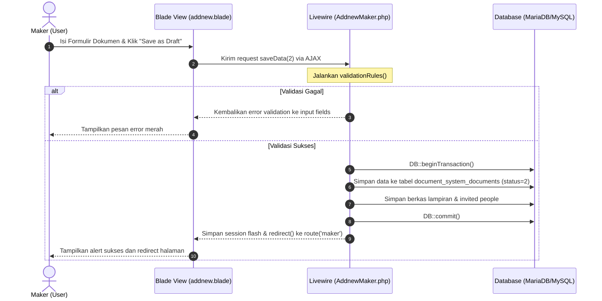

# ⚡ Panduan Alur Livewire: Pembuatan Draft & Submit Dokumen
Panduan ini menjelaskan arsitektur komunikasi antara frontend (Blade View) dan backend (Livewire Component Class) pada fitur **Pembuatan Draft** (`AddnewMaker`) di modul Document System.
---
## 📂 Berkas Terkait
*   **Backend Component**: [AddnewMaker.php](file:///c:/laragon/www/aims/app/Http/Livewire/DocumentSystems/Maker/AddnewMaker.php)
*   **Frontend Template (Blade)**: [addnew.blade.php](file:///c:/laragon/www/aims/Modules/DocumentSystem/Resources/views/livewire/maker/addnew.blade.php)
---
## 🔄 1. Hubungan Aksi: Button, Submit, & Fungsi
Interaksi formulir ini menggunakan perpaduan **Form Submit Event (`wire:submit.prevent`)** dan **Button Click Action (`wire:click`)** dengan status parameter dinamis.
### A. Tag Form Utama
Di dalam file `addnew.blade.php`, seluruh input dibungkus dalam tag form berikut:
```html
<form wire:submit.prevent='saveData' wire:ignore.self class="form-horizontal">
    <!-- Input Fields -->
</form>
```
> [!NOTE]
> `wire:submit.prevent='saveData'` mencegah perilaku default form submit halaman (refresh page) dan mengalihkannya langsung ke fungsi `saveData()` di backend component.
### B. Tombol Aksi di Footer (Submit Action)
Formulir ini memiliki dua aksi submit utama di bagian tombol tindakan:
1.  **Simpan Sebagai Draft (Save as Draft - Status 2)**
    ```html
    <button type="button" wire:click="saveData(2)" class="dropdown-item">
        Save as Draft
    </button>
    ```
    *   **Trigger**: Ketika tombol ini diklik, ia akan memanggil fungsi `saveData(2)` langsung di backend.
    
2.  **Kirim Untuk Review (Submit for Review - Status 1)**
    ```html
    <button type="button" wire:click.prevent="saveData(1)" class="dropdown-item">
        Submit for Review
    </button>
    ```
    *   **Trigger**: Memanggil fungsi `saveData(1)` di backend, menaikkan status dokumen menjadi dalam proses review.
---
## 🧩 2. Skema Pengikatan Data (Data Binding)
Livewire mengikat properti HTML langsung ke variabel kelas backend menggunakan sintaks `wire:model`.
| Input Element | Properti Blade View | Properti PHP Backend | Deskripsi |
| :--- | :--- | :--- | :--- |
| **Title Input** | `wire:model="title"` | `public $title;` | Menyimpan judul dokumen |
| **Description** | `wire:model="description"` | `public $description;` | Menyimpan deskripsi dokumen (terikat dengan Rich Text Editor) |
| **Company Select** | `wire:model="company_id"` | `public $company_id;` | Menentukan kode instansi perusahaan |
| **Dept Select** | `wire:model="department_id"` | `public $department_id;` | Menentukan kode departemen |
| **Upload Type** | `wire:model="upload_type"` | `public $upload_type;` | Tipe unggah (`document` atau `record`) |
| **Document Type** | `wire:model="document_type"` | `public $document_type;` | Level dokumen (`SOP`, `TS`, `MN`) |
---
## ⚙️ 3. Bedah Logika Backend (`saveData`)
Metode `saveData($status = 2)` di dalam [AddnewMaker.php](file:///c:/laragon/www/aims/app/Http/Livewire/DocumentSystems/Maker/AddnewMaker.php) bertugas memproses data masukan:
```php
public function saveData($status = 2)
{
    DB::beginTransaction();
    try {
        // 1. Validasi Input berdasarkan rule dinamis
        $data = $this->validate($this->validationRules(), $this->message);
        
        // 2. Kumpulkan data pendukung lainnya dari state/properti
        $data['peoples'] = $this->invitedPeople;
        $data['description'] = $this->description;
        $data['documents'] = array_values($this->tmp); // File lampiran sementara
        $data['user_id'] = $this->pic;
        $data['status'] = $status; // 2 = Draft, 1 = Waiting Review
        $data['document_level'] = $this->document_type;
        $data['is_notify_email'] = $this->notify_via_email == 'on' ? true : false;
        $data['doc_created'] = date('Y-m-d', strtotime($this->doc_created));
        $data['created_by'] = auth()->id();
        $data['deleted_id_media'] = $this->deleted_id_media;
        $service = new DocumentSystemService();
        
        if ($this->id_maker) {
            // JIKA EDIT: Panggil fungsi update
            $service->update($data, $this->id_maker);
        } else {
            // JIKA BUAT BARU: Panggil fungsi store
            unset($data['pic']);
            unset($data['document_type']);
            $service->store($data);
        }
        DB::commit();
        // 3. Reset form jika pembuatan baru berhasil
        if (!$this->id_maker) {
            $this->resetExcept(['companies', 'modules']);
            $this->dispatchBrowserEvent('resetSummernote');
        }
        // 4. Set Session Flash & Redirect ke halaman Maker
        session()->flash('success', $status == 1 
            ? trans('global.success_add_document_review') 
            : trans('global.success_add_document_draft')
        );
        return redirect()->route('maker');
    } catch (\Throwable $th) {
        DB::rollBack();
        return $this->dispatchBrowserEvent('swal', [
            'title' => 'Failed',
            'icon' => 'error',
            'text' => env('APP_ENV') == 'local' 
                ? $th->getMessage() . ' ' . $th->getLine() . ' ' . $th->getFile() 
                : 'Failed to create new document',
        ]);
    }
}
```
---
## ⚡ 4. Alur Kerja Siklus Draft (Flow Sequence)
Berikut adalah urutan proses saat user membuat draft dokumen baru:

### Penanganan Khusus Komponen Tambahan:
*   **Select2 Integration**: Karena Select2 mengambil alih DOM, data diperbarui ke Livewire menggunakan event listener javascript di Blade:
    ```javascript
    $('#company_id').on('change', function(e) {
        var data = $(this).select2("val");
        @this.set('company_id', data); // Memaksa update state Livewire
    });
    ```
*   **Rich Text Editor (Summernote)**: Konten text editor diperbarui ke model `description` setiap kali terjadi ketikan melalui callback:
    ```javascript
    callbacks: {
        onChange: function(contents, $editable) {
            @this.set(id, contents);
        }
    }
    ```
*   **Dropbox / File Attachment**: Berkas yang ditarik (*drag & drop*) diunggah terlebih dahulu secara asinkron ke endpoint temp folder (`document-systems::maker.files`) melalui ajax, lalu hasilnya didaftarkan ke state `$tmp` di Livewire menggunakan `@this.createdFiles(res)`.

---

## 📊 5. Alur Pengambilan & Filtering Data Tabel (Table Data Retrieval)

Bagian ini menjelaskan bagaimana data tabel dokumen aktif ditarik secara dinamis dari database, difilter berdasarkan berbagai parameter pencarian, dan disajikan menggunakan paginasi Livewire.

### A. Berkas Terkait
*   **Backend Component**: [TableMaker.php](file:///c:/laragon/www/aims/Modules/DocumentSystem/Http/Livewire/Maker/TableMaker.php)
*   **Frontend Template (Blade)**: [table-maker.blade.php](file:///c:/laragon/www/aims/Modules/DocumentSystem/Resources/views/livewire/maker/table-maker.blade.php)

---

### B. Properti Komputasi Pengambilan Data (`getListingsProperty`)

Livewire menggunakan **Computed Properties** untuk memuat data secara dinamis. Di kelas [TableMaker.php](file:///c:/laragon/www/aims/Modules/DocumentSystem/Http/Livewire/Maker/TableMaker.php), data tabel diambil melalui fungsi `getListingsProperty()` yang mengembalikan data terpaginasi:

```php
public function getListingsProperty(): LengthAwarePaginator
{
    try {
        return Document::with([
            'attachments' => fn($q) => $q->where('status', 1),
            'department.company',
            'user',
            'mapping.category.module'
        ])
        // 1. Filter Multi-Kategori Terpilih (Company, Department, Module, dll)
        ->when(!empty($this->sortSelected), function ($q) {
            $q->where(function ($q) {
                $q->when(isset($this->sortSelected['company_id']), function ($q) {
                    $q->whereHas('department', function ($q) {
                        $q->whereIn('company_id', $this->sortSelected['company_id']);
                    });
                });
                $q->when(isset($this->sortSelected['department_id']), function ($q) {
                    $q->whereIn('department_id', $this->sortSelected['department_id']);
                });
                $q->when(isset($this->sortSelected['document_level']), function ($q) {
                    $q->whereIn('document_level', $this->sortSelected['document_level']);
                });
                $q->when(isset($this->sortSelected['module_id']), function ($q) {
                    $q->whereIn('module_id', $this->sortSelected['module_id']);
                });
            });
        })
        // 2. Filter Pencarian Judul
        ->when(!empty($this->searchTitle), function ($query) {
            $query->where('title', 'like', '%' . $this->searchTitle . '%');
        })
        // 3. Filter Pencarian ID Document (SOP, WIN, Form, dll)
        ->when(!empty($this->searchIdDocument), function ($query) {
            $query->where('sop_number', 'like', '%' . $this->searchIdDocument . '%')
                ->orWhere('sop_add_win', 'like', '%' . $this->searchIdDocument . '%')
                ->orWhere('sop_add_form', 'like', '%' . $this->searchIdDocument . '%')
                ->orWhere('document_number', 'like', '%' . $this->searchIdDocument . '%')
                ->orWhere('prefix_code', 'like', '%' . $this->searchIdDocument . '%');
        })
        // 4. Filter Berdasarkan Rentang Tanggal Pembuatan
        ->when(!empty($this->startDate) && !empty($this->endDate), function ($query) {
            $query->whereBetween('doc_created', [$this->startDate, $this->endDate]);
        })
        // 5. Batasi hanya dokumen berstatus ACTIVE atau EXPIRED
        ->isActive() 
        // 6. Urutkan berdasarkan kolom & tipe sort
        ->orderBy($this->sortField, $this->sortType)
        // 7. Paginasi berdasarkan limit yang diinput user
        ->paginate($this->limit);
        
    } catch (\Throwable $err) {
        // Fallback jika error
        return Document::whereRaw('1 = 0')->paginate($this->limit);
    }
}
```

---

### C. Pemanggilan Data di Blade View

Pada file [table-maker.blade.php](file:///c:/laragon/www/aims/Modules/DocumentSystem/Resources/views/livewire/maker/table-maker.blade.php), properti komputasi di atas dipanggil menggunakan sintaks `$this->listings` di dalam perulangan `@foreach`:

```html
<tbody>
    @foreach ($this->listings as $itemIndex => $items)
        <tr wire:key="{{ $itemIndex }}" wire:click="onSelectedItem('{{ $items->id }}')">
            <!-- Checkbox selector -->
            <td class="td-check">
                <span class="icon-checked"></span>
            </td>
            <!-- Kolom Detail Dokumen -->
            <td>{{ $items->department->company->company_name }}</td>
            <td>{{ $items->department->name }}</td>
            <td>{{ $items->user->name ?? '-' }}</td>
            <td>{{ $items->title }}</td>
            <td>{{ $items->fix_document_number }}</td>
            <td>{!! $items->status_badge !!}</td>
        </tr>
    @endforeach
</tbody>
```

> [!TIP]
> Di Livewire, variabel dengan penamaan `getListingsProperty()` diakses di file Blade dengan menghilangkan kata `get` dan `Property` serta menggunakan format camelCase `$this->listings`.

---

### D. Fitur Pendukung Tabel

1.  **Checkbox Row Selection (`wire:click="onSelectedItem('...')`)**
    Setiap baris yang diklik akan memicu fungsi `onSelectedItem($id)` untuk menambahkan atau menghapus ID dokumen dari array `$itemSelected`. Ini digunakan untuk fitur batch export/delete.
    
2.  **Pencarian Real-time Otomatis (`wire:model.1500ms`)**
    Input pencarian menggunakan debouncing `1500ms` agar Livewire tidak mengirim request AJAX terlalu sering saat pengguna mengetik:
    ```html
    <input type="text" wire:model.1500ms="searchTitle" placeholder="Cari Judul...">
    ```
    
3.  **Pengaturan Limit Data Tersemat (`wire:model="limit"`)**
    Pengguna dapat menentukan berapa banyak baris yang ingin ditampilkan secara dinamis melalui binding input limit pada footer:
    ```html
    <input type="text" wire:model="limit" id="limit" value="{{ $limit }}">
    ```

