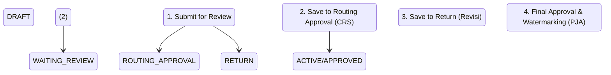

# ⚡ Panduan Lengkap Alur Livewire: Siklus Hidup Dokumen (Submit, Routing, & Watermark)

Panduan ini mendokumentasikan arsitektur komunikasi frontend-backend Livewire serta integrasi script Python Watermark untuk seluruh siklus hidup dokumen standar.

---

## 📂 Berkas Utama Terkait
*   **Pembuat (Maker)**:
    *   Backend: [AddnewMaker.php](file:///c:/laragon/www/aims/app/Http/Livewire/DocumentSystems/Maker/AddnewMaker.php)
    *   Blade View: [addnew.blade.php](file:///c:/laragon/www/aims/Modules/DocumentSystem/Resources/views/livewire/maker/addnew.blade.php)
*   **Pemeriksa (Reviewer/Approver)**:
    *   Backend: [ReviewDetail.php](file:///c:/laragon/www/aims/app/Http/Livewire/DocumentSystems/Review/ReviewDetail.php)
    *   Blade View: [review-detail.blade.php](file:///c:/laragon/www/aims/Modules/DocumentSystem/Resources/views/livewire/review/review-detail.blade.php)
*   **Model & Status**:
    *   Model Eloquent: [Document.php](file:///c:/laragon/www/aims/app/Models/DocumentSystem/Document.php)
    *   Enum Status: [DocumentStatus.php](file:///c:/laragon/www/aims/app/Enums/DocumentSystem/DocumentStatus.php)
*   **Watermark Processor**:
    *   Python Helper: [watermark.py](file:///c:/laragon/www/aims/app/Helpers/watermark.py)

---

## 🔄 1. Hubungan Aksi: Button, Submit, & Fungsi

### A. Pengajuan Dokumen Baru (Maker)
Pada halaman pembuatan dokumen, formulir menggunakan event `wire:submit.prevent='saveData'` dan tombol tindakan dropdown untuk membedakan target status:

1.  **Simpan Sebagai Draft (Save as Draft - Status `2` / `DRAFT`)**
    ```html
    <button type="button" wire:click="saveData(2)" class="dropdown-item">
        Save as Draft
    </button>
    ```
2.  **Kirim Untuk Review (Submit for Review - Status `1` / `WAITING_REVIEW`)**
    ```html
    <button type="button" wire:click.prevent="saveData(1)" class="dropdown-item">
        Submit for Review
    </button>
    ```

---

## 🚀 2. Tahapan Alur Kerja Siklus Hidup Dokumen

Siklus hidup perpindahan status dokumen ditangani melalui fungsi-fungsi khusus di backend Livewire:



### A. Submit for Review (DRAFT ➔ WAITING_REVIEW)
Fungsi `saveData(1)` dipanggil di [AddnewMaker.php](file:///c:/laragon/www/aims/app/Http/Livewire/DocumentSystems/Maker/AddnewMaker.php). Selain memvalidasi dan menyimpan metadata ke tabel `document_system_documents`, sistem akan memicu pengiriman email notifikasi secara asinkron menggunakan Laravel Queue Job:
```php
if ($data['status'] == Document::WAITNG_REVIEW && $data['is_notify_email']) {
    NotifyCreateDocument::dispatch($document->id);
}
```

### B. Routing for Approval (WAITING_REVIEW ➔ ROUTING_APPROVAL)
Saat peninjau CRS menyetujui dokumen di tahap awal, tombol *"Approve/Route"* memicu fungsi `saveToRoutingApproval()` di [ReviewDetail.php](file:///c:/laragon/www/aims/app/Http/Livewire/DocumentSystems/Review/ReviewDetail.php):
```php
public function saveToRoutingApproval()
{
    $this->document->updateToRoutingApproved(); // Mengubah status ke ROUTING_APPROVAL (3)
    $this->description = 'Document status Routing Approval';

    // Mencatat log aktivitas
    $activity = [
        'description' => $this->description,
        'user_id' => $this->user->id,
        'status_document' => DocumentStatus::RoutingApproval()->value
    ];
    $this->document->activities()->create($activity);

    return redirect()->route('document-systems::review');
}
```

### C. Return with Comment (WAITING_REVIEW ➔ RETURN)
Jika peninjau menolak dokumen, fungsi `saveToReturn()` dipanggil untuk mengubah status dokumen menjadi revisi (`RETURN` / status `4`), serta menyimpan file lampiran komentar jika ada ke folder `document-systems-files/activity`.

---

## 🛡️ 3. Final Approval & Proses Watermark (ROUTING_APPROVAL ➔ ACTIVE)

Ketika PJA memberikan persetujuan final melalui fungsi `saveToApproved()`, sistem akan memproses file PDF dokumen asli untuk ditambahkan watermark miring semi-transparan **"UNCONTROLLED COPY"** sebelum dipublikasikan sebagai dokumen aktif.

### A. Kode Backend Eksekusi Watermark
Berikut potongan logika pemrosesan watermark pada [ReviewDetail.php](file:///c:/laragon/www/aims/app/Http/Livewire/DocumentSystems/Review/ReviewDetail.php):

```php
public function saveToApproved()
{
    // 1. Ambil file attachment PDF terbaru
    $file = $this->document->attachments()->latest()->first();
    
    // 2. Berikan watermark pada file PDF tersebut
    $uncontrolledFile = $this->setWaterMark($file);
    
    // 3. Update status dokumen menjadi APPROVED (5 / ACTIVE) & simpan path file uncontrolled
    $this->document->updateToApproved([
        'file_path' => $file->path,
        'uncontrolled_file_path' => $uncontrolledFile
    ]);

    // 4. Catat aktivitas persetujuan akhir
    $this->description = 'Document status Approved';
    $activity = [
        'description' => $this->description,
        'user_id' => $this->user->id,
        'status_document' => DocumentStatus::Approved()->value,
    ];
    $this->document->activities()->create($activity);

    return redirect()->route('document-systems::review');
}
```

### B. Mekanisme Fungsi `setWaterMark($attach)`
Fungsi ini melakukan langkah-langkah berikut:

1.  **Penanganan Cloud Storage (Azure Blob)**: 
    Jika file PDF asli tersimpan di Azure Blob Storage, sistem akan men-generate SAS URI dan mengunduh berkas tersebut ke penyimpanan lokal sementara (`storage/app/tmp/downloaded_...`).
2.  **Menyiapkan Gambar Watermark**: 
    Mengambil file gambar stamp watermark dari `public_path('images/uncontrolled.png')`.
3.  **Eksekusi Script Python**:
    Menjalankan script Python (`app/Helpers/watermark.py`) menggunakan fungsi `exec()` PHP:
    ```php
    $scriptPath = app_path('Helpers/watermark.py');
    $cmd = "python " . escapeshellarg($scriptPath) . " " . escapeshellarg($file) . " " . escapeshellarg($fileOutput) . " " . escapeshellarg($text_image) . " review";
    exec($cmd, $outputCmd, $returnVar);
    ```
4.  **Fallback Mekanisme**:
    Jika eksekusi script Python gagal (kembalian `$returnVar !== 0`), sistem secara otomatis akan menyalin (*copy*) file PDF asli ke folder target uncontrolled sebagai cadangan agar proses tidak macet.
5.  **Output Hasil**:
    Mengembalikan path file PDF baru yang telah dibubuhi watermark miring transparan untuk disimpan ke kolom `uncontrolled_file_path` pada database.
